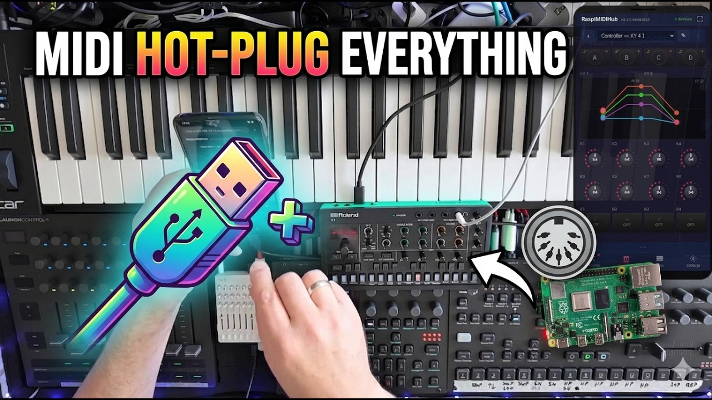

# RaspiMIDIHub

**Turn your Raspberry Pi into a plug-and-play USB MIDI hub with virtual instruments.**

Plug in your keyboards, synths, drum machines, and controllers -- they appear in a routing matrix instantly. Connect any two with a tap, or flip on all-to-all routing for classic plug-and-play. No computer needed; everything is configured from your phone.

With the built-in plugin system, you can add virtual instruments and effects (arpeggiator, LFO, chord generator, and more) that appear as MIDI devices in the routing matrix. Configure everything from your phone -- the Pi creates its own WiFi network with a captive portal.

The Raspberry Pi runs on a **read-only filesystem**, so you can pull the power at any time without risk of SD card corruption.

[](LICENSE)
[](https://discord.gg/DYQ7keGm)

> 💬 **Join the community on [Discord](https://discord.gg/DYQ7keGm)** -- questions, setups, feature ideas, and distributed-jam experiments. New here? Say hi!

## Watch the Demo

[](https://www.youtube.com/watch?v=q2tct0SiazU)

A full walkthrough of the routing matrix, MIDI mapping, and virtual instruments in a live setup with Digitone, Roland S1, Launch Control XL, and a keyboard.

<p align="center">
  
  
  
</p>
<p align="center">
  
  
  
</p>

See all screenshots in [docs/screenshots/](docs/screenshots/). The full **[User Manual (PDF)](https://github.com/wamdam/raspimidihub/releases/latest/download/raspimidihub-manual.pdf)** is shipped with every release and covers every screen end-to-end.

---

## Features

### MIDI Routing Matrix
- **Tap-to-connect matrix** with device icons and live rate meters -- new devices start disconnected; one optional setting restores classic all-to-all auto-routing
- **Single-tap context menu** on every cell, header, and mapping row -- Edit, Copy, Paste, Remove
- **Connection / plugin / mapping clipboard** -- copy filter+mappings (or a whole plugin instance) and paste anywhere
- **URL routing** -- back/forward and bookmarks work for /routing, /controller, /settings, and the open device panel
- **Dirty-state asterisk** on the bottom-nav Routing icon when in-memory state diverges from the saved config
- **Hot-plug support** -- add or remove devices at any time, saved connections re-apply automatically
- **Offline connections** -- saved routing for unplugged devices stays visible and toggleable
- **Loop prevention** and **multi-port devices** fully supported

### Virtual Instruments and Plugins
- **15 built-in routing plugins** that appear as MIDI devices in the matrix, plus **4 play-surface plugins** (Arpeggiator, Tracker, Euclidean and Cartesian) on the fullscreen Play tab
- **Plugins start unconnected** -- route them manually for precise control
- **Custom UI controls** -- wheels, faders, knobs, XY pads, toggles, step editors, curve editors, scopes, meters
- **MIDI clock sync** -- plugins can sync to external clock or generate their own
- **Sample-accurate scheduling** -- Master Clock, MIDI Delay, Arpeggiator and drop-button fires use ALSA kernel-side queue scheduling for sub-millisecond jitter under load
- **CC automation** -- map hardware knobs to plugin parameters; the on-screen control animates in real time
- **Live display outputs** -- scopes and meters show plugin state in real time
- **Plugin help** -- "?" button reveals a per-plugin extended HELP text

### Built-in Plugins

15 routing-graph plugins -- add them under **Add → Plugin**. The Arpeggiator, Tracker, Euclidean and Cartesian live under **Add → Play** instead and are documented in the **Play Surfaces** section below.

| Plugin | Description |
|--------|-------------|
| CC LFO | CC waveforms (sine, triangle, square, saw, sample-and-hold); free or clock-sync up to 8 bars; live scope |
| CC Smoother | Removes jitter from noisy knobs with configurable smoothing; dual scopes (in / out) |
| Chord Generator | Input note triggers a chord (major, minor, 7th, custom intervals) with inversions |
| Clock Divider | Emit one MIDI Clock for every N received (2..32) |
| Hold | Latch notes without a sustain pedal; chord-latch or per-note toggle; MIDI-Learn the release note |
| Master Clock | Internal BPM clock with start/stop/continue, beat meter, bar counter |
| MIDI Delay | Pre-scheduled echoes with feedback repeats and velocity decay; sync rate or free ms |
| Note Splitter | Splits keyboard at a configurable note into two channels with per-zone transpose |
| Note Transpose | Shifts all notes up or down by semitones |
| Panic Button | Momentary trigger -- All Notes Off; second tap upgrades to All Sound Off |
| Pitch CC | Emits a pitch CC before each Note On (base value ± semitones from a base note); turns a keyboard into a chromatic player for synths like the Volca Sample whose pitch is a CC |
| Scale Remapper | Quantizes notes to a scale (major, minor, pentatonic, blues, ...) with labeled root selector |
| SysEx Sender | Upload a .syx file in the panel; bytes stream straight to the destination (256-byte chunks, ~5 ms gap; nothing saved) |
| Velocity Curve | Drawable 128-point velocity response curve with shape presets |
| Velocity Equalizer | Normalize velocity to a fixed value or compress the range |

### Controllers (tap-to-play surfaces)

Fullscreen play surfaces that send CCs over MIDI. Each cell is renameable; the (channel, CC) binding is symmetric (touch emits, hardware mirrors) and edited via long-press on the cell itself. Four controller templates ship out of the box:

| Controller | Layout | Default CC range |
|------------|--------|------------------|
| Mixer 8 | 24 knobs / 8 faders / 16 buttons | CC 16-63 ch 1 |
| FX 6 | 18 knobs / 6 faders / 6 buttons | CC 16-45 ch 1 |
| Performance 16 | 16 macro knobs + 4 scene buttons | CC 16-35 ch 1 |
| XY 4 | 2 XY pads + 8 knobs + 4 buttons | CC 16-31 ch 1 |

- **Drop buttons** -- 4 per controller. Long-press to capture, tap to fire. Modes: Now / Bar / 2-Bar / 4-Bar / 8-Bar / 16-Bar. Quantised to musical-grid boundaries; fade-on-fire and MIDI-note trigger optional; dual-slot (one fade + one hard drop side by side)
- **Long-press cell binding** -- Channel + CC + MIDI Learn + Reset to factory in a single popup; XY pads get a per-axis split with its own Learn for each axis
- **XY pad spring** -- per-cell force + home (Bottom-left / Center); dot returns to home after release
- **8 dark themes** per controller (Default / Navy / Forest / Wine / Plum / Teal / Sienna / Slate)
- **Top nav** -- swipe / arrow / dropdown to switch between instances; last-viewed remembered

### Plugin Control Mappings

A long-press (touch) or right-click (mouse) on any bindable plugin control -- the Arpeggiator's Rate, the Euclidean's Pulses, Note Transpose's Semitones, every controller cell -- opens a popup that lets you pick a Channel + CC, MIDI-Learn from hardware, or Reset to the plugin author's factory default. Bindings are per instance; existing routing-level CC→CC mappings still work for hardware that can't be reprogrammed.

**Settings → Plugin Control Mappings** lists every binding across every instance in a single editable table -- click any row to open the same popup. Plugin authors opt controls into the popup by declaring `default_cc` on the param dataclass; setup-group knobs (Sync, Channel filters, BPM) stay non-bindable on purpose.

### Play Surfaces

Plugins on the **Play** bottom-nav tab (alongside Controllers). They route in the matrix like any other plugin but additionally render a fullscreen play surface for live performance. Add them under **Add → Play**.

**Arpeggiator**
- **Pattern + Rate** as wide wheels at the top of the play surface for one-finger live tweaks; **Steps / Accent Vel. / Gate % / Octaves** as a row of shapers; **Step Pattern** grid below for per-step on/off + offset + accent
- **Seven pattern modes** -- up / down / up-down / random / as-played / `programmed` (live step-sequencer: keypresses write the next-to-fire slot, chord-spread on simultaneous presses, slots persist while keys / pedal are held) / `chord` (every held note fires simultaneously each step)
- **Sustain pedal (CC 64)** acts as temporary Hold -- released keys keep arping until pedal lift
- **CC automation** -- every play-surface knob is bindable; long-press a control on touch (or right-click on desktop) to pick a Channel + CC, MIDI-Learn from hardware, or Reset to the plugin author's factory default
- **Pattern bank** -- 8 P1..P8 slots, each storing a full snapshot of the play-surface params. Tap to switch immediately; held notes / sustain persist across the switch. Long-press for Overwrite / Reset
- **Setup group** (config-only) -- Sync (free / tempo / transport) + BPM / Arp Ch / Ctrl Ch + 8 learnable trigger notes, in the slide-up device-detail panel

**Tracker**
- **8-voice step sequencer**, **16 hex-numbered rows × up to 16 pages** chained linearly, loops back to page 0
- **Per voice cell** -- Note (3-char pitch / Off / End / hold), Velocity (hex), CC# (hex or `.`), CC Val (hex). Note and CC events fire independently
- **Per-track output channel** -- T1..T8 each route to their own MIDI channel (defaults all 1, remappable in the device-detail panel)
- **8 pattern slots** -- tap to switch (queued to the next page-0 boundary while playing); Shift+Tap switches immediately. A per-Tracker **Trigger Mode** (Switch / One-shot / Hold / Toggle) fires patterns from a pad or key via **Pt. Ctrl Ch**, launching in sync from anywhere in the song without waiting for the bar
- **Live recording** -- play notes / move CCs in time with playback and they land on the row under the playhead, with note-offs captured so recorded notes keep their real length. Cursor stays put while playing; step-record at cursor when stopped
- **Keyboard entry** -- q..u for white keys + 2/3/5/6/7 for black keys (QWERTY and QWERTZ both work via physical-key code); Space toggles play; Shift held + cursor extends a sub-cell selection; Cut / Copy / Paste with half-compatibility check
- **Clock master** -- Send Clock generates an internal 24-PPQ at the configured BPM; Send Trnsp. forwards START / STOP / CONTINUE (and emits its own from the Play / Stop buttons); Rcv Trnsp. (default on) gates whether external transport drives the playhead, so a Tracker can free-run on the shared clock

**Euclidean**
- **Bjorklund distribution** -- Pulses / Steps / Rotate generate evenly-spaced hits (E(4,16) is four-on-the-floor; E(3,8) is the tresillo; E(5,8) is the cinquillo)
- **Window wave** -- a sine threshold (Phase / Cycles / Open) masks which steps are allowed to fire; Open=100 is transparent, Open=0 closes the gate
- **Three-layer pattern model** -- algorithm + window wave + per-step manual overrides on top (default / FORCE_ON / FORCE_ON+accent / FORCE_OFF). Default cells render a subdued underlay tint to preview what the generator would do
- **Six pattern modes** -- up / down / up-down / random / as-played / chord (every held note fires simultaneously each step)
- **Internal Scale + Root** -- 9 scales (major / minor / dorian / mixolydian / pentatonic / blues / harmonic m / whole tone / chromatic) quantise the output; chromatic is the identity pass-through
- **Tune Spread + Snap** -- random per-step transpose, with snap presets (free / octaves / 5ths+oct.) that bias toward consonant intervals before the scale quantiser
- **Fade In / Fade Out** -- velocity ramps over N firing steps at the start of a phrase and after every key is released
- **Jitter** -- per-step micro-timing humanisation, re-rolled every step
- **Pattern bank** -- 8 P1..P8 slots, each a full snapshot of every play-surface param. Tap to switch immediately; held notes / sustain persist. Long-press for Overwrite / Reset
- **Ctrl Ch + 8 trigger notes** -- reserve a MIDI channel and MIDI-Learn one note per slot for hardware pattern switching
- **CC automation** -- every play-surface knob is bindable from the same long-press popup; factory defaults match the Arpeggiator where they overlap (so a single hardware controller drives both)
- **Polyrhythm** -- two instances on the same Master Clock with co-prime pulse / step counts

**Cartesian**
- **2D grid sequencer** in the spirit of the Make Noise René -- a held note is the root and a square grid (2×2…4×4) of semitone offsets is swept by two clocks
- **Two independent clocks** -- **Rate** steps through the cells along a **Path** (Rows / Cols / Diagonal / Knight / Spiral in / Spiral out / Random); **Inv. Rate** advances the chord inversion (it is not a second spatial axis — Rate drives the whole sweep), so a fast Rate + slow Inv. Rate climbs a chord through its inversions
- **Fill Voicing** -- one knob stamps the grid (Unison → 5th → Triad → 7th → Scale), scale-aware so thirds and sevenths follow the **Scale** wheel; chord tones climb across the cells as a ladder of inversions
- **Root** -- doubles as the harmony selector: **No root** = chordal (played note is the tonic, fixed quality, transposes with the note); a root **C..B** = diatonic (Root + Scale define a key; the played note picks a degree and is harmonised in-key, so the third gives a iii-chord, the fifth a V-chord)
- **Inversion** -- bidirectional (-4…+4) re-voicing, not octave stacking -- lifts the lowest voice an octave for smooth voice-leading
- **Autofill** -- a latching toggle: on, Voicing / Scale / Root / Grid / Inversion re-fill the offsets instantly (all CC-bindable) while preserving your on/off + accent mask, so a held note + two knobs is a full instrument; turn it off and the grid freezes as-is for hand-editing
- **Two channels** -- **Play Ch** holds the root, **Fill Ch** records cell offsets by holding notes (programmed-Arp style)
- **Pattern bank + CC automation** -- same 8-slot bank and bindable knobs as the other play surfaces

### Bluetooth MIDI (BLE-MIDI)
- **Pair, connect, disconnect, forget** any BLE-MIDI peripheral from the matrix UI -- Add Device → Bluetooth → Scan
- **Bluetooth icon and color** in matrix headers; offline devices stay visible with a "Reconnect" entry in the context menu
- **Auto-reconnect on boot** for paired devices (Pi initiates the BLE connection -- BLE peripherals don't auto-reconnect on their own)
- **Auto-disconnect detection** -- when a peripheral leaves range or powers off, its row/column flips to offline within a couple of seconds
- **Full message coverage** -- notes, CC, PC, pitch bend, aftertouch, MIDI Clock, Start/Stop/Continue, Song Position. (SysEx pending.)
- **Persistent bonds across power-off** -- BlueZ state lives on tmpfs and is snapshotted to `/boot/firmware` on every change via inotify, so re-pairing isn't needed even on read-only-root appliances that get yanked from power

### Network MIDI (RTP-MIDI / AppleMIDI)
- **Export any device as a standard RTP-MIDI session** -- advertised over mDNS as "Name @hostname"; Macs (Audio MIDI Setup), iPads and rtpmidid connect with no extra software
- **Link two hubs over Ethernet** -- a direct cable (no router needed, link-local fallback) or any shared network; the peer's exported devices mirror into the matrix automatically, grouped per hub (collapsible), with filters / mappings / renames / saved connections like any device
- **Self-healing** -- cable pull or peer power-cut detected in ~30 s, devices drop to offline like unplugged hardware, reconnection is automatic; loop-safe by construction (mirrors can't be re-exported)
- **Manual peers** for networks that swallow multicast; sub-millisecond added latency on wired LAN

### MIDI Filtering and Mapping
- **Per-connection channel filtering** -- enable/disable any of 16 MIDI channels
- **Message type filtering** -- block notes, CCs, program changes, pitch bend, aftertouch, SysEx, or clock
- **Note to CC / Note to CC toggle / CC to CC / Channel remap** mappings (CC-to-CC supports range scaling and inversion; Channel remap supports fan-out)
- **MIDI Learn** -- press a key or move a knob to auto-fill the mapping source
- **Wheels, faders, radio buttons, and toggles** replace dropdowns for fast editing on stage

### Connectivity
- **Built-in WiFi access point** -- connect from your phone, captive portal opens automatically
- **WiFi mode preference** -- AP only / WiFi for updates / WiFi always (Settings)
- **USB tethering** -- plug a phone into a USB-A port, Settings shows the tethered URL as a clickable link (Pi gets internet for updates without flipping wlan0)
- **Software Updates** -- Settings card auto-downloads newer GitHub releases, keeps the latest 3, installs offline with one tap
- **Auto-fallback** -- if WiFi client mode is lost, reverts to AP mode within ~90 seconds
- **Progressive Web App (PWA)** -- install to home screen for app-like experience
- **Mobile-first touch UI** designed for live performance
- **Real-time sync** across multiple browsers via SSE; per-view subscriptions keep traffic minimal
- **mDNS** -- reachable at `http://raspimidihub.local`

### Appliance Reliability
- **Read-only filesystem** -- SD card never written during normal operation
- **Power-safe** -- pull the power at any time, boots back to last saved config
- **CPU 3 reserved** -- the asyncio main loop runs on an isolated core (no kernel timer, no other userland) for tight sub-ms loop lag
- **Auto-start** -- MIDI routing active within 30 seconds of power-on
- **Watchdog** -- service automatically restarts on failure
- **LED status** -- green ACT LED steady = running, blinks on MIDI activity
- **Settings stats** -- live loop lag, MIDI in→out and Control in→MIDI out latency probes, CPU %, SSE rate / backlog

---

## Quick Start

### Requirements

- Raspberry Pi 3B+, 4B, 5, or Zero 2 W
- microSD card (4 GB+)
- USB MIDI devices
- **Internet on first boot** — ethernet, USB-tethered phone, or WiFi credentials set in the Pi Imager wizard
- [Raspberry Pi Imager](https://www.raspberrypi.com/software/) (free, official Raspberry Pi flashing tool)

### Installation — flash the bootstrap image (recommended)

The fastest path: flash one image with [Raspberry Pi Imager](https://www.raspberrypi.com/software/), let it install itself on first boot.

1. **Download the image**: [`raspimidihub-bootstrap-2026-04-21.img.xz`](https://github.com/wamdam/raspimidihub/releases/download/image-2026-04-21/raspimidihub-bootstrap-2026-04-21.img.xz) (~535 MB) from the [image release](https://github.com/wamdam/raspimidihub/releases/tag/image-2026-04-21).
2. Open **Raspberry Pi Imager**, click **CHOOSE OS** → scroll to the bottom → **Use custom**, then select the `.img.xz` file.
3. Click **CHOOSE STORAGE**, pick your SD card, **NEXT**. Pi Imager asks "would you like to apply OS customisation settings?" — click **EDIT SETTINGS**:
   - **WiFi SSID + password + country** (or skip if you'll use ethernet)
   - **Keyboard layout** + locale + timezone
   - **Username + password**, and paste an SSH public key if you want passwordless SSH later
4. **Save** → **YES** → **YES** to write. Insert SD into the Pi, plug in power.
5. Wait roughly **5 minutes**. The green ACT LED progresses heartbeat → medium blink → fast blink → solid → reboot → steady-on. When it settles to steady, the appliance is up and the access point is broadcasting `RaspiMIDIHub-XXXX`.

The image is just a fresh Raspberry Pi OS Lite (64-bit) + a oneshot that downloads and installs the latest RaspiMIDIHub release on first boot. Re-flashing the same image any time gives you the newest release — no separate image per code release.

<details>
<summary>Pi Imager 2.0+ custom-repository (optional)</summary>

If you'd rather have **RaspiMIDIHub OS** show up directly in Pi Imager's OS picker, add this URL in Pi Imager → **⚙ Settings** (gear icon, top-right) → **Use custom repository**:

```
https://raw.githubusercontent.com/wamdam/raspimidihub/main/image/os-list.json
```

Restart Pi Imager. This option only exists on Pi Imager 2.0+ — older versions are fine with the direct-download flow above.

</details>

<details>
<summary>Manual installation on an existing Raspberry Pi OS Lite system</summary>

If you already have a fresh Raspberry Pi OS Lite running and prefer to install from the shell, run the one-liner over SSH:

```bash
curl -sL https://github.com/wamdam/raspimidihub/releases/latest/download/install.sh | bash
sudo reboot
```

Or fetch the .debs manually:

```bash
TAG=$(curl -sL -o /dev/null -w '%{url_effective}' https://github.com/wamdam/raspimidihub/releases/latest | grep -oP 'v[\d.]+$')
wget https://github.com/wamdam/raspimidihub/releases/download/$TAG/raspimidihub_${TAG#v}-1_all.deb
wget https://github.com/wamdam/raspimidihub/releases/download/$TAG/raspimidihub-rosetup_1.0.2-1_all.deb
sudo apt install ./raspimidihub_${TAG#v}-1_all.deb ./raspimidihub-rosetup_1.0.2-1_all.deb
sudo reboot
```

> **Warning:** Install on a **fresh Raspberry Pi OS Lite** image only. The `raspimidihub-rosetup` package converts the filesystem to read-only and may conflict with other software. Do not install on a Pi you use for other purposes.
</details>

After the install reboot, the Pi runs with a read-only filesystem and all connected MIDI devices are automatically routed. The WiFi AP starts automatically.

### Connecting

1. On your phone, go to WiFi settings
2. Connect to `RaspiMIDIHub-XXXX` (default password: `midihub1`)
3. The configuration page opens automatically (captive portal)
4. Tap a matrix cell to open its menu (Edit, Copy, Paste, Remove); pick **Edit** to set filters and mappings
5. Tap **Add** at the bottom of the matrix to add plugins or controllers
6. Hit **Save Config** to persist across reboots

---

## Screenshots

See [docs/screenshots/](docs/screenshots/) for the full set. Highlights:

| | | |
|---|---|---|
|  |  |  |
| Routing Matrix | Settings | Filter Panel |
|  |  |  |
| Mapping (Note to CC) | Device Detail | Arpeggiator play surface |
|  |  |  |
| CC LFO with Scope | Velocity Curve | Note Splitter |
|  |  |  |
| MIDI Delay | Chord Generator | CC Smoother |

---

## Plugin Development

Plugins are Python classes that inherit from `PluginBase`. Drop a directory under `plugins/` with an `__init__.py` and an `icon.svg`, and the framework auto-discovers it at startup.

```python
from raspimidihub.plugin_api import PluginBase, Wheel, Toggle

class MyPlugin(PluginBase):
    NAME = "My Plugin"
    DESCRIPTION = "Does something cool"
    AUTHOR = "You"
    VERSION = "1.0"

    params = [
        Wheel("speed", "Speed", min=1, max=10, default=5),
        Toggle("active", "Active", default=True),
    ]

    def on_note_on(self, channel, note, velocity):
        self.send_note_on(channel, note, velocity)
```

See the full [Plugin Developer Guide](plugins/README.md) for parameter types, clock sync, CC automation, display outputs, and sandbox restrictions.

---

## Architecture

RaspiMIDIHub consists of two Debian packages:

| Package | Purpose |
|---------|---------|
| `raspimidihub` | MIDI routing service + plugin host + web UI + WiFi AP |
| `raspimidihub-rosetup` | Read-only filesystem hardening (optional but recommended) |

MIDI routing uses the Linux ALSA sequencer at the kernel level via ctypes bindings to libasound2, adding virtually zero latency for direct connections. Filtered and mapped connections route through userspace with ~1-3ms latency. Plugins run as virtual ALSA MIDI devices with their own input and output ports.

The web UI is a Preact SPA served by a Python stdlib async HTTP server -- no build step, no npm, no external dependencies.

---

## Maintenance

### Resetting WiFi to Access Point

```bash
sudo reset-wifi
```

### Updating

The Pi is in AP mode by default and the AP has no internet, so updates need a way out. Pick whichever path is convenient — the **Settings > Software Update** card just needs the Pi to reach GitHub once; it auto-detects which of these is available. The newest 3 debs are kept on disk so re-installs work fully offline.

**Ethernet** -- simplest. Plug a cable into the Pi, hit Install. The access point stays up the whole time; your phone/laptop connection to the Pi is unaffected. Recommended for headless setups.

**USB tethering** -- plug a phone into one of the Pi's USB-A ports with Personal Hotspot / USB Tethering enabled. The kernel brings up a `usb0` / `enx…` interface and the phone hands the Pi an IP. The Settings page shows the tethered URL as a clickable link so you can switch your browser to the faster link, but you don't have to — the AP stays up either way. Works on iOS and Android.

**WiFi** -- the Pi has only one wireless radio, so going online over WiFi means temporarily dropping the AP. Set **Settings > Connectivity > WiFi mode** to **WiFi for updates** and save your home network's SSID/password. When you hit Install, the Pi briefly switches `wlan0` from AP to client, downloads the deb, then switches back. Your phone/laptop will lose its connection to the Pi for ~30 seconds during the switch and again on the way back; reconnect to the AP afterwards. A 180-second watchdog force-restarts the service if anything hangs in client mode, so the AP always comes back even if the update step fails.

Once the deb is on disk, Install applies it offline regardless of which path fetched it.

### Uninstalling

```bash
ssh user@raspimidihub.local
rw
sudo apt purge raspimidihub raspimidihub-rosetup
sudo reboot
```

---

## Testing

```bash
make test
```

This creates a Python venv, installs test dependencies, and runs ~290 unit and integration tests covering:

- **MIDI filter logic** -- channel masks, message type filtering, serialization
- **Mapping pipeline** -- CC-to-CC scaling, Note-to-CC, toggle, channel remap (incl. fan-out), pass-through
- **All 15 plugins + 2 play surfaces + 4 controllers** -- end-to-end behaviour, parameter wiring, clock sync, drop-button scheduling
- **Filter engine** -- end-to-end mapping with captured output verification
- **Plugin host** -- hotplug restore, instance lifecycle, ALSA queue scheduling

Tests run without ALSA hardware (`RASPIMIDIHUB_TEST_MODE=1`). No Raspberry Pi required.

---

## Supported Hardware

| Raspberry Pi Model | USB Ports | Recommended Max Devices | Notes |
|--------------------|-----------|-------------------------|-------|
| Pi Zero 2 W | 1 (via OTG + hub) | 3-4 | Single USB bus |
| Pi 3B+ | 4 | 4 | Shared USB/Ethernet bus |
| Pi 4B | 4 (2x USB 3.0) | 8+ | Recommended |
| Pi 5 | 4 (2x USB 3.0) | 8+ | Best performance |

---

## Documentation

- **[User Manual (PDF)](https://github.com/wamdam/raspimidihub/releases/latest/download/raspimidihub-manual.pdf)** -- the canonical user-facing reference; covers every screen, plugin, controller, and setup flow. Markdown source under [docs/manual/](docs/manual/).
- [Plugin Developer Guide](plugins/README.md) -- creating custom plugins
- [Building from Source](docs/BUILDING.md) -- how to build the `.deb` packages
- [Changelog](CHANGELOG.txt) -- release history
- [Roadmap](docs/ROADMAP.md) -- living design doc for upcoming work

---

## License

LGPL -- see [LICENSE](LICENSE) for details. Includes bundled Preact (MIT) and HTM (Apache-2.0).
