# RaspiMIDIHub

**Turn your Raspberry Pi into a plug-and-play USB MIDI hub with virtual instruments.**

RaspiMIDIHub automatically connects all USB MIDI devices to each other. Plug in your keyboards, synths, drum machines, and controllers -- they all talk to each other instantly. No computer needed, no configuration required.

With the built-in plugin system, you can add virtual instruments and effects (arpeggiator, LFO, chord generator, and more) that appear as MIDI devices in the routing matrix. Configure everything from your phone -- the Pi creates its own WiFi network with a captive portal.

The Raspberry Pi runs on a **read-only filesystem**, so you can pull the power at any time without risk of SD card corruption.


<p align="center">
  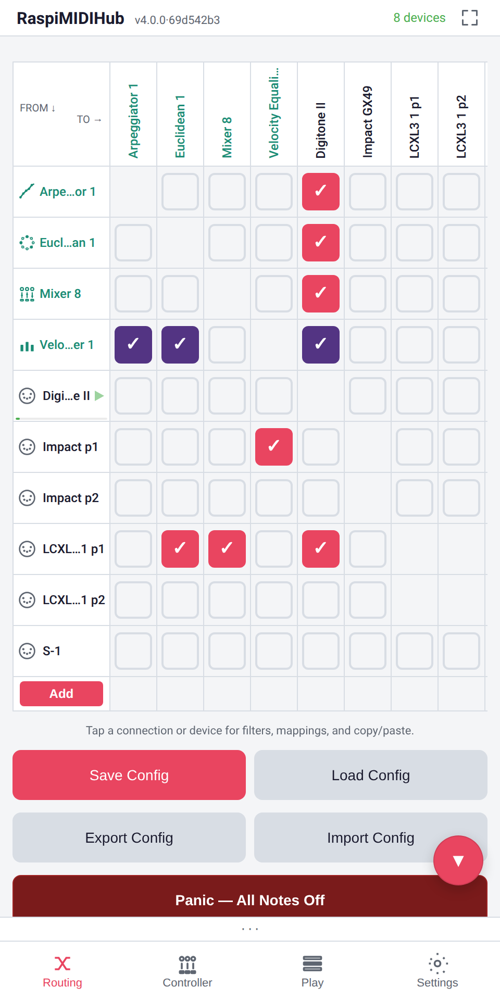
  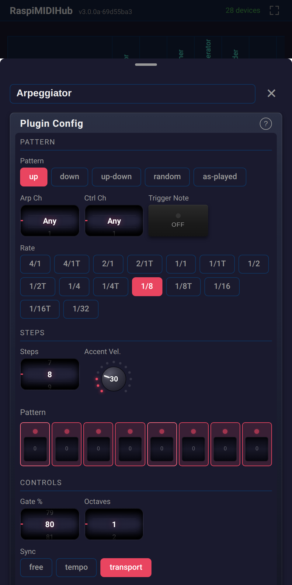
  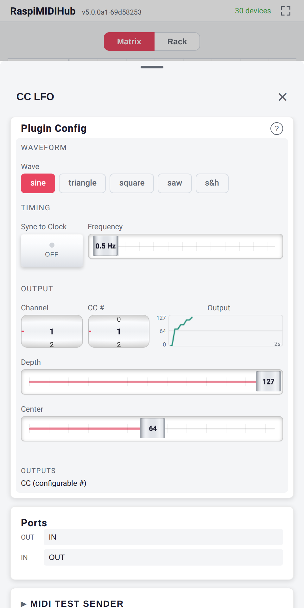
</p>
<p align="center">
  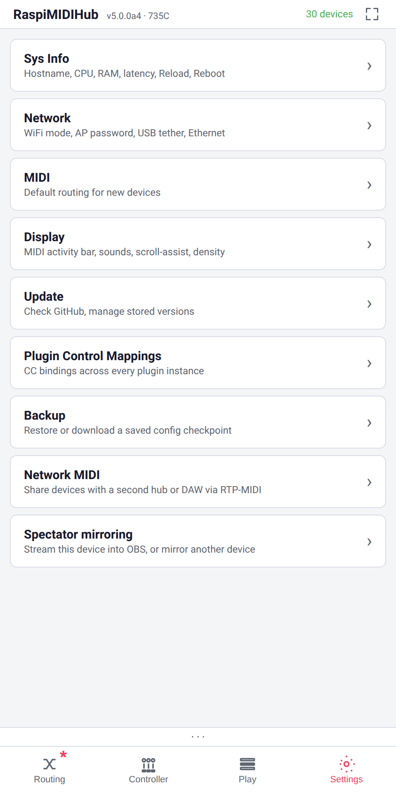
  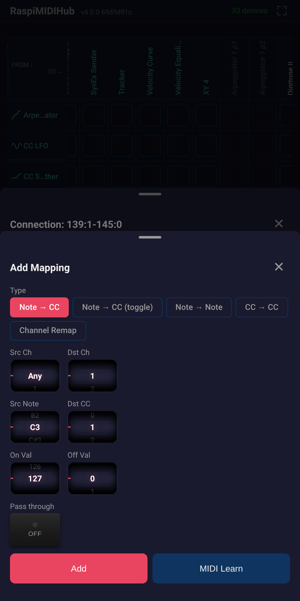
  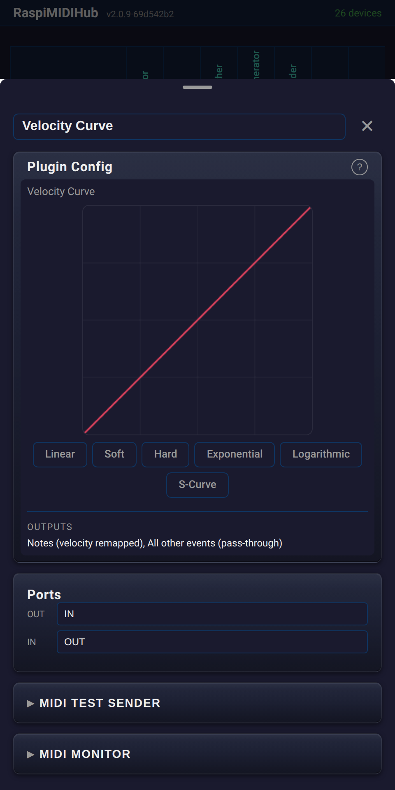
</p>

See all screenshots in [docs/screenshots/](docs/screenshots/) and the full [UI Guide](docs/UI_GUIDE.md).

---

## Features

### MIDI Routing Matrix
- **Automatic all-to-all routing** between USB MIDI devices out of the box
- **Tap-to-connect matrix** with device icons and live rate meters
- **Hot-plug support** -- add or remove devices at any time
- **Offline connections** -- configure routing for unplugged devices
- **Loop prevention** -- self-connections excluded automatically
- **Multi-port devices** fully supported

### Virtual Instruments and Plugins
- **12 built-in plugins** that appear as routable MIDI devices
- **Custom UI controls** -- wheels, faders, toggles, step editors, curve editors, scopes
- **MIDI clock sync** -- plugins can sync to external clock or generate their own
- **CC automation** -- map hardware knobs to plugin parameters
- **Live display outputs** -- scopes and meters show plugin state in real time
- **Plugin sandbox** -- plugins run in restricted threads, no filesystem or network access

### Built-in Plugins

| Plugin | Description |
|--------|-------------|
| Arpeggiator | Plays held notes as a pattern (up, down, up-down, random) with clock sync |
| CC LFO | Generates CC waveforms (sine, triangle, square, saw, sample-and-hold) |
| CC Smoother | Smooths incoming CC values to remove jitter from noisy knobs |
| Chord Generator | Input note triggers a full chord (major, minor, 7th, custom intervals) |
| Master Clock | Generates MIDI clock (24 PPQ) with transport controls (start/stop/pause) |
| MIDI Delay | Delays notes with feedback repeats and velocity decay |
| Note Splitter | Splits keyboard at a configurable note into two MIDI channels |
| Note Transpose | Shifts all notes up or down by semitones |
| Panic Button | Sends All Notes Off and All Sound Off on all 16 channels |
| Scale Remapper | Quantizes notes to a musical scale (major, minor, pentatonic, blues, etc.) |
| Velocity Curve | Remaps velocity response with a drawable 128-point curve |
| Velocity Equalizer | Normalizes velocities to a fixed value or compressed range |

### MIDI Filtering and Mapping
- **Per-connection channel filtering** -- enable/disable any of 16 MIDI channels
- **Message type filtering** -- block notes, CCs, program changes, pitch bend, aftertouch, SysEx, or clock
- **Note to CC / Note to CC toggle / CC to CC / Channel remap** mappings
- **MIDI Learn** -- press a key or move a knob to auto-fill the mapping source
- **Wheels, faders, radio buttons, and toggles** replace dropdowns for fast editing on stage

### Presets
- **Save and recall** named routing configurations including plugin states
- **Export/import** as JSON files for backup or sharing between devices
- **Overwrite confirmation** prevents accidental preset loss

### WiFi and Web Interface
- **Built-in WiFi access point** -- connect from your phone, captive portal opens automatically
- **Progressive Web App (PWA)** -- install to home screen for app-like experience
- **Mobile-first touch UI** designed for live performance
- **Real-time sync** across multiple browsers via SSE
- **Client mode** -- join an existing WiFi network, reachable at `http://raspimidihub.local`
- **Auto-fallback** -- if WiFi connection is lost, reverts to AP mode within ~90 seconds

### Appliance Reliability
- **Read-only filesystem** -- SD card never written during normal operation
- **Power-safe** -- pull the power at any time, boots back to last saved config
- **Auto-start** -- MIDI routing active within 30 seconds of power-on
- **Watchdog** -- service automatically restarts on failure
- **LED status** -- green ACT LED steady = running, blinks on MIDI activity

---

## Quick Start

### Requirements

- Raspberry Pi 3B+, 4B, 5, or Zero 2 W
- **Fresh** [Raspberry Pi OS **Lite**](https://www.raspberrypi.com/software/operating-systems/) (Trixie/Bookworm or later)
- microSD card (4 GB+)
- USB MIDI devices
- **Internet connection** during installation

> **Warning:** Install on a **fresh Raspberry Pi OS Lite** image only. The `raspimidihub-rosetup` package converts the filesystem to read-only and may conflict with other software. Do not install on a Pi you use for other purposes.

### Installation

```bash
curl -sL https://github.com/wamdam/raspimidihub/releases/latest/download/install.sh | bash
sudo reboot
```

<details>
<summary>Manual installation</summary>

```bash
wget https://github.com/wamdam/raspimidihub/releases/latest/download/raspimidihub_2.0.0-1_all.deb
wget https://github.com/wamdam/raspimidihub/releases/latest/download/raspimidihub-rosetup_1.0.0-1_all.deb
sudo apt install ./raspimidihub_2.0.0-1_all.deb ./raspimidihub-rosetup_1.0.0-1_all.deb
sudo reboot
```
</details>

After reboot, the Pi runs with a read-only filesystem and all connected MIDI devices are automatically routed. The WiFi AP starts automatically.

### Connecting

1. On your phone, go to WiFi settings
2. Connect to `RaspiMIDIHub-XXXX` (default password: `midihub1`)
3. The configuration page opens automatically (captive portal)
4. Tap the matrix to route devices, long-press for filters and mappings
5. Tap the "+" button in the matrix to add plugins
6. Hit **Save Config** to persist across reboots

---

## Screenshots

See [docs/screenshots/](docs/screenshots/) for the full set. Highlights:

| | | |
|---|---|---|
|  |  | 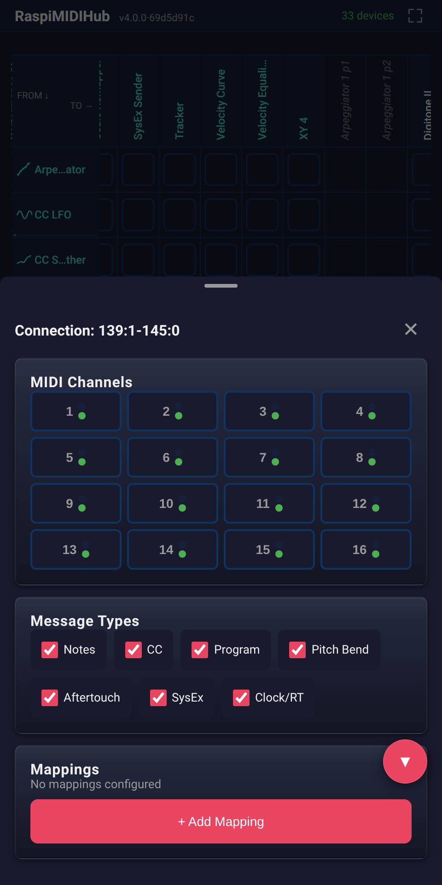 |
| Routing Matrix | Settings | Filter Panel |
|  | 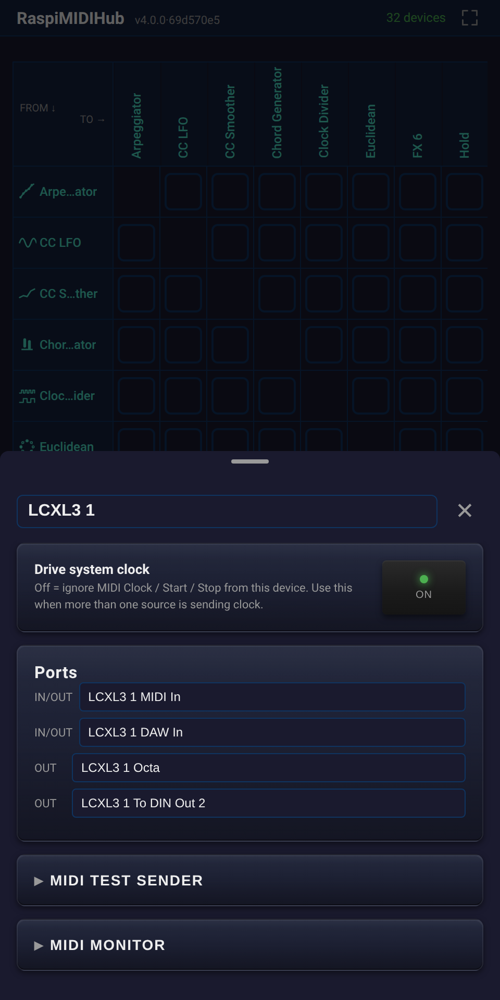 |  |
| Mapping (Note to CC) | Device Detail | Arpeggiator |
|  |  | 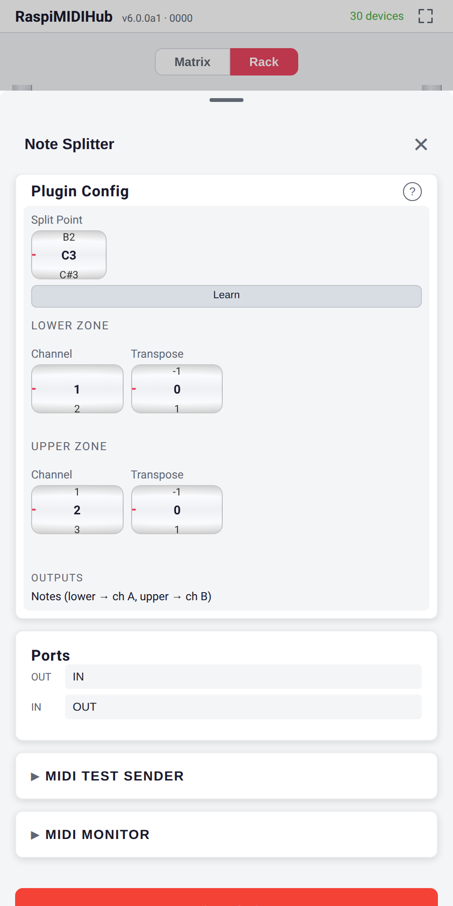 |
| CC LFO with Scope | Velocity Curve | Note Splitter |
| 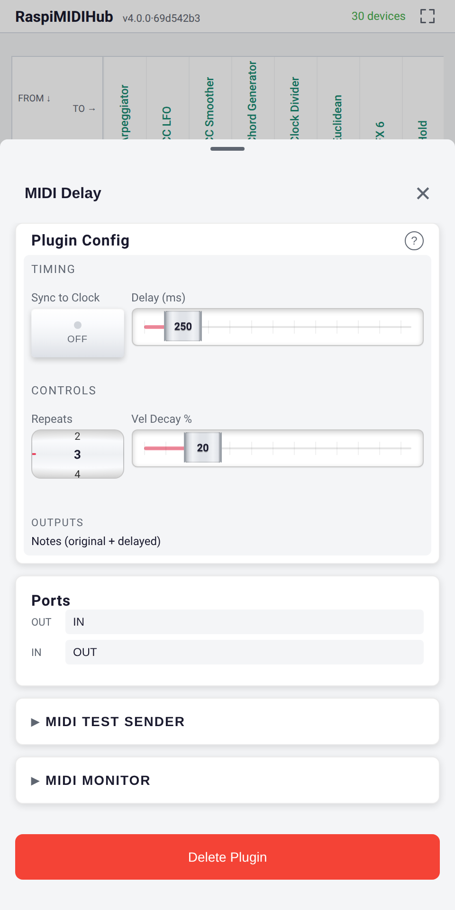 | 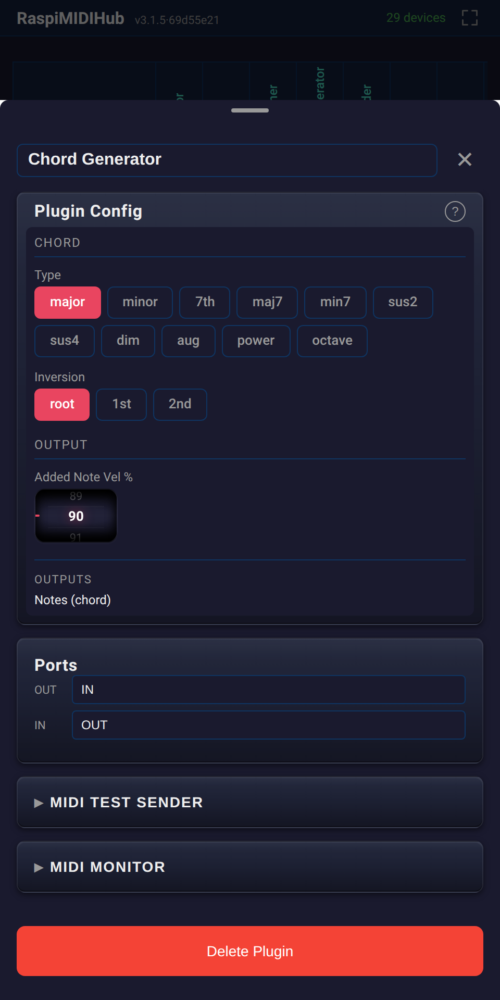 | 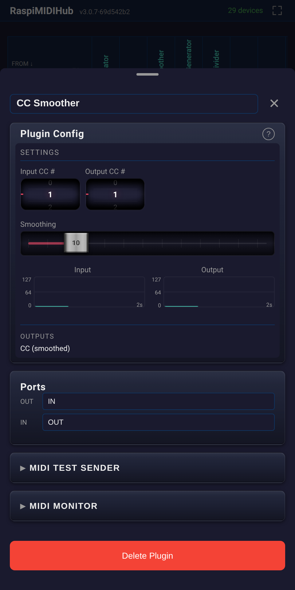 |
| MIDI Delay | Chord Generator | CC Smoother |

---

## Plugin Development

Plugins are Python classes that inherit from `PluginBase`. Drop a directory under `plugins/` with an `__init__.py` and an `icon.svg`, and the framework auto-discovers it at startup.

```python
from raspimidihub.plugin_api import PluginBase, Wheel, Toggle

class MyPlugin(PluginBase):
    NAME = "My Plugin"
    DESCRIPTION = "Does something cool"
    AUTHOR = "You"
    VERSION = "1.0"

    params = [
        Wheel("speed", "Speed", min=1, max=10, default=5),
        Toggle("active", "Active", default=True),
    ]

    def on_note_on(self, channel, note, velocity):
        self.send_note_on(channel, note, velocity)
```

See the full [Plugin Developer Guide](plugins/README.md) for parameter types, clock sync, CC automation, display outputs, and sandbox restrictions.

---

## Architecture

RaspiMIDIHub consists of two Debian packages:

| Package | Purpose |
|---------|---------|
| `raspimidihub` | MIDI routing service + plugin host + web UI + WiFi AP |
| `raspimidihub-rosetup` | Read-only filesystem hardening (optional but recommended) |

MIDI routing uses the Linux ALSA sequencer at the kernel level via ctypes bindings to libasound2, adding virtually zero latency for direct connections. Filtered and mapped connections route through userspace with ~1-3ms latency. Plugins run as virtual ALSA MIDI devices with their own input and output ports.

The web UI is a Preact SPA served by a Python stdlib async HTTP server -- no build step, no npm, no external dependencies.

---

## Maintenance

### Resetting WiFi to Access Point

```bash
sudo reset-wifi
```

### Updating

Connect via Ethernet, then go to **Settings > Software Update** and click **Install**. The access point keeps running so you stay connected via WiFi.

### Uninstalling

```bash
ssh user@raspimidihub.local
rw
sudo apt purge raspimidihub raspimidihub-rosetup
sudo reboot
```

---

## Supported Hardware

| Raspberry Pi Model | USB Ports | Recommended Max Devices | Notes |
|--------------------|-----------|-------------------------|-------|
| Pi Zero 2 W | 1 (via OTG + hub) | 3-4 | Single USB bus |
| Pi 3B+ | 4 | 4 | Shared USB/Ethernet bus |
| Pi 4B | 4 (2x USB 3.0) | 8+ | Recommended |
| Pi 5 | 4 (2x USB 3.0) | 8+ | Best performance |

---

## Documentation

- [UI Guide](docs/UI_GUIDE.md) -- Walkthrough of every screen
- [Plugin Developer Guide](plugins/README.md) -- Creating custom plugins
- [Building from Source](docs/BUILDING.md) -- How to build the .deb packages
- [Changelog](CHANGELOG.md) -- Release history
- [Functional Specification](docs/FSD.md)

---

## License

LGPL -- see [LICENSE](LICENSE) for details. Includes bundled Preact (MIT) and HTM (Apache-2.0).
