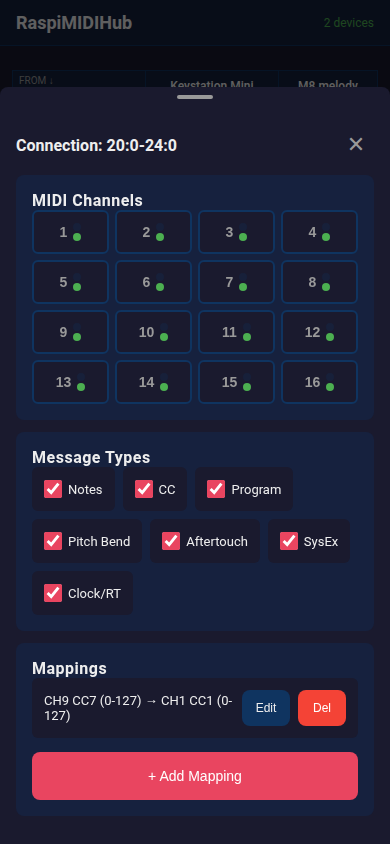
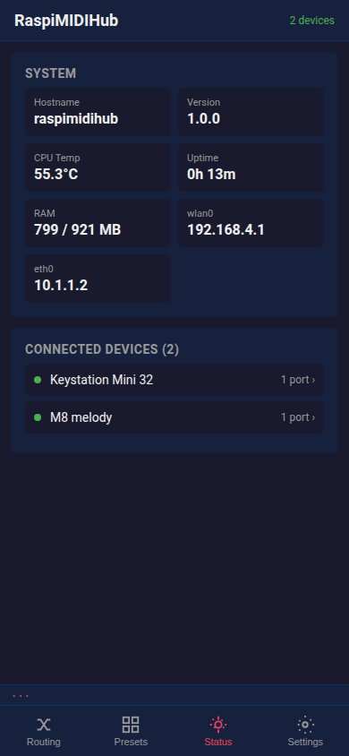

# RaspiMIDIHub

**Turn your Raspberry Pi into a plug-and-play USB MIDI hub.**

RaspiMIDIHub automatically connects all USB MIDI devices to each other. Plug in your keyboards, synths, drum machines, and controllers — they all talk to each other instantly. No computer needed, no configuration required.

The Raspberry Pi runs on a **read-only filesystem**, so you can pull the power at any time without risk of SD card corruption. Your last saved MIDI routing configuration is preserved across reboots and power cycles.

For custom routing, filtering, and MIDI mapping, open the web interface from your phone — the Pi creates its own WiFi network with a captive portal that opens the configuration page automatically.


<p align="center">
  
  
  
  
</p>

See the full [UI Guide](docs/UI_GUIDE.md) for all screens.

---

## Features

### Zero-Configuration MIDI Routing
- **Automatic all-to-all:** Every connected MIDI device can send to every other device
- **Loop prevention:** Self-connections are excluded automatically
- **Hot-plug support:** Add or remove devices at any time — routing updates within 2 seconds
- **Multi-port devices:** Devices with multiple MIDI ports are fully supported

### Appliance Reliability
- **Read-only filesystem:** The SD card is never written to during normal operation, preventing corruption
- **Power-safe:** Pull the power cord at any time. The Pi boots back up with your last saved configuration intact
- **Auto-start:** MIDI routing is active within 30 seconds of power-on
- **Watchdog:** The service automatically restarts if anything goes wrong
- **LED status:** Green ACT LED steady = running, blinks on MIDI activity. Red PWR LED off = healthy, on = config fallback

### WiFi & Web Interface
- **Built-in WiFi access point:** The Pi creates its own WiFi network (`RaspiMIDIHub-XXXX`)
- **Captive portal:** Connect from your phone and the config page opens automatically
- **Mobile-first design:** Touch-friendly interface designed for phones on stage
- **Connection matrix:** Tap to connect/disconnect, long-press for filters and mappings
- **Presets:** Save and recall routing configurations for different songs or shows
- **MIDI activity bar:** Persistent live MIDI event display (toggleable)
- **MIDI monitor:** Per-device real-time event log with note names
- **MIDI test sender:** Piano keyboard and CC slider for testing connections
- **Client mode:** Join an existing WiFi network. Reachable at `http://raspimidihub.local`
- **WiFi network scanner:** Browse available networks from the settings page
- **Auto-fallback:** If WiFi connection is lost, the Pi automatically reverts to AP mode within ~90 seconds

### MIDI Filtering
- **Per-connection channel filtering:** Enable/disable any of the 16 MIDI channels per connection
- **Message type filtering:** Block notes, CCs, program changes, pitch bend, aftertouch, SysEx, or clock/realtime per connection
- **Instant apply:** Filters take effect immediately when toggled
- **Colorblind-friendly:** Traffic light indicators (red/green dots) for channel state

### MIDI Mapping
- **Note to CC:** Convert note on/off to CC values (e.g., use a pad to toggle an effect)
- **Note to CC (toggle):** Each note press alternates between two CC values (e.g., mute/unmute)
- **CC to CC:** Remap CC numbers with configurable input/output ranges (scaling, inversion)
- **Channel remap:** Route events from one MIDI channel to another
- **Pass-through option:** Optionally forward the original event alongside the mapped output
- **MIDI Learn:** Press a key or move a knob to auto-fill the mapping source
- **Per-connection:** Each connection can have independent mappings
- **Persisted:** Mappings survive reboots via stable USB device identification

### Device Management
- **Device renaming:** Assign custom names that persist across reboots
- **Stable identification:** Devices are tracked by USB topology path + VID:PID, not volatile ALSA client IDs
- **Device detail panel:** View device info, monitor MIDI, send test events

### Easy Installation
- **Single package install:** Download one `.deb` file, install, reboot — done
- **Clean uninstall:** `dpkg --purge` fully restores the original system

---

## Quick Start

### Requirements

- Raspberry Pi 3B+, 4B, 5, or Zero 2 W
- **Fresh** Raspberry Pi OS **Lite** (Trixie/Bookworm or later)
- microSD card (4 GB+)
- USB MIDI devices
- **Internet connection** during installation (for downloading dependencies)

> **Warning:** This software is designed for a **fresh Raspberry Pi OS Lite** image. Installing on a Pi with other software already configured (desktop environment, Docker, custom services, etc.) may cause conflicts and could render the system unusable — especially the `raspimidihub-rosetup` package which converts the filesystem to read-only. **Do not install on a Pi you use for other purposes.**

### Installation

The Pi needs internet access during installation to download dependencies (hostapd, dnsmasq, ntpsec). Connect via Ethernet or configure WiFi first.

```bash
curl -sL https://github.com/wamdam/raspimidihub/releases/latest/download/install.sh | bash
sudo reboot
```

<details>
<summary>Manual installation</summary>

```bash
wget https://github.com/wamdam/raspimidihub/releases/latest/download/raspimidihub_1.3.0-1_all.deb
wget https://github.com/wamdam/raspimidihub/releases/latest/download/raspimidihub-rosetup_1.0.0-1_all.deb
sudo apt install ./raspimidihub_1.3.0-1_all.deb ./raspimidihub-rosetup_1.0.0-1_all.deb
sudo reboot
```
</details>

After reboot, the Pi runs with a read-only filesystem and all connected MIDI devices are automatically routed to each other. The WiFi AP starts automatically — no internet needed after installation.

### Connecting to the Web Interface

1. On your phone, go to WiFi settings
2. Connect to `RaspiMIDIHub-XXXX` (default password: `midihub1`)
3. The configuration page opens automatically (captive portal)
4. Tap the connection matrix to route devices, long-press for filters and mappings
5. Hit **Save Config** to persist across reboots

### Client WiFi Mode

To connect the Pi to an existing WiFi network instead of running its own AP:

1. Open Settings in the web UI
2. Select a network from the dropdown (scanned automatically)
3. Enter the password and tap Connect
4. Find the Pi at **http://raspimidihub.local** on the same network

**Safety net:** If the WiFi network becomes unreachable, the Pi automatically falls back to AP mode within ~90 seconds. On boot, if the saved WiFi fails to connect, AP mode activates immediately.

---

## Usage Examples

### Simple Keyboard-to-Synth

```
[MIDI Keyboard] --USB--> [Raspberry Pi] --USB--> [Synthesizer]
```

Connect both USB MIDI cables, power on the Pi, play. No configuration needed.

### Live Performance

```
[Controller Keyboard]  --+
[Drum Machine]         --+-- [Raspberry Pi] -- all-to-all
[Bass Synth]           --+
[Sampler]              --+
```

All devices talk to each other. Pull the power after the gig — next time it works exactly the same.

### Custom Routing

1. Connect your phone to the Pi's WiFi
2. Tap connections in the matrix to enable/disable routes
3. Long-press a connection for channel filters or MIDI mappings
4. Save Config to persist

### MIDI Mapping Example

Map a keyboard pad to a synth mute toggle:

1. Long-press the keyboard→synth connection
2. Tap **+ Add Mapping**
3. Select "Note → CC (toggle)"
4. Hit **MIDI Learn**, press the pad
5. Set Dest CC to the synth's mute CC, values 127/0
6. Tap Add, then Save Config

### Song-Based Presets

1. Configure routing for Song 1, save as preset "Song 1 - Ballad"
2. Configure routing for Song 2, save as preset "Song 2 - Rock"
3. During the show: select preset → routing changes instantly

---

## Architecture

RaspiMIDIHub consists of two Debian packages:

| Package | Purpose |
|---------|---------|
| `raspimidihub` | MIDI routing service + web UI + WiFi AP |
| `raspimidihub-rosetup` | Read-only filesystem hardening (optional but recommended) |

The MIDI routing uses the Linux ALSA sequencer at the kernel level via ctypes bindings to libasound2, adding virtually zero latency for direct connections. Filtered and mapped connections route through userspace with ~1-3ms latency.

The web UI is a Preact SPA served by a Python stdlib async HTTP server — no build step, no npm, no external dependencies.

See [docs/FSD.md](docs/FSD.md) for the full functional specification and [docs/IMPLEMENTATION_PLAN.md](docs/IMPLEMENTATION_PLAN.md) for the development roadmap.

---

## Important Notes

### Power Safety

**You can power off the Raspberry Pi at any time.** The read-only filesystem ensures that sudden power loss will never corrupt the SD card or the operating system.

Your MIDI routing configuration is stored on the boot partition (FAT32) and is written only when you explicitly tap Save Config. The last saved configuration — including connections, filters, and mappings — is automatically restored on every boot using stable USB device identifiers.

If the saved configuration cannot be read, the Pi falls back to default all-to-all routing. The red PWR LED stays on and the green ACT LED blinks to indicate fallback mode.

### Network & Security

The Pi creates its own WiFi network by default. The WPA2 password is the only security gate — anyone with the password can access the configuration page. This is intentional for trusted environments (your studio, your stage).

- Change the default AP password (`midihub1`) via Settings
- The Pi is reachable at `http://raspimidihub.local` via mDNS/Avahi

### SD Card Lifetime

With the read-only filesystem enabled, the SD card receives zero writes during normal operation. An inexpensive SD card should last for many years of continuous use.

---

## Maintenance

### Remounting Read-Write

If you need to make system changes via SSH:

```bash
sudo mount -o remount,rw /
sudo mount -o remount,rw /boot/firmware
# ... make changes ...
sudo mount -o remount,ro /boot/firmware
sudo mount -o remount,ro /
```

The `rw` and `ro` shell aliases are provided by `raspimidihub-rosetup`.

### Resetting WiFi to Access Point

If the Pi joined a WiFi network and you can't find it, connect a keyboard+monitor (or serial console) and run:

```bash
sudo reset-wifi
```

This removes saved WiFi connections and switches back to AP mode. You can then reconnect via the `RaspiMIDIHub-XXXX` WiFi network.

### Updating

The easiest way to update is to connect the Pi to your router via **Ethernet cable** — the access point keeps running, so you connect to it via WiFi as usual. Then go to **Settings → Software Update** and click **Install**. The Pi downloads and installs the update automatically.

No need to switch to WiFi client mode or use SSH.

### Uninstalling

```bash
ssh user@raspimidihub.local
rw
sudo apt purge raspimidihub raspimidihub-rosetup
sudo reboot
```

This fully restores the Pi to a normal read-write Raspberry Pi OS installation.

---

## Supported Hardware

| Raspberry Pi Model | USB Ports | Recommended Max Devices | Notes |
|--------------------|-----------|-------------------------|-------|
| Pi Zero 2 W | 1 (via OTG + hub) | 3-4 | Single USB bus |
| Pi 3B+ | 4 | 4 | Shared USB/Ethernet bus |
| Pi 4B | 4 (2x USB 3.0) | 8+ | Recommended |
| Pi 5 | 4 (2x USB 3.0) | 8+ | Best performance |

---

## Documentation

- [UI Guide](docs/UI_GUIDE.md) — Walkthrough of every screen with screenshots
- [Building from Source](docs/BUILDING.md) — How to build the .deb packages
- [Changelog](docs/CHANGELOG.md) — Release history
- [Functional Specification](docs/FSD.md)
- [Implementation Plan](docs/IMPLEMENTATION_PLAN.md)

---

## License

LGPL — see [LICENSE](LICENSE) for details. Includes bundled Preact (MIT) and HTM (Apache-2.0).
