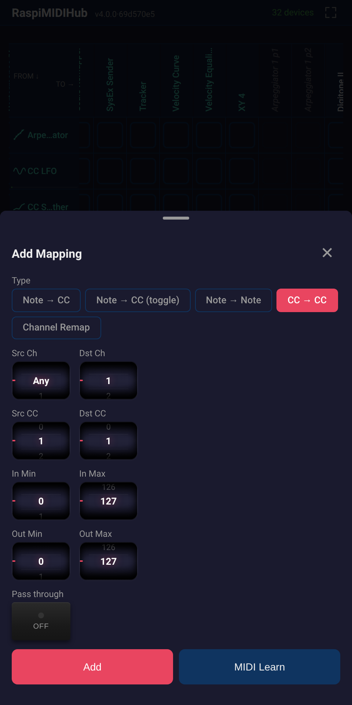
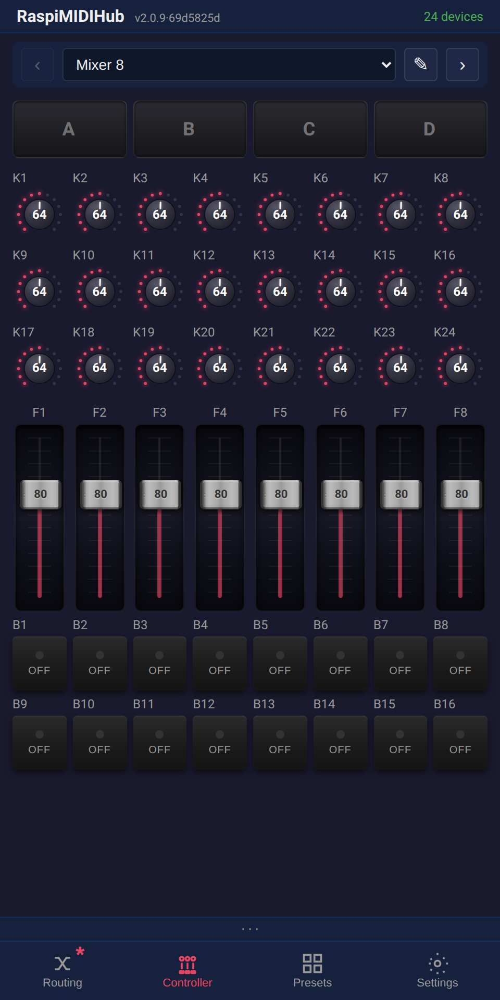
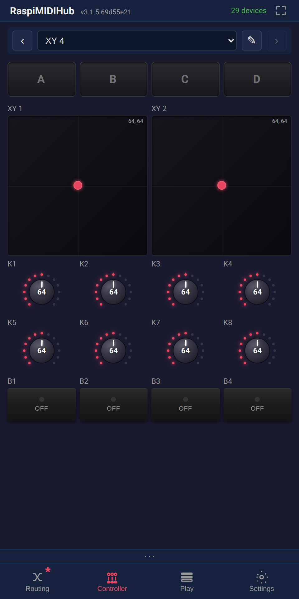
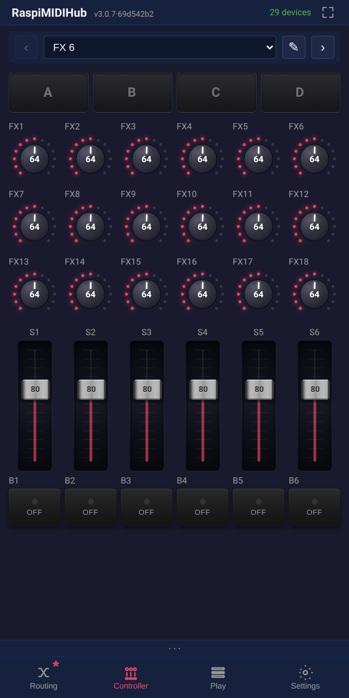
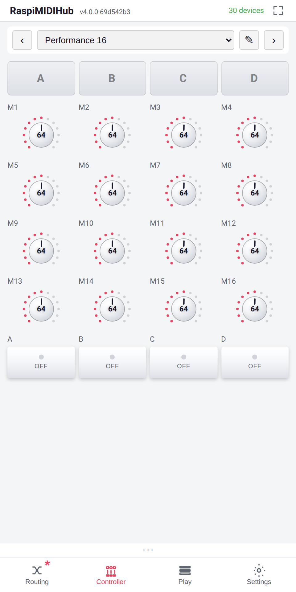
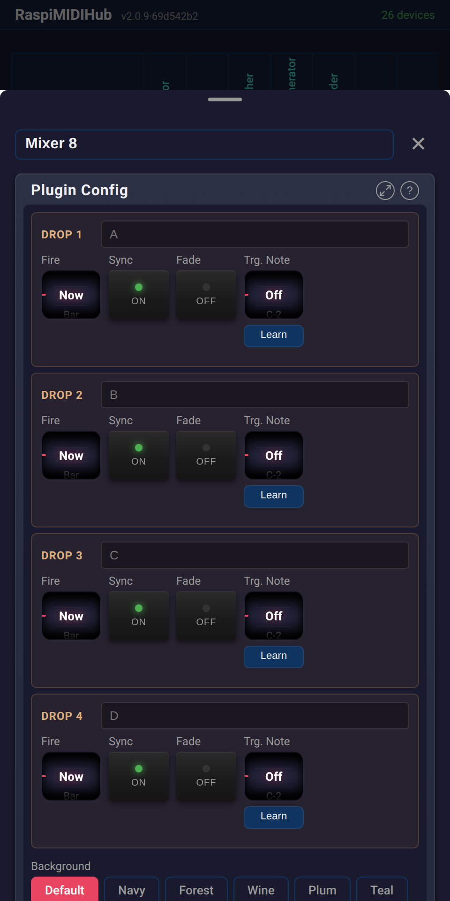

# RaspiMIDIHub -- UI Guide

This guide walks through every screen of the RaspiMIDIHub web interface.

The UI has **4 tabs**: Routing, Controller, Presets, and Settings. The bottom-nav Routing icon shows a **dark-red asterisk** when in-memory state diverges from the saved config (e.g. you added a plugin or rewired a connection but haven't pressed Save Config yet).

URL routing is real: `/routing`, `/controller`, `/presets`, `/settings` and even an open device-detail panel are bookmarkable; the browser back / forward buttons work as expected.

---

## Routing Page

The main screen shows the **connection matrix** -- a grid where rows are MIDI sources (FROM) and columns are destinations (TO). **Tap a cell** to open its context menu (Add connection, Copy, Paste; or for a connected cell: Edit, Copy, Paste, Remove). Purple cells indicate connections with active filters or mappings.

**Plugins and Controllers** appear in the matrix alongside USB devices. Each shows its icon (from `icon.svg`) next to the device name. Live **rate meters** on connection cells show MIDI message throughput.

**Offline devices** (saved but unplugged) appear grayed out with their saved connections shown as dimmed checkboxes. You can toggle offline connections on/off -- the settings are stored and applied when the device is plugged back in.

A pulsing play icon appears next to devices sending MIDI clock. If multiple devices send clock simultaneously (a common misconfiguration), the icon turns orange as a warning.

Tap a device label (row / column header) to open its menu, and pick **Edit** to open the device-detail panel. Renamed devices also show the original ALSA name in gray.

The **Add** button at the bottom of the matrix lets you add a new plugin or controller instance. Select a type from the list and it appears as a new device with its own IN / OUT ports.

**Clipboards.** The cell menu offers Copy / Paste; a connection's filter and mappings can be cloned to any other cell. The same works for plugin instances ("Paste-as-new" duplicates the plugin with its current params) and individual mappings (paste-with-bump auto-resolves duplicate-conflicts onto a free slot).

At the bottom: **Save Config** persists the current routing (including plugin states) to disk. **Load Config** reloads the last saved state -- including stopping any unsaved plugin instances. **Export Config** / **Import Config** let you back up or transfer the full configuration as JSON.

---

## Filter & Mapping Panel

Tap a connected (lit) cell and pick **Edit** from the menu to open the connection panel. Here you can:

- **MIDI Channels:** Toggle individual channels on/off. Traffic light indicators (red = blocked, green = passing) are colorblind-friendly. Tap the "MIDI Channels" heading to toggle all.
- **Message Types:** Enable/disable notes, CCs, program changes, pitch bend, aftertouch, SysEx, and clock/realtime. Changes apply instantly.
- **Mappings:** View active mappings as tappable rows. Tap a row to edit; long-press / right-click for Edit / Copy / Remove. Tap **+ Add Mapping** to create a new one. When the clipboard holds a mapping, **+ Paste Mapping** appears next to it.

Dismiss the panel by swiping down, tapping X, pressing ESC, or tapping the dark overlay.

Toggling a connection off in the matrix preserves its filters and mappings -- they are restored when you re-enable it.

---

## Add / Edit Mapping

The mapping form opens as a sub-overlay. Controls use **wheels, faders, radio buttons, and toggles** instead of dropdowns for fast editing on stage.

Mapping types:

| Type | Description |
|------|-------------|
| **Note -> CC** | Note on/off sends configurable CC values |
| **Note -> CC (toggle)** | Each note press alternates between two CC values (e.g., mute toggle) |
| **CC -> CC** | Remap CC numbers with input/output range scaling |
| **Channel Remap** | Route all events to a different MIDI channel |

- **Src Ch / Dst Ch:** Filter by source channel and remap to destination channel
- **MIDI Learn:** Press the button, then play a note or move a knob -- the source is auto-filled with visual feedback
- **Pass through original event:** When checked, the original note/CC is forwarded alongside the mapped output

| | |
|---|---|
|  |  |
| Note to CC | CC to CC with ranges |

---

## Controller Page

Fullscreen play surface for the controller instances you've added. The top bar shows the current controller name, swipe / arrow / dropdown to switch between instances; the last-viewed instance is remembered across reloads. The pencil icon on the bar opens the controller's plugin-config directly in the device-detail panel.

Four controller templates ship out of the box:

| Controller | Layout | Default CC range |
|------------|--------|------------------|
| Mixer 8 | 24 knobs / 8 faders / 16 buttons | CC 16-63 ch 1 |
| FX 6 | 18 knobs / 6 faders / 6 buttons | CC 16-45 ch 1 |
| Performance 16 | 16 macro knobs + 4 scene buttons | CC 16-35 ch 1 |
| XY 4 | 2 XY pads + 8 knobs + 4 buttons | CC 16-31 ch 1 |

Every cell is **renameable**, **MIDI-Learnable**, and themable; XY pads support **per-axis Learn**.

### Drop buttons

Each controller has a **row of 4 drop buttons** that capture and replay snapshots of the surface state.

- **Tap** to fire / cancel; **long-press** (or send the MIDI trigger note) to capture.
- **Modes**: Now / Bar / 2-Bar / 4-Bar / 8-Bar / 16-Bar -- musical-grid quantised so the CC snapshot lands ahead of the bar boundary.
- **Sync to bars** toggle locks fires to the master clock; with sync off it fires immediately.
- **Fade-on-fire** toggle interpolates the snapshot over the cycle instead of jumping; non-faded fires are pre-scheduled through the ALSA queue for sample-accurate timing.
- **MIDI-Note trigger** with Learn -- arm a button from a hardware key.
- **Dual-slot scheduling** -- one fade and one hard drop can be queued side by side.
- **Progress ring** -- a segmented arc shows position in the cycle, peach-pulses while scheduled, freezes on MIDI Stop.

### Themes

8 dark themes per controller: Default / Navy / Forest / Wine / Plum / Teal / Sienna / Slate. Theme is per controller, not global.

| | |
|---|---|
|  |  |
| Mixer 8 -- 24 knobs / 8 faders / 16 buttons | XY 4 -- 2 XY pads + 8 knobs + 4 buttons |
|  |  |
| FX 6 -- 18 knobs / 6 faders / 6 buttons | Performance 16 -- 16 macro knobs + 4 scene buttons |

The same controller's **Plugin Config** in the device-detail panel renders a flat per-cell list with mini wheels for Ch / CC / On / Off; the **Maximize** button jumps to the full Controller page. Drop buttons get their own card per slot with Sync / Fade / Trg. Note + Learn.

---

## Presets Page

Save the current routing as a named preset and recall it later. Presets now include plugin instances and their parameter values.

- **Save:** Enter a name and tap Save. If the name already exists, a confirmation dialog asks whether to overwrite.
- **Load:** Activate a saved preset instantly -- routing, filters, mappings, and plugin states are all restored.
- **Export/Import:** Share presets as JSON files between devices.
- **Delete:** Remove presets with a confirmation dialog.

Note: After loading a preset, tap **Save Config** on the Routing page to make it the boot default.

---

## Device Detail Panel

Tap a device label in the routing matrix to open the detail panel (slides up).

### For USB MIDI devices:

- **Editable title:** Rename the device inline from the panel header. Custom names persist across reboots (stored by USB topology).
- **Port rename:** For multi-port devices, rename individual ports (e.g., name a DIN output "Octatrack").
- **MIDI Monitor:** Live display of incoming MIDI events with note names (e.g., "Note On ch1 C3 vel=100"). Uses direct DOM updates so it won't interfere with other controls.
- **MIDI Test Sender:** Scrollable multi-octave piano keyboard with multitouch support, plus CC slider for testing connections.

### For plugin devices:

- **Plugin config panel:** Full parameter UI rendered inside the detail panel. Controls include:
  - **Wheels** -- scrollable drums with momentum and optional labels (e.g., note names on the Scale Remapper root selector)
  - **Faders** -- horizontal or vertical mixer-style sliders with optional scaled display (e.g., "0.5 Hz" on the CC LFO)
  - **Radio buttons** -- pill-style tap-to-select (e.g., waveform shape, scale type)
  - **Toggles** -- metal switches with LED indicators (e.g., clock sync on/off)
  - **Step Editor** -- step sequencer grid with on/off dots, per-step note offsets, and accent steps (arpeggiator). Supports transport sync modes (internal, external clock).
  - **Curve Editor** -- drawable 128-point curve canvas (velocity curve)
  - **Scope** -- real-time waveform display showing plugin output (CC LFO, CC Smoother)
  - **Meter** -- segmented beat/level indicator (Master Clock)
  - **Button** -- momentary action trigger (e.g., Master Clock start/stop)
- **CC automation:** hardware CCs mapped to plugin parameters update the UI controls in real time via SSE -- turn a knob on your controller and watch the on-screen wheel/fader animate.
- **Help button:** "?" icon shows the plugin's extended HELP text with usage examples.
- **Port list:** Input and output ports with connection info.

More plugin examples:

| | | |
|---|---|---|
|  |  |  |
| CC LFO with scope | Velocity Curve editor | Note Splitter |
|  |  |  |
| MIDI Delay | Scale Remapper | CC Smoother with scopes |
|  |  |  |
| Master Clock with bar counter | Hold (latch notes) | Clock Divider |
|  | | |
| SysEx Sender (file picker) | | |

---

## Settings Page

Configuration and system controls.

- **WiFi:** Single panel with status badge plus rows for Home WiFi, AP password, and **WiFi mode preference** (AP only / WiFi for updates / WiFi always). USB-tethered phone? The card surfaces a clickable link ("Open http://x.y.z.w/ on your phone") so you can move to a faster connection.
- **Ethernet (eth0):** Configure as DHCP or static IP with address, netmask, gateway, and DNS.
- **MIDI Routing:** Default routing for new devices -- "Connect all" or "None" (new devices start disconnected).
- **Display:** Toggle the persistent MIDI activity bar; toggle knob / wheel tick sounds.
- **Stats:** Live loop lag, MIDI in→out and Control in→MIDI out latency probes, process CPU %, SSE rate / backlog -- a pocket-sized health dashboard.
- **Software Versions:** Lists every locally-stored .deb (newest first) with its changelog and an Install button. **Check GitHub for newer versions** auto-downloads anything newer than the running build, keeps the latest 3, and installs offline with one tap; live progress + "we're alive" hopping dot. The watchdog forces the Pi back to AP mode if the orchestrator hangs.
- **PWA Install:** "Install App" button for adding RaspiMIDIHub to your device's home screen.
- **Reload App:** Force-reloads the web UI; reliably picks up a new build even on phones (busts mobile Safari's bf-cache).
- **System:** Reboot the Pi remotely.

A **dirty-state asterisk** on the bottom-nav Routing icon lights up whenever the in-memory state diverges from the saved config. The header version badge shows a "stale, reload" link when the server has been redeployed.

**Safety net:** If the WiFi connection is lost in client mode, the Pi automatically falls back to AP mode within ~90 seconds. Run `sudo reset-wifi` from a console to force AP mode.

---

## MIDI Activity Bar

A persistent bar above the bottom navigation showing the latest MIDI events from two sources -- left and right. Device names are truncated to fit. Clock events are not shown here (they appear as the play indicator in the matrix instead). Entries auto-expire after 2 seconds of inactivity. Toggleable in Settings > Display.

---

## LED Status

| Green ACT LED | Red PWR LED | Meaning |
|---------------|-------------|---------|
| Steady on | Off | Running normally |
| Flickering | Off | MIDI activity |
| Fast blink | On | Config fallback (error) |
| Off | Default | Service stopped |
