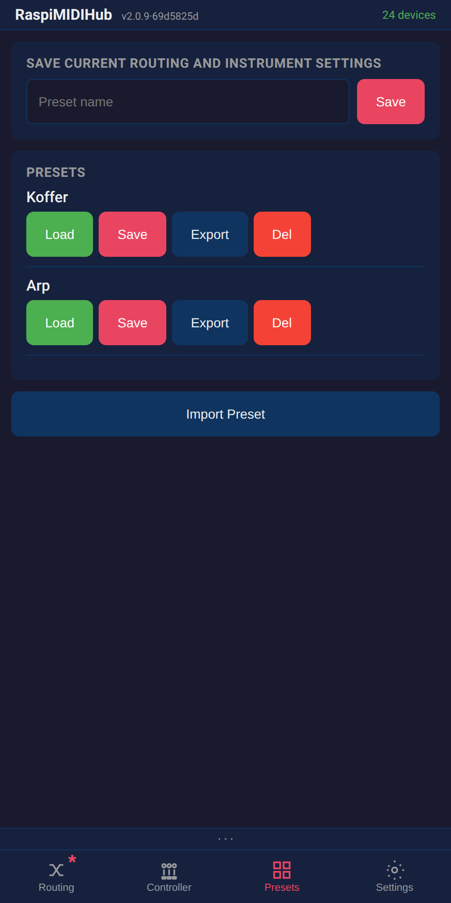
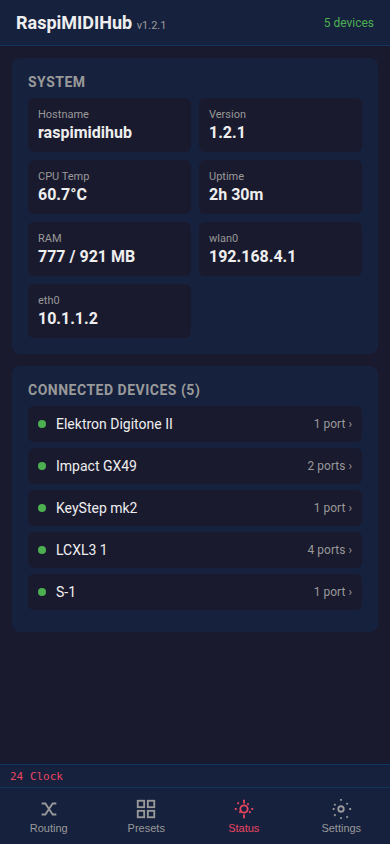

# RaspiMIDIHub — UI Guide

This guide walks through every screen of the RaspiMIDIHub web interface.

---

## Routing Page

The main screen shows the **connection matrix** — a grid where rows are MIDI sources (FROM) and columns are destinations (TO). Tap a cell to connect or disconnect two devices. Purple cells indicate connections with active filters or mappings.

**Offline devices** (saved but unplugged) appear grayed out with their saved connections shown as dimmed checkboxes. You can toggle offline connections on/off — the settings are stored and applied when the device is plugged back in.

A pulsing **▶ play icon** appears next to devices sending MIDI clock. If multiple devices send clock simultaneously (a common misconfiguration), the icon turns orange as a warning.

Tap a device label to see its full name in a toast. Renamed devices also show the original ALSA name in gray.

At the bottom: **Save Config** persists the current routing to disk (survives reboots), **Load Config** reloads the last saved state. **Export Config** / **Import Config** let you back up or transfer the full configuration as JSON. Disconnected connections are also saved and restored.

---

## Filter & Mapping Panel

Long-press (or right-click) a connected cell to open the connection panel. Here you can:

- **MIDI Channels:** Toggle individual channels on/off. Traffic light indicators (red = blocked, green = passing) are colorblind-friendly. Tap the "MIDI Channels" heading to toggle all.
- **Message Types:** Enable/disable notes, CCs, program changes, pitch bend, aftertouch, SysEx, and clock/realtime. Changes apply instantly.
- **Mappings:** View active mappings with Edit/Delete buttons. Tap **+ Add Mapping** to create a new one.

Dismiss the panel by swiping down, tapping X, pressing ESC, or tapping the dark overlay.

Toggling a connection off in the matrix preserves its filters and mappings — they are restored when you re-enable it.

---

## Add / Edit Mapping

The mapping form opens as a sub-overlay. Mapping types:

| Type | Description |
|------|-------------|
| **Note -> CC** | Note on/off sends configurable CC values |
| **Note -> CC (toggle)** | Each note press alternates between two CC values (e.g., mute toggle) |
| **CC -> CC** | Remap CC numbers with input/output range scaling |
| **Channel Remap** | Route all events to a different MIDI channel |

- **Src Ch / Dst Ch:** Filter by source channel and remap to destination channel
- **MIDI Learn:** Press the button, then play a note or move a knob — the source is auto-filled
- **Pass through original event:** When checked, the original note/CC is forwarded alongside the mapped output

---

## Presets Page

Save the current routing as a named preset and recall it later. Useful for switching between different setups at a gig.

- **Save:** Enter a name and tap Save to snapshot the current routing
- **Load:** Activate a saved preset instantly
- **Export/Import:** Share presets as JSON files between devices
- **Delete:** Remove presets you no longer need

Note: After loading a preset, tap **Save Config** on the Routing page to make it the boot default.

---

## Status Page

System overview and device list.

- **System info:** Hostname, version, CPU temperature, uptime, RAM, IP addresses
- **Connected Devices:** Tap a device to open its detail panel

---

## Device Detail Panel

Tap a device on the Status page to open the detail panel (slides up). Features:

- **Device info:** ALSA client ID, USB VID:PID, port types
- **Rename:** Assign a custom device name that persists across reboots (stored by USB topology)
- **Port rename:** For multi-port devices, rename individual ports (e.g., name a DIN output "Octatrack")
- **MIDI Monitor:** Live display of incoming MIDI events with note names (e.g., "Note On ch1 C3 vel=100"). Uses direct DOM updates so it won't interfere with other controls.
- **MIDI Test Sender:** Select channel and port, then use the piano keyboard (one octave, adjustable with +/- octave buttons) and CC slider for testing connections without physical MIDI input

---

## Settings Page

Configuration and system controls.

- **WiFi:** Current mode (AP or client) with clear status badge. Join WiFi or change AP password.
- **Ethernet (eth0):** Configure as DHCP or static IP with address, netmask, gateway, and DNS (8.8.8.8 added automatically for static).
- **MIDI Routing:** Default routing for new devices — "Connect all" (every new device connects to all others) or "None" (new devices start disconnected).
- **Display:** Toggle the persistent MIDI activity bar.
- **Software Update:** Check for updates, view changelog, one-click install (requires internet — easiest via Ethernet cable, which works alongside the WiFi AP).
- **System:** Reboot the Pi remotely.

**Safety net:** If the WiFi connection is lost in client mode, the Pi automatically falls back to AP mode within ~90 seconds. Run `sudo reset-wifi` from a console to force AP mode.

---

## MIDI Activity Bar

A persistent bar above the bottom navigation showing the latest MIDI events from two sources — left and right. Device names are truncated to fit. Clock events are not shown here (they appear as the ▶ indicator in the matrix instead). Entries auto-expire after 2 seconds of inactivity. Toggleable in Settings > Display.

---

## LED Status

| Green ACT LED | Red PWR LED | Meaning |
|---------------|-------------|---------|
| Steady on | Off | Running normally |
| Flickering | Off | MIDI activity |
| Fast blink | On | Config fallback (error) |
| Off | Default | Service stopped |
