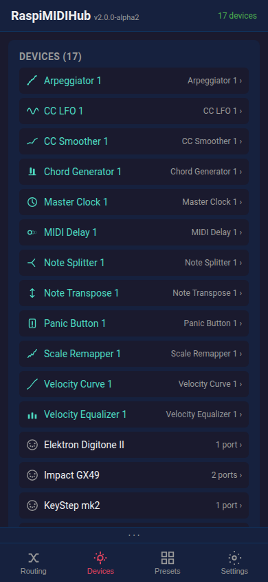

# RaspiMIDIHub -- UI Guide

This guide walks through every screen of the RaspiMIDIHub web interface.

---

## Routing Page

The main screen shows the **connection matrix** -- a grid where rows are MIDI sources (FROM) and columns are destinations (TO). Tap a cell to connect or disconnect two devices. Purple cells indicate connections with active filters or mappings.

**Plugins** appear in the matrix alongside USB devices. Each plugin shows its icon (from `icon.svg`) next to the device name. Live **rate meters** on connection cells show MIDI message throughput.

**Offline devices** (saved but unplugged) appear grayed out with their saved connections shown as dimmed checkboxes. You can toggle offline connections on/off -- the settings are stored and applied when the device is plugged back in.

A pulsing play icon appears next to devices sending MIDI clock. If multiple devices send clock simultaneously (a common misconfiguration), the icon turns orange as a warning.

Tap a device label to open its **device detail panel** directly. Renamed devices also show the original ALSA name in gray.

The **"+" button** in the matrix header lets you add a new plugin instance. Select a plugin type from the list, and it appears as a new device in the matrix with its own IN and OUT ports.

At the bottom: **Save Config** persists the current routing (including plugin states) to disk. **Load Config** reloads the last saved state. **Export Config** / **Import Config** let you back up or transfer the full configuration as JSON.

---

## Filter & Mapping Panel

Long-press (or right-click) a connected cell to open the connection panel. Here you can:

- **MIDI Channels:** Toggle individual channels on/off. Traffic light indicators (red = blocked, green = passing) are colorblind-friendly. Tap the "MIDI Channels" heading to toggle all.
- **Message Types:** Enable/disable notes, CCs, program changes, pitch bend, aftertouch, SysEx, and clock/realtime. Changes apply instantly.
- **Mappings:** View active mappings with Edit/Delete buttons. Tap **+ Add Mapping** to create a new one.

Dismiss the panel by swiping down, tapping X, pressing ESC, or tapping the dark overlay.

Toggling a connection off in the matrix preserves its filters and mappings -- they are restored when you re-enable it.

---

## Add / Edit Mapping

The mapping form opens as a sub-overlay. Controls use **wheels, faders, radio buttons, and toggles** instead of dropdowns for fast editing on stage.

Mapping types:

| Type | Description |
|------|-------------|
| **Note -> CC** | Note on/off sends configurable CC values |
| **Note -> CC (toggle)** | Each note press alternates between two CC values (e.g., mute toggle) |
| **CC -> CC** | Remap CC numbers with input/output range scaling |
| **Channel Remap** | Route all events to a different MIDI channel |

- **Src Ch / Dst Ch:** Filter by source channel and remap to destination channel
- **MIDI Learn:** Press the button, then play a note or move a knob -- the source is auto-filled with visual feedback
- **Pass through original event:** When checked, the original note/CC is forwarded alongside the mapped output

---

## Presets Page

Save the current routing as a named preset and recall it later. Presets now include plugin instances and their parameter values.

- **Save:** Enter a name and tap Save. If the name already exists, a confirmation dialog asks whether to overwrite.
- **Load:** Activate a saved preset instantly -- routing, filters, mappings, and plugin states are all restored.
- **Export/Import:** Share presets as JSON files between devices.
- **Delete:** Remove presets with a confirmation dialog.

Note: After loading a preset, tap **Save Config** on the Routing page to make it the boot default.

---

## Devices Page

The Devices tab shows all connected MIDI devices and active plugin instances.

- **System info:** Hostname, version, CPU temperature, uptime, RAM, IP addresses
- **Load indicator:** CPU and memory usage shown in real time
- **Connected Devices:** Tap a device to open its detail panel
- **Plugin instances:** Listed alongside hardware devices, tap to configure

---

## Device Detail Panel

Tap a device on the Devices page or tap a device label in the routing matrix to open the detail panel (slides up).

### For USB MIDI devices:

- **Editable title:** Rename the device inline from the panel header. Custom names persist across reboots (stored by USB topology).
- **Port rename:** For multi-port devices, rename individual ports (e.g., name a DIN output "Octatrack").
- **MIDI Monitor:** Live display of incoming MIDI events with note names (e.g., "Note On ch1 C3 vel=100"). Uses direct DOM updates so it won't interfere with other controls.
- **MIDI Test Sender:** Scrollable multi-octave piano keyboard with multitouch support, plus CC slider for testing connections.

### For plugin devices:

- **Plugin config panel:** Full parameter UI rendered inside the detail panel. Controls include:
  - **Wheels** -- scrollable drums with momentum and optional labels (e.g., note names on the Scale Remapper root selector)
  - **Faders** -- horizontal or vertical mixer-style sliders with optional scaled display (e.g., "0.5 Hz" on the CC LFO)
  - **Radio buttons** -- pill-style tap-to-select (e.g., waveform shape, scale type)
  - **Toggles** -- metal switches with LED indicators (e.g., clock sync on/off)
  - **Step Editor** -- step sequencer grid with on/off dots and per-step note offsets (arpeggiator)
  - **Curve Editor** -- drawable 128-point curve canvas (velocity curve)
  - **Scope** -- real-time waveform display showing plugin output (CC LFO, CC Smoother)
  - **Meter** -- segmented beat/level indicator (Master Clock)
- **Help button:** "?" icon shows the plugin's extended HELP text with usage examples.
- **Port list:** Input and output ports with connection info.

---

## Settings Page

Configuration and system controls.

- **WiFi:** Current mode (AP or client) with clear status badge. Join WiFi or change AP password.
- **Ethernet (eth0):** Configure as DHCP or static IP with address, netmask, gateway, and DNS.
- **MIDI Routing:** Default routing for new devices -- "Connect all" or "None" (new devices start disconnected).
- **Display:** Toggle the persistent MIDI activity bar.
- **PWA Install:** "Install App" button for adding RaspiMIDIHub to your device's home screen.
- **Reload:** Force-reload the web UI.
- **Software Update:** Check for updates, view changelog, one-click install (requires internet -- easiest via Ethernet cable alongside the WiFi AP).
- **System:** Reboot the Pi remotely.

**Safety net:** If the WiFi connection is lost in client mode, the Pi automatically falls back to AP mode within ~90 seconds. Run `sudo reset-wifi` from a console to force AP mode.

---

## MIDI Activity Bar

A persistent bar above the bottom navigation showing the latest MIDI events from two sources -- left and right. Device names are truncated to fit. Clock events are not shown here (they appear as the play indicator in the matrix instead). Entries auto-expire after 2 seconds of inactivity. Toggleable in Settings > Display.

---

## LED Status

| Green ACT LED | Red PWR LED | Meaning |
|---------------|-------------|---------|
| Steady on | Off | Running normally |
| Flickering | Off | MIDI activity |
| Fast blink | On | Config fallback (error) |
| Off | Default | Service stopped |
