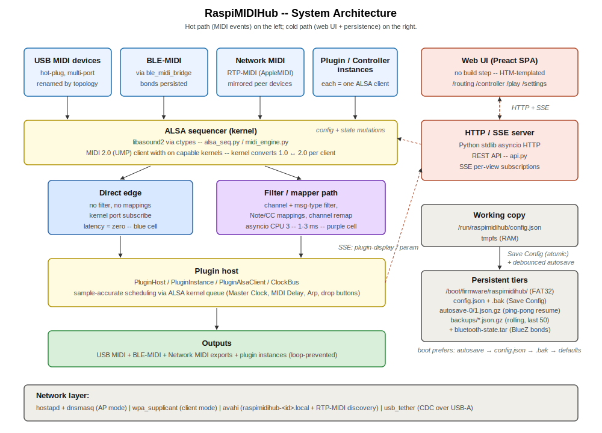
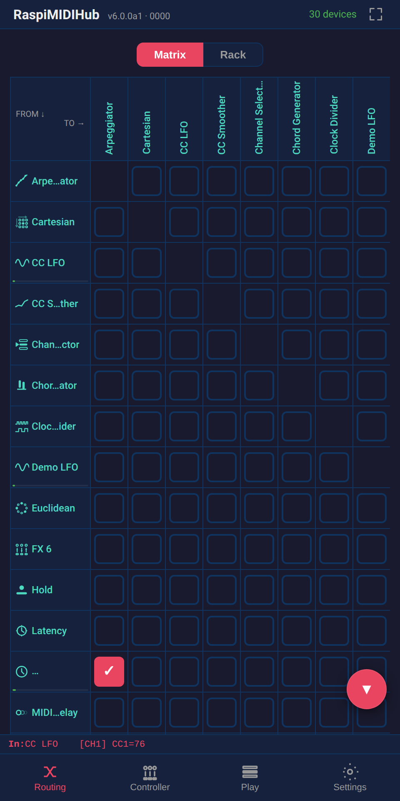

# How It All Fits Together

A short tour of the moving parts under the hood, written for the
user who wants to understand *why* things behave the way they do.
Nothing in this chapter is required to operate the unit; everything
in it pays off when diagnosing edge cases.

## The Top-Level Block Diagram

The MIDI path on the left is the *hot* path -- every MIDI event
goes through it. The web UI on the right is the *cold* path --
configuration changes flow through it and result in routing
updates, but it does not sit in the per-event critical path.

## How MIDI Flows

Every MIDI event takes one of two paths through the appliance:

- **Direct path.** A connection without any filter or mapping is
  wired at the kernel level. Events do not pass through any
  RaspiMIDIHub code at all -- the kernel forwards them straight
  from the source to the destination. Added latency is
  effectively zero (sub-microsecond).
- **Filtered path.** A connection with a channel filter, a
  message-type filter, or any mapping is handled in software. The
  event is received, transformed, and re-emitted. Added latency
  is roughly 1--3 ms.

The routing matrix shows the difference visually: a *red* cell
is the direct path; a *purple* cell is the filtered path. Most
of the time the latency difference does not matter, but the rule
is worth knowing: filters and mappings have a cost; toggling a
filter off temporarily can shave a couple of milliseconds on a
latency-critical chain.

## Plugins Are Virtual Devices

Plugin instances appear as rows and columns in the routing matrix
alongside USB devices and Bluetooth peripherals. From the matrix's
point of view there is no difference -- a plugin has an input port
and an output port, just like a USB synth has an input port and an
output port. The same routing, filtering, and mapping behaviour
that works on USB devices works on plugins.

The play-surface plugins (Tracker, Arpeggiator, Euclidean, Cartesian), the
controllers (Mixer 8, FX 6, Performance 16, XY 4), and every
other plugin are implemented this way. There is no special-case
path for any plugin -- they all live in the same routing graph.

## The Bluetooth MIDI Bridge

BLE-MIDI peripherals do not appear to the operating system as MIDI
devices automatically. RaspiMIDIHub includes its own BLE-MIDI
bridge that handles pairing, GATT subscription, and the BLE-MIDI
framing, then exposes each paired peripheral as a virtual MIDI
device in the routing matrix. From there, the peripheral is
indistinguishable from a USB device.

Chapter 14 covers the user-facing side of BLE-MIDI (pairing,
reconnection, persistence across power-off).

## The Network MIDI Bridge

The network MIDI bridge does for RTP-MIDI (AppleMIDI) what the
BLE bridge does for Bluetooth. On the *export* side, each local
device the user shares is advertised over mDNS as its own
RTP-MIDI session and bridged through a hidden ALSA client -- any
standard RTP-MIDI participant (a second hub, macOS, iOS,
`rtpmidid`) can connect to it. On the *mirror* side, sessions
exported by a peer hub appear as virtual MIDI devices in the
routing matrix, indistinguishable from local hardware to the
routing engine.

The protocol implementation is in-process and journal-free (the
recovery journal of RFC 6295 targets lossy open-internet paths;
on a wired LAN the engine's panic / note-release machinery covers
the residual risk). Discovery and advertising use the
`python3-zeroconf` library alongside the avahi daemon the hub
already runs for `raspimidihub-<id>.local`.

Chapter 17's *Network MIDI* section covers the user-facing side.

## The Web UI Connection

The configuration UI is a single-page web application served by
the Pi. When you open the AP and the captive portal pops the UI,
your browser is loading a small set of static files and then
talking to the Pi over two channels:

- **HTTP** for actions: every tap of Save Config, every change to
  a filter, every plugin parameter edit goes out as an HTTP
  request.
- **Server-Sent Events** for live state: every change in the
  matrix, every MIDI event the UI is asked to show, every plugin
  scope value is pushed back over a long-lived event stream.

The web UI runs on the Pi, but the *rendering* happens on your
phone or tablet. The Pi does not need a display of its own.

### Themes

RaspiMIDIHub ships with two themes -- **Light** and **Dark** --
both selectable from Settings → Display. Light is the daytime
default and is what every screenshot in this manual is captured
in. Dark is the night-rig alternative; first-time visitors with
no saved preference inherit their OS's `prefers-color-scheme`.

{width=42%}

{width=42%}

Every colour the UI paints is declared as a CSS custom property
in `static/themes/_tokens.css`. Each installed theme is one CSS
file in `static/themes/` that overrides a subset of those tokens
inside a `[data-theme="<id>"]` block; missing tokens fall through
to the dark default. The Settings → Display picker reads
`static/themes/manifest.json` at runtime and writes the chosen
id to `<html data-theme="…">` and to the browser's local
storage. Canvas-painting surfaces (the Display scope, the curve
editor, the drop-button ring segments) read the live token
values via a tiny `lib/theme.js` helper so they reskin when the
theme changes too. Adding a third theme is a matter of dropping
one CSS file in the folder and adding a row to the manifest.

### Spectator Mirroring

The spectator feature -- where one browser tab or OBS Browser
Source renders the same UI as another connected device -- lives
in its own module so the core web layer doesn't have to know
about it. Server side: `src/raspimidihub/spectator.py` owns the
per-connection mirror state, the watcher map, the
`spectator-state` fan-out filter, and the four
`/api/spectator/*` routes. It plugs into `web.py` via three
small extension points -- an SSE delivery filter
(`add_sse_filter`), a connection-close hook
(`add_disconnect_handler`), and an extension on
`/api/sse/subscribe` (`add_subscribe_extension`). web.py and
api.py do not contain the word "spectator" outside import lines.

Client side: every spectator-specific module lives under
`static/lib/spectator/` -- the `shared-ui-state` hook, the
source broadcaster, the spectator view, and the touch-ripple
overlay. Two opt-in surfaces remain visible in core code on
purpose, so a developer adding a new overlay or scrollable
container naturally sees the pattern:

- Popovers that should mirror call `useSharedUiState(key, init)`
  in place of `useState`. App-level overlays
  (`contextMenu`, `ccBinding`, `cellBinding`) plus the
  routing-page overlays (`filterConnId`, `showAddPlugin`) do
  this; any new popover should follow suit.
- Scrollable containers carry a `data-spectator-scroll="<key>"`
  attribute. `.main` and the matrix wrapper do this; any new
  internally-scrollable surface (a future tracker editor, an
  inspector panel, …) should add the same attribute to be
  mirrored automatically.

The handful of integration lines in `app.js`
(`SourceAppWrapper`, the `?spectate=` boot branch, the
useSSE callback's watch-start / watch-stop handling) are
clearly marked and pointer-comment back to
`static/lib/spectator/`.

## Configuration Persistence

State on the boot partition (FAT32) comes in three tiers:

- A **working copy** in RAM (tmpfs). This is what the running
  unit reads from and writes to.
- The **persistent copy** (`config.json` + `config.json.bak`) --
  the deliberate **Save Config** checkpoint.
- A rolling **autosave** (two ping-pong slots) of the live edited
  state, plus rolling **backups** of each Save. Boot prefers the
  newest valid autosave, then `config.json`, then `.bak`, then
  defaults.

Tapping **Save Config** copies the working state to the
persistent location with an atomic write (write a temp file,
flush to disk, rename). Pulling the power mid-edit cannot
corrupt the persistent copy because the rename either completes
or doesn't -- and because the autosave is double-buffered and
gzip-CRC validated, a cut mid-autosave still leaves a good slot
to resume from. So a hard power cut resumes the last *edited*
state, not just the last Save (chapter 18.3; chapter 15.6 is the
user-facing description).

Both filesystems are mounted **read-only** during normal
operation -- the root and the boot partition alike. The save
flow briefly remounts `/boot/firmware` rw to land the file (or
the BlueZ snapshot, or a downloaded update deb), syncs, and
remounts it ro again. The main root stays ro throughout.
Chapter 18 documents the read-only model.

## The Reserved CPU

The routing service runs its main loop on a CPU core that is
isolated from the rest of the operating system. The kernel does
not schedule any other userland process or kernel timer on that
core. The effect is that loop-lag spikes from unrelated system
activity (apt updates, log rotation, scheduled backups) cannot
disturb the MIDI path.

The reserved core is what makes the Stats card in **Settings**
typically read sub-millisecond loop lag even on a busy unit.

## The Two Packages

The appliance ships as two Debian packages:

| Package | Role |
|---------|------|
| `raspimidihub` | The routing service, the plugin host, the web UI, the access point |
| `raspimidihub-rosetup` | Read-only filesystem hardening and CPU isolation |

The `raspimidihub-rosetup` package is technically optional -- the
service runs without it on a normal writable root. In practice the
read-only setup is what makes the appliance power-safe, so the
install one-liner installs both.

