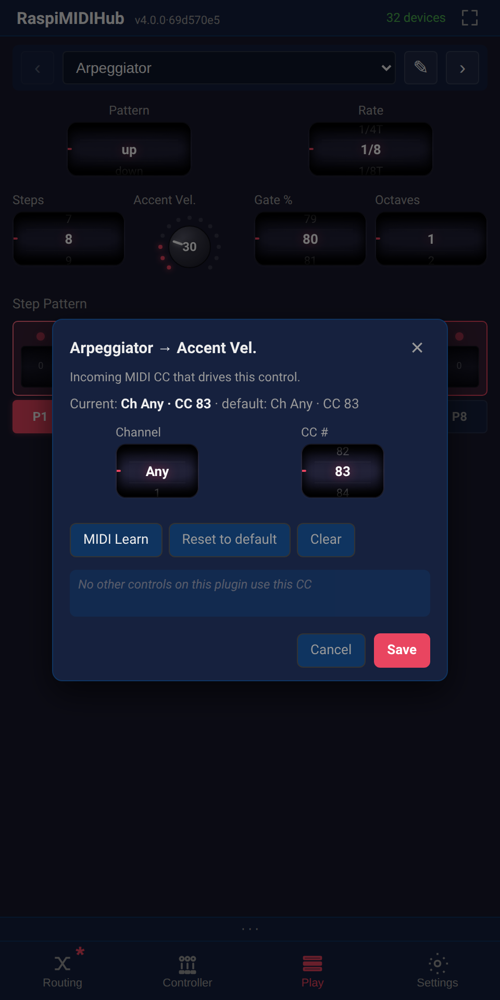

# Plugins and Virtual Instruments

Plugins are virtual MIDI devices in the routing matrix: they consume
MIDI from connected sources, transform it, and emit it to connected
destinations. Per-plugin parameters are in **Appendix A**.

## The Plugin Model

To the matrix an instance is just another device with its own input
and output ports: route, filter, map, and save it like USB hardware.
Behaviour lives in the plugin's configuration panel, routing in the
matrix.

## Adding and Removing Instances

1. Tap **Add** at the bottom of the matrix.
2. Pick a plugin from the **Plugins** section of the overlay.
3. The instance appears as a new row and column.

Multiple instances of one plugin can coexist, each with its own
parameters. **Remove** in the row/column header menu destroys state
and routing; **Copy → Paste-as-new** (chapter 5.8) keeps a duplicate
first.

## Why Plugins Start Unconnected

A new instance has **no** connections (USB devices default to
all-to-all): plugins want deliberate wiring. To make new USB devices
start unconnected too, set the default routing to **None** in
**Settings → MIDI Routing**.

## The Plugin Configuration Panel

Tap the plugin's row or column header. The panel renders the
plugin's parameter UI inline (chapter 3) plus three header controls:

- **Maximize (double-arrow) icon** -- jumps to the plugin's
  fullscreen tab if it has one (controllers to **Controller**;
  Tracker, Arpeggiator, Euclidean, Cartesian to **Play**); the
  **pencil** icon there jumps back.
- **`?`** -- extended help text.
- **`X`** -- closes the panel.

**MIDI Monitor** and **MIDI Test Sender** work as on USB devices:
the monitor streams every event on the plugin's ports, the test
sender fires notes or CCs into its input. Some plugins add live
displays (section 7.8).

## MIDI Clock and Sync

- **Clock-naive** -- ignore clock (**Chord Generator**,
  **Note Splitter**, **Note Transpose**, **Panic Button**,
  **Scale Remapper**, **Velocity Curve**, **Velocity Equalizer**,
  **CC Smoother**, **Hold**, **SysEx Sender**).
- **Clock-consuming** -- driven by incoming MIDI Clock
  (**Arpeggiator**, **Euclidean**, **CC LFO**, **MIDI Delay**,
  **Clock Divider** -- both consumes and produces).
- **Clock-generating** -- emit MIDI Clock (**Master Clock**,
  **Tracker** with **Send Clock** enabled, **Clock Divider**).

Clock consumers have a **Sync** toggle: on, incoming clock schedules
events (no clock routed in leaves the plugin idle); off, an internal
BPM parameter does. The **Master Clock** is the usual source -- one
per project, routed to every clock consumer and to hardware that
wants tempo.

## Sample-Accurate Scheduling

Pre-known events (a **Master Clock** tick, a **MIDI Delay** echo, a
bar-quantised drop-button fire) are pre-scheduled in the kernel and
leave at the exact target time, with sub-millisecond jitter.
Clock-followers (**Arpeggiator**, **Euclidean**, **Cartesian** --
which consumes two subdivisions, one per axis -- and **Tracker**)
fire when the subdivision arrives, so their timing follows the clock
source's quality. Purely event-driven plugins (**Scale Remapper**,
**Note Splitter**) add well under a millisecond.

## CC Automation

Every performance-surface control (Pattern, Rate, Gate, Steps, ...)
can be bound to an incoming MIDI CC: **long-press** (or
**right-click**) the control to open the binding popup.

{width=48%}

- **Current binding** -- channel ("Any" or 1..16) + CC (0..127);
  cleared = no CC drives the control.
- **Reset to factory** -- restores the shipped (channel, CC).
- **MIDI Learn** -- a 30-second listen for the next CC on any routed
  source; cancel anytime.
- **Save / Cancel** -- edits stay local until Save commits them.

The CC value scales to the parameter's full range; the control
animates as CCs arrive, and simultaneous touch + CC input resolves
to one value without flicker.

**MIDI 2.0 controllers** drive bound parameters at full 32-bit
resolution on a capable hub (chapter 17): *fine* parameters (the
CC LFO's Depth and Center) hold fractional values like `63.7` with
one extra decimal; integer parameters hit every step. MIDI 1.0
controllers behave exactly as before.

Bindings are per *instance* and persist in the saved config. There
is no per-plugin CC list in the panel or help -- the popup is the
discovery surface; **Settings → Plugin Control Mappings**
(chapter 12) lists every binding, Appendix A the factory defaults.
If the hardware can't send the wanted CC, a **CC → CC** mapping
(chapter 6) can rewrite the CC number instead of rebinding every
plugin.

## Live Display Outputs

Some plugins render live data in the configuration panel, updating
only while the panel is open:

- **Scope** -- a rolling waveform: **CC LFO** (LFO output),
  **CC Smoother** (input and output side by side).
- **Meter** -- a segmented level / beat indicator: **Master Clock**
  (bar position).

## Per-Instance State

Parameters are project state: saved by **Save Config**, captured
and restored by **Export / Import Config** (chapter 11),
re-instantiated on **Load Config** or reboot. State survives
renaming and re-routing, not removal (re-adding gives defaults);
**Copy → Paste-as-new** clones it.

## The Built-In Plugins

| Plugin | Function |
|--------|----------|
| **Arpeggiator** | Held notes voiced as a step pattern; pattern modes (up, down, up-down, random, as-played, programmed, chord); per-step accent / offset / gate; sustain pedal acts as temporary Hold. *Play-surface plugin* (**Add → Play**) |
| **Cartesian** | René-style 2D grid sequencer; voices a held note (root + per-cell offset); two clocks (X steps the grid along a Path, Y advances inversions); scale-aware Fill Voicing (Unison / 5th / Triad / 7th / Scale); bidirectional Inversion; Live re-fill or Latch; second channel records cell offsets. *Play-surface plugin* (**Add → Play**) |
| **CC LFO** | CC waveforms (sine/triangle/square/saw/sample-and-hold); free or clock-sync up to 8 bars; live scope |
| **CC Smoother** | Removes jitter from noisy CC inputs with configurable smoothing; dual scopes (in / out) |
| **Channel Selector** | Momentary CC buttons each select an output channel; the input channel is ignored and everything is re-stamped onto the active channel. For displayless controllers -- a live "Active Channel" wheel shows the selection. Pair with the matrix's channel filters to choose a destination by button |
| **Chord Generator** | Input note triggers a chord (major / minor / 7th / custom intervals) with inversions |
| **Clock Divider** | Emit one MIDI Clock for every N received (2..32) |
| **Euclidean** | Held notes voiced through a Bjorklund-distributed step pattern; per-step manual overrides on top; chord mode; internal Scale + Root; Jitter, Tune Spread, Fade In / Out. *Play-surface plugin* (**Add → Play**) |
| **Hold** | Latch notes without a sustain pedal; chord-latch or per-note toggle; MIDI-Learn the release note |
| **Latency** | Adds a fixed ms delay (1--100 ms) to every event before forwarding; clock + transport pass through untouched. Compensates synths whose own MIDI-in lands the sound late |
| **Master Clock** | Internal BPM clock with start/stop/continue, beat meter, bar counter |
| **MIDI Delay** | Pre-scheduled echoes with feedback repeats and velocity decay; sync rate or free ms |
| **Note Splitter** | Splits keyboard at a configurable note into two channels with per-zone transpose |
| **Note Transpose** | Shifts all notes up or down by semitones |
| **Panic Button** | All Notes Off; second tap upgrades to All Sound Off |
| **Pitch CC** | Each Note On emits a pitch CC (base value ± semitones from a base note) then the Note On itself — chromatic playback for samplers like the Volca Sample that pitch via CC |
| **Scale Remapper** | Quantizes notes to a scale (major / minor / pentatonic / blues / ...) with labelled root selector |
| **SysEx Sender** | Upload a `.syx` file in the panel; bytes stream to the destination (256-byte chunks, ~5 ms gap; nothing saved) |
| **Tracker** | Hex-numbered 8-voice step sequencer on a dedicated Play panel; per-track MIDI channel; notes / velocity / CC per cell; live recording; keyboard note entry; Cut/Copy/Paste with sub-cell selection. *Play-surface plugin* (**Add → Play**) |
| **Velocity Curve** | Drawable 128-point velocity response curve with shape presets |
| **Velocity Equalizer** | Normalise velocity to a fixed value or compress the range |

The **Tracker**, **Arpeggiator**, **Euclidean** and **Cartesian**
are *play-surface* plugins: normal matrix plugins that also render a
fullscreen surface on the **Play** tab. Add them from **Add → Play**;
workflow in chapter 9, parameters in **Appendix A**.

## User-Supplied Plugins

Plugins you write yourself appear in the **Add** overlay alongside
the built-ins, with the same instance / save / clipboard semantics.
The plugin developer guide in the project repository covers the API
and sandbox restrictions.
