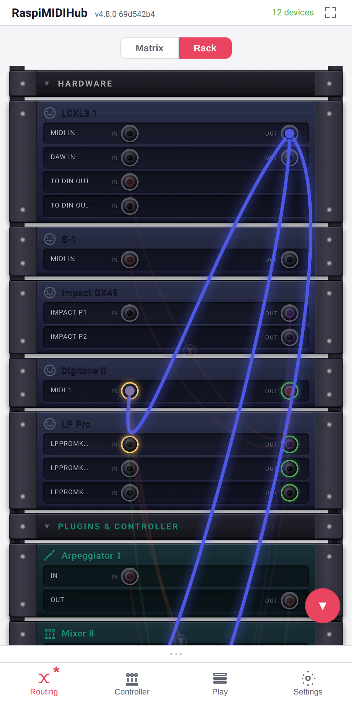

# The Routing Matrix

The **Routing** tab is the central screen of RaspiMIDIHub. Every USB
MIDI device, every Bluetooth MIDI peripheral, every plugin instance,
and every controller instance appears here. Every potential
connection between them can be made on this screen.

The tab offers **two views of the same routing**, switched with the
**Matrix / Rack** toggle at the top:

- **Matrix** -- the dense grid where rows are sources, columns are
  destinations, and each cell is a connection. Best for an at-a-glance
  overview of a whole rig.
- **Rack** -- devices drawn as 19" rack units with cables hanging
  between IN/OUT jacks. Best for following signal flow and for touch.

Both views read and write the *same* connections, filters, mappings
and clipboard, so the cell/header menus, the Add menu and the bottom
bar described in this chapter behave identically in either. The view
choice is a per-browser display preference (like layout density); it
is not part of the saved config. This chapter documents the matrix
first, then the rack.

{width=42%}

## Reading the Grid

Rows are **sources** (FROM). Columns are **destinations** (TO).
Headers along the top show the columns; headers along the left show
the rows. The intersection cell of a source row and a destination
column represents that one connection.

Cells are in one of four visual states:

| Appearance | Meaning |
|------------|---------|
| Empty (unlit) | No connection between this source and destination |
| Lit (red) | Connection active, no filter or mapping applied |
| Lit (purple) | Connection active, with an active filter or mapping |
| Dimmed | Connection saved but at least one side is offline |

A live **rate meter** ticks on every cell with traffic, showing
MIDI message throughput. The clock indicator (a pulsing play icon
next to a row header) marks devices currently sending MIDI Clock;
when more than one device sends clock the icon turns orange to
warn of a typical misconfiguration.

The diagonal -- a device's own row meeting its own column -- is
always blocked. Self-connections would feed a device into itself
and the loop-prevention logic disallows them.

The row-header column on the left is held to a fixed narrow
width (~96 px) so the rest of the matrix gets the room. Long
device names are middle-truncated to fit (`Velocity Equalizer
1 → Velo…ar 1`); tapping a row header opens its context menu
with the full name at the top of the menu.

Row and column headers are colour-tinted by device category:
teal for plugins, blue for Bluetooth, violet for devices mirrored
from a peer hub over Network MIDI (which also carry a two-node
link icon).

## Remote Hub Groups

Devices mirrored from a peer hub (chapter 17's *Network MIDI*
section) sit at the bottom of the matrix, grouped under a violet
header row per hub -- `@hub2 · 3 devices`. Tapping the group row
collapses or expands the hub: collapsing hides the hub's **rows
and columns** entirely (the group row stays as the re-expand
handle), keeping the grid compact when the far end shares more
than you currently need. The collapse state is a per-browser
display preference, like layout density -- it is not part of the
saved config.

The matrix row shows the device's bare name ("TX-7"); the group
header carries the hub, and the context menu's title line shows
the full `TX-7 @hub2` so twin device names across hubs stay
unambiguous.

When the peer hub goes offline, its mirrored devices behave
exactly like unplugged hardware: rows and columns stay, dimmed,
with all connections, filters and mappings intact, and everything
reconnects by itself when the peer comes back.

## The Rack View

Flip the **Rack** toggle and the grid becomes a 19" rack. Each
device is a rack unit -- its name and icon at the top-left, its
ports listed below as rows: an **IN** jack (where the device
receives) on the left, an **OUT** jack (where it sends) pushed to
the right. Hardware sits at the top, then plugins and controllers,
then one collapsible sub-rack per Network-MIDI peer hub. Group
blendes collapse and expand exactly as the matrix's hub groups do,
sharing the same per-browser state -- fold a hub in one view and it
is folded in the other.

Connections are **cables** that hang between jacks, one colour per
source port so a strand stays recognisable where it crosses others.
A small **funnel badge** sits on a cable that carries a filter or
mapping. Port jacks glow on MIDI activity; a jack that is sending
MIDI Clock gets a green ring.

**Patching.** Make a connection by tapping a jack and then its
counterpart -- tap an OUT then an IN (or the reverse); valid targets
pulse while one end is chosen. You can also **drag** from one jack to
the other; while dragging, thin auto-scroll zones appear at the top
and bottom edges so you can reach a unit that is off-screen, and the
target jack shows an expanding "insert here" ring.

**Inspecting and editing.** Hover (desktop) or **press and hold**
(touch) a jack to spotlight just its cables -- the others dim and the
highlighted ones fan apart so a single cable is easy to pick out; the
highlight stays until you pick another jack or tap the same one
again. Tap a cable (or its funnel badge) to open the connection's
menu -- the same Edit / Copy / Paste / Remove menu as a matrix cell,
where **Edit** opens the filter & mapping panel. Press and hold (or
right-click) a unit's faceplate for its device menu -- Rename, Edit,
and the plugin/network actions, identical to the matrix's header
menu. The **+ Add Device** button at the foot opens the same Add
menu as the matrix.

{width=42%}

## The Cell Context Menu

Tapping a cell opens its context menu. The entries depend on the
cell state:

**Empty cell.**

- **Add connection** -- enables the connection with the default
  empty filter (all channels, all message types pass).
- **Paste** -- pastes the cell clipboard contents (filter +
  mappings) and enables the connection. Visible only when the
  clipboard holds a cell payload.

**Connected cell.**

- **Edit** -- opens the filter and mappings panel (chapter 10).
- **Copy** -- copies the filter + mappings to the cell clipboard.
- **Paste** -- overwrites the cell's filter + mappings from the
  clipboard, keeping the connection enabled.
- **Remove** -- disables the connection. The filter and mappings
  are *not* discarded; re-enabling the cell restores them.

## Row and Column Header Menus

Tapping a row or column header opens a menu of device-level actions:

- **Edit** -- opens the device-detail panel. For USB devices, this
  is the rename + MIDI monitor + test-sender panel. For plugins,
  it is the plugin-config panel.
- **Copy / Paste** (controllers, plugins) -- copies the whole
  instance. Paste creates a new instance with all parameters
  cloned.
- **Reconnect / Disconnect / Forget** (Bluetooth devices) --
  chapter 14.
- **Unmirror** (network devices) -- drops the mirrored device from
  this hub's matrix. The peer's export is untouched; the session
  stays discoverable and can be re-added from the Add menu or
  Settings → Network MIDI.
- **Rename** -- inline edit of the displayed name. The original
  ALSA name remains shown in grey alongside.

## Adding and Renaming Devices

USB devices appear as soon as they are plugged in. Custom names
follow the device: hardware with a real USB serial number is
recognised on any port, and a serial-less device is matched by
vendor/product ID when it is the only one of its model -- so
re-plugging into a different port restores the name and routing in
both cases. Only *identical serial-less* devices used side by side
stay bound to their ports (chapter 5, "Device Topology and
Renames").

Multi-port devices (some interfaces expose multiple MIDI ports per
USB connection) appear as one row and one column *per port*.
Individual ports can be renamed; the **Octatrack** DIN output, for
example, can be named explicitly instead of appearing as
`<Device> Port 2`.

## Offline Devices

When a saved device is unplugged, it does not disappear from the
matrix. Its row and column stay visible, dimmed, with any saved
connections still shown as toggleable cells. This means you can
build up routing in advance and only physically connect the gear
when you are ready, or recover from a cable getting kicked out
without losing the routing state.

The dimmed cells can still be toggled on or off; the changes apply
the moment the device is plugged back in. Offline cells in the
purple state (filtered / mapped) keep their filter and mapping
state through the offline period.

## The Clipboard

The matrix supports three clipboards, each with its own scope:

| Clipboard | Holds | Pasted by |
|-----------|-------|-----------|
| **Cell clipboard** | One cell's filter + mappings | Pasting onto any cell |
| **Plugin clipboard** | One plugin instance with all parameters | Pasting from a plugin's header menu |
| **Mapping clipboard** | One mapping (Note → CC, CC → CC, ...) | Pasting from the **+ Paste Mapping** button in the filter panel |

The cell clipboard and the mapping clipboard interact with their
own paste-conflict resolution:

- **Cell paste** overwrites the destination cell's filter and
  mappings wholesale.
- **Mapping paste-with-bump** auto-resolves duplicate CC conflicts
  by bumping the pasted mapping onto the next free slot.

The plugin clipboard duplicates the *instance*: a Mixer 8 with all
its renamed cells, learned CCs, drop-button captures, and theme
choices can be cloned for a second venue by Copy on the original,
Paste on the matrix, and renaming the duplicate.

## The Add Menu

The **Add** button at the bottom of the matrix opens an overlay
with four sections, each grouping addable instances by what they
do:

1. **Plugins** -- routing-graph plugins that consume / transform /
   produce MIDI events: CC LFO, CC Smoother, Chord Generator, Clock
   Divider, Hold, Master Clock, MIDI Delay, Note Splitter, Note
   Transpose, Panic Button, Pitch CC, Scale Remapper, SysEx Sender,
   Velocity Curve, Velocity Equalizer (chapter 11). Tapping an
   entry creates a new instance and adds it to the matrix.
2. **Controllers** -- the four play-surface templates (Mixer 8,
   FX 6, Performance 16, XY 4) that live on the **Controller** tab.
   See chapter 12.
3. **Play** -- fullscreen play surfaces that live on the **Play**
   tab. Currently the Tracker, the Arpeggiator and the Euclidean
   (chapter 13; per-plugin parameter tables in Appendix A).
4. **Bluetooth MIDI** -- a Scan button and a list of paired
   peripherals. See chapter 14 for the pairing flow.
5. **Network MIDI** (when enabled in Settings) -- discovered but
   unmirrored RTP-MIDI sessions: peer-hub exports you previously
   unmirrored, and foreign sessions from Macs / iPads / DAWs,
   which never mirror automatically. **Add** mirrors one into the
   matrix. See chapter 17's *Network MIDI* section.

User-supplied plugins discovered at startup appear in the
appropriate section based on their declared surface kind.

## The Bottom Bar -- Save, Load, Export, Import

Four buttons run across the bottom of the matrix:

- **Save Config** -- persists the current in-memory state to disk
  as the boot default, and drops a rolling backup checkpoint
  (Settings -> Backup, chapter 16). Clears the dirty-state asterisk.
- **Load Config** -- reloads the last saved state (the deliberate
  Save, not the autosave). Plugin instances that exist only in
  memory (unsaved) are stopped and discarded.
- **Export Config** -- downloads the current state as a JSON file.
  Useful for backing up before a risky experiment.
- **Import Config** -- uploads a JSON file and replaces the current
  state. The import is validated before commit; a partial / corrupt
  file is rejected with an error.

**Save Config** is the most-used button in the UI. The dirty-state
asterisk on the bottom-nav **Routing** icon is the reminder to use
it -- though edits are also autosaved in the background, so a hard
power cut resumes your last edit even before you Save (chapter 15.6).

## The Dirty-State Asterisk

A dark-red `*` next to the **Routing** icon in the bottom navigation
lights up whenever any of the following diverges from the saved
config:

- A connection added or removed
- A filter or mapping edited
- A plugin instance added, removed, or a saveable parameter changed
- A controller instance added, removed, or its cells renamed /
  rebound (labels, bindings, theme, drop-button settings)
- A device renamed
- A port renamed

**Performing does not light it.** Live play — moving a fader / knob /
XY pad, launching or switching Tracker patterns, firing or cancelling
a drop button — changes no saveable content, so it leaves the
asterisk clear and triggers no autosave. Only edits to the saved
state do. (Capturing a drop snapshot *is* an edit and does count.)

The asterisk is *only* about persistence. The unit runs perfectly
fine with unsaved state; the next reboot is the only thing that
loses it -- and even then the background autosave (chapter 15.6)
resumes your last edit.

## The Direct-Path vs Filter-Path Distinction

Connections without a filter and without mappings are wired
directly in the ALSA kernel sequencer -- effectively zero added
latency, no userspace involvement after setup. Connections with any
filter or mapping go through the userspace filter/mapper, adding
roughly 1--3 ms. Most of the time this distinction does not matter
in practice, but it is the reason the matrix differentiates red
(direct) from purple (filtered/mapped) cells: the colour also
hints at the latency profile.

See chapter 4 for the architectural details.

Screenshots needed:

- `09-matrix-remote-hub-group.png` -- the matrix with a second
  hub's devices mirrored: the violet `@hub2` group row expanded
  with two device rows, and a second capture collapsed. Needs two
  real hubs on one network; not coverable by the scripted scenes.
- `01-routing-rack.png` -- the Routing tab on the **Rack** toggle.
  Wired as the `_open_rack_view` scene in `scripts/screenshots/run.py`
  (pre-setup phase, like `01-routing`), so it regenerates with
  `make screenshots`. The committed shot was captured against a live
  rig; rerun to refresh against the curated demo set if desired.
