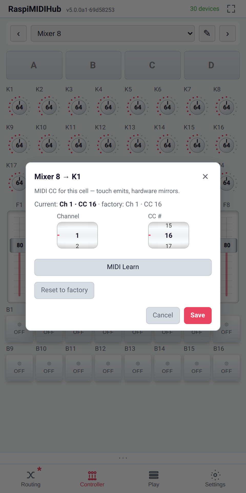
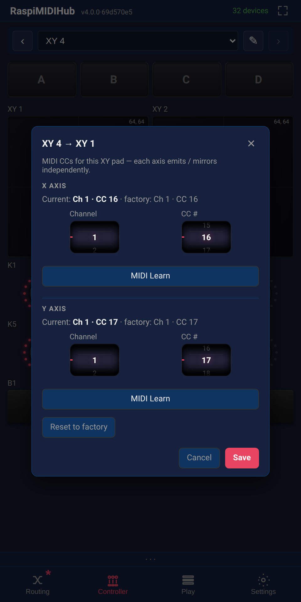

# Controllers and Play Surfaces

Controllers are fullscreen tap-to-play surfaces that send CCs over
MIDI. They live in the **Controller** tab, which appears in the
bottom navigation as soon as at least one controller instance has
been added. This chapter covers the cross-controller features --
the play surface, the drop buttons, the themes, the configuration
panel. The per-controller layout reference is in **Appendix B**.

## The Four Templates

Four controller templates ship out of the box. Each is added from
the **Add → Controller** section of the routing matrix overlay.

| Controller | Layout | Default CC range |
|------------|--------|------------------|
| **Mixer 8** | 24 knobs / 8 faders / 16 buttons | CC 16--63 ch 1 |
| **FX 6** | 18 knobs / 6 faders / 6 buttons | CC 16--45 ch 1 |
| **Performance 16** | 16 macro knobs + 4 scene buttons | CC 16--35 ch 1 |
| **XY 4** | 2 XY pads + 8 knobs + 4 buttons | CC 16--31 ch 1 |

Multiple instances of the same template can coexist. The
**Controller** tab shows them with a top-bar selector; swipe
left / right or use the arrows / dropdown to switch between
instances. The last-viewed instance is remembered across reloads.

{width=42%}

{width=42%}

{width=42%}

{width=42%}

## The Play Surface

Each controller template renders a different surface. What is
universal:

- **Every cell sends one CC** on one channel, with an **On** value
  and an **Off** value. Knobs and faders send the dragged value;
  buttons toggle between On and Off; XY pads send two CCs (one
  per axis).
- **Symmetric in / out** -- an incoming CC with the same (channel,
  CC) silently mirrors the on-screen cell. Touch emits, hardware
  mirrors -- one number, both directions.
- **Long-press to rebind a cell** -- hold any cell on the
  Controller page and the *cell-binding popup* opens. Pick a
  channel + CC manually, MIDI-Learn from a hardware twist, or
  **Reset to factory** to restore the template's wiring. Same
  popup as the plugin-control popup (chapter 11.7), but the
  binding is symmetric.
- **XY pads have per-axis MIDI Learn** -- the cell-binding popup
  grows to two axis sections (X / Y), each with its own
  Channel + CC + Learn button. Save commits both axes at once.

The label, button **On / Off** values, and XY-pad spring config
live in the *plugin config* panel (section 12.7) -- not in the
long-press popup, which is binding-only.

{width=48%}

{width=48%}

## Drop Buttons

Each controller has a row of four **drop buttons** above the play
surface. A drop button is a *snapshot trigger*: long-press it to
capture the current state of every cell on the controller, then
tap to fire that snapshot back.

The drop-button row is part of the controller surface, not a
separate widget. It is always visible while the controller is
shown.

### Capturing

Long-press a drop button for around 600 ms. The button flashes
once to confirm; the current values of every cell on the
controller are captured into that button's slot. The capture also
fires when a learned MIDI trigger note arrives (see *Trigger
notes* below).

### Firing

A tap on the captured drop button fires the snapshot. What
"firing" means depends on the mode and the sync state:

- **Mode = Now** with **Sync = off** -- every cell jumps to its
  captured value immediately.
- **Mode = Bar / 2-Bar / 4-Bar / 8-Bar / 16-Bar** with
  **Sync = on** -- the snapshot is pre-scheduled to land *at* the
  next bar (or 2/4/8/16-bar) boundary of the master clock. The
  ALSA queue handles the scheduling for sub-millisecond accuracy.
- **Fade-on-fire = on** -- the snapshot is interpolated over the
  cycle instead of being applied in one step. Each cell sweeps
  smoothly from its current value to the captured value across
  the bar (or 2/4/8/16-bar) length.
- **Fade-on-fire = off** -- the snapshot is applied in a single
  step at the scheduled boundary.

### The Progress Ring

A segmented arc around the drop button shows the progress of a
scheduled fire. It peach-pulses while the snapshot is scheduled
but not yet fired and freezes if MIDI Stop arrives mid-cycle.

### Trigger Notes

A drop button can be armed by a learned MIDI note: receive the
note on any channel routed to the controller, and the button
fires (or captures, depending on which Learn flow you used) just
as if you tapped it.

### Dual-Slot Scheduling

One **fade** and one **hard drop** can be queued side by side --
useful for, say, fading a filter sweep while pre-scheduling a
hard cut on the next bar. Two fades cannot overlap; the second
overrides the first.

## Themes

Each controller carries its own theme. Eight dark themes ship:

- Default
- Navy
- Forest
- Wine
- Plum
- Teal
- Sienna
- Slate

Theme is **per controller instance**, not global. A Mixer 8 in
Forest and an FX 6 in Wine can sit side by side in the bottom-nav
without affecting each other. The theme is chosen from the
controller's plugin config panel.

## XY Pad Spring

XY pads (on the **XY 4** controller) optionally spring back to a
home position when released. Per-cell:

- **Force** -- 0--127. Zero disables the spring; higher values
  pull the dot back faster.
- **Home** -- Bottom-left or Centre. The position the dot returns
  to when released.

With spring on, releasing the pad fires a CC event for each axis
as the dot returns. With spring off, releasing leaves the dot
where it was; the next CC event happens only when the pad is
touched again.

## The Controller Tab

The **Controller** tab is the fullscreen play surface. Top-bar
controls:

- **Instance selector** -- name of the current controller, with
  arrows / swipe / dropdown to switch.
- **Pencil icon** -- opens the controller's *plugin config* in
  the device-detail panel without leaving the controller tab.

The bottom of the tab shows the standard MIDI activity bar
(section 6.9) when enabled in Settings.

## The Configuration Panel

Tapping the pencil on the controller tab (or tapping the
controller's row / column header in the routing matrix) opens the
*plugin config* view. It is a flat list of every cell on the
controller -- each card carries the parts of a cell's
configuration that aren't part of the (channel, CC) binding:

- **Cell label** -- rename the on-screen text; blank to fall back
  to the template default.
- **Button On / Off values** (button cells only) -- the CC values
  sent on press / release; a `↔` swap inverts them.
- **XY pad spring config** (XY pad cells only) -- spring force
  (0..127; 0 = off) and spring home (Bottom-left / Center) drive
  the auto-release animation.

The cell's MIDI binding (Channel, CC, Learn) is **not** here --
long-press the cell on the Controller page for that. Settings →
Plugin Control Mappings (chapter 16) lists every cell's current
binding in a single table if you want a global view.

Each of the four drop buttons gets its own card with:

- **Sync to bars** toggle
- **Fade on fire** toggle
- **Mode** radio (Now / Bar / 2-Bar / 4-Bar / 8-Bar / 16-Bar)
- **Trg. Note** field + Learn button

A **Maximize** button at the top of the config panel jumps back
to the fullscreen Controller tab.

## Routing a Controller

In the routing matrix, a controller is a **row** (it sends MIDI)
*and* a useful destination column. Route its row to the device
you want to drive (a hardware synth, the DAW, a plugin like the
**CC Smoother**); route a source *into* the controller when you
want any of the following:

- **MIDI-Learn capture.** Cell-level Learn (chapter 10) listens on
  the controller's IN port -- the source you want to learn from
  must be routed to the controller for the next CC to reach the
  learn logic.
- **Drop-button trigger notes.** Trigger notes (12.3.5) arrive on
  the controller's IN port; route the keyboard or pad that fires
  them to the controller.
- **Hardware-to-on-screen feedback (mirroring).** Route a hardware
  controller (e.g. a Launch Control XL) to the matching software
  controller and the on-screen faders / knobs / pads will follow
  the hardware in real time. For every cell whose (channel, CC#)
  binding matches the incoming CC the cell's stored value is
  updated silently -- nothing is re-emitted to OUT, so there's no
  routing loop. This is the standard pattern for keeping a
  physical control surface and its software twin in lock-step,
  and is what makes snapshot capture, drop fades, and theme-level
  visual feedback reflect the real hardware state.

For the common live setup the recipe is therefore: route the
hardware controller to the software controller (mirroring), and
route the software controller to the destination device(s) (the
actual MIDI work).

## Saving Controller State

Cell renames, learned CCs, theme choices, and captured drop-button
snapshots are part of the project state. **Save Config** persists
them; **Export Config** captures them in a JSON snapshot (chapter
15). Removing a controller instance discards its state; cloning
it (Copy → Paste-as-new from the header menu) duplicates the
state.

What is **not** saved -- and so does not light the dirty-state
asterisk (chapter 9.9) -- is *performing*: moving a fader / knob /
XY pad, and **firing or cancelling a drop button**. Those are live
play, not edits, so a gig of pad-firing leaves the config clean and
triggers no autosave. **Capturing** a drop (long-press) *does*
count -- it writes a new snapshot into the saved state -- as do cell
renames, rebinds, theme changes, and drop-button settings (mode,
label, fade/sync).

