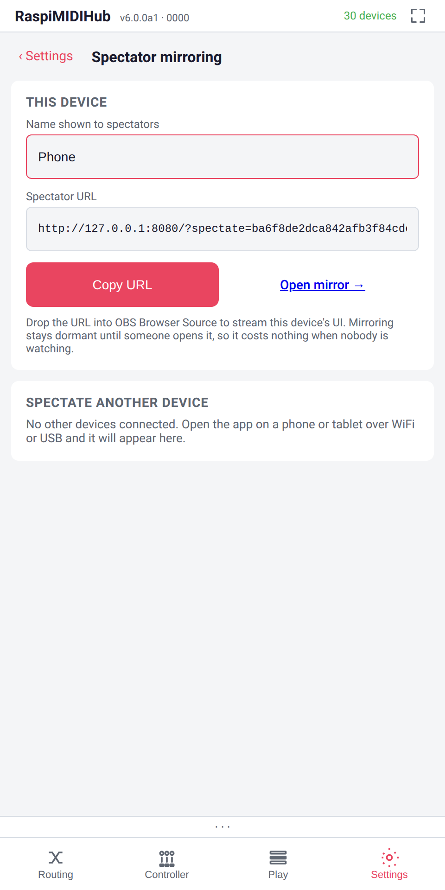
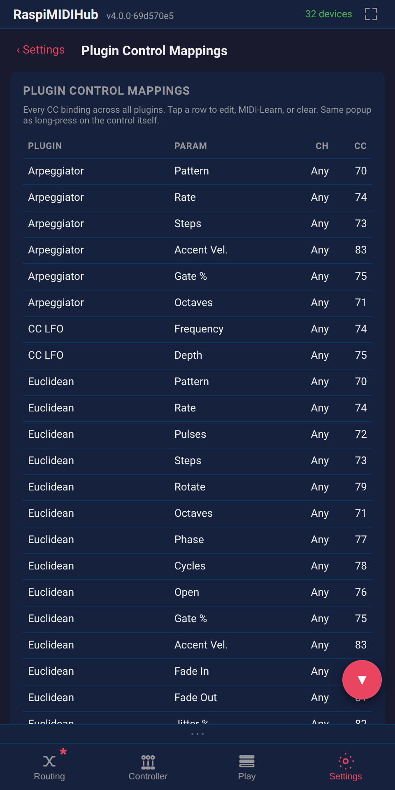

# Settings

The **Settings** tab is a hub of sub-pages: one card each, opening
under a `< Settings / <title>` back-bar. The active sub-page is part
of the URL (`/settings/<section>`); the bottom-nav remembers your
last sub-page across tab switches.

| Sub-page | What lives there |
|---|---|
| **Sys Info** | Live system stats (version, CPU, RAM, latency, IPs), **Reload App**, **Reboot Pi**, **Factory Reset** |
| **Network** | WiFi card with mode picker + home / AP credentials, USB-tether status, Ethernet config |
| **MIDI** | Default routing for newly-plugged-in devices (all-to-all / disconnected — **disconnected by default**) |
| **Display** | Per-device browser preferences — activity bar, knob/wheel tick sounds, scroll-assist FABs, layout density |
| **Update** | Check GitHub, manage stored versions, install |
| **Plugin Control Mappings** | Flat editable table of every CC binding across every plugin instance and every controller cell |
| **Backup** | Restore or download a rolling save checkpoint (see **Backup** below) |
| **Network MIDI** | Export local devices as RTP-MIDI sessions for a second hub, Macs, iPads (see **Network MIDI** below) |

(plus **Spectator mirroring**, documented below.)

Most Settings changes bypass the dirty-state asterisk (chapter 6.4)
and apply the moment you save them. The exceptions (default routing;
the activity-bar toggle) are noted in their subsections.

## Spectator mirroring

{width=48%}

Streams a device's UI into OBS (or another browser tab) with
effectively zero latency — no screen-capture, no `scrcpy`. The
mirror URL `/?spectate=<conn_id>` re-renders the target device's
view, including touch ripples where it is tapped; OBS Browser
Source renders it natively at any resolution.

### This device

- **Name shown to spectators** — the label others see instead of a
  short UUID. Per-device, persisted to localStorage; empty allowed.
- **Spectator URL** — what a tab or OBS opens to mirror *this*
  device. Copy it, or tap **Open mirror →** to test. The copied URL
  includes `&touches=1` (touch ripples); remove it for a feed
  without the pointer trail.

Mirroring costs the source nothing until a spectator opens the URL,
and stops when the last one closes — zero CPU and bandwidth on
phones nobody is watching.

### Spectate another device

A live list of every other RaspiMIDIHub tab on the Pi: label (or
short UUID), viewport size, how recently it published state.
Tapping opens the mirror in a new tab.

The mirror adopts the source's viewport size, density and theme and
mirrors every popup (context menu, CC-binding with live wheel
values, Cell-binding, Plugin Control Mappings), the matrix
horizontal scroll, the bottom-bar toast, the Save/Load/Panic button
state, and — in the rack view — the cable highlight and a live
patch cable being dragged. Touch ripples paint where the source is
touched (`?touches=1`, default on). If the source disconnects, the
mirror shows "Source disconnected" and waits.

### Presentation knobs

Four optional query params control the mirror's presentation:

- **`frame=1`** — a stylised phone bezel (rounded corners, speaker
  slot, home indicator). Default off.
- **`chroma=<color>`** — paints the backdrop *around* the mirror
  (`#ff00ff`, `magenta`, any CSS colour); frame and mirror stay
  opaque, so an OBS Chroma Key filter on that colour cuts the device
  out cleanly. Default: the regular dark UI background.
- **`tilt-x=<deg>` / `tilt-y=<deg>`** — 3D rotation for a
  perspective shot. Clamps at ±35°.

A floating panel top-right wires these up: frame toggle, tilt
sliders, chroma picker with magenta / green / black / default
chips, **Reset tilt**, **Copy URL**. It fades after 2.5 s of
pointer inactivity — and since OBS sends no pointer events, it
stays invisible in the feed. Faster tilt: drag anywhere on the
backdrop; the URL rewrites live, so the adjusted view is shareable.

### Use in OBS

{width=42%}

1. Open the spectator URL in a browser tab; adjust frame, tilt,
   chroma.
2. Click **Copy URL**.
3. In OBS: **Sources → + → Browser**. Paste the URL; set width and
   height to your scene region (e.g. 1080×1920 for a vertical phone
   capture).
4. For chroma, add a **Chroma Key** filter on the Browser Source
   with the same colour and adjust similarity.

Scrollbars are hidden across the spectator document so OBS never
paints them onto the feed.

## Plugin Control Mappings

{width=48%}

One row per CC binding across every plugin instance. Columns:

- **Plugin** — the instance's display name.
- **Param** — the control's label; controller cells use the cell
  label, XY pads expand to two rows with `(X)` / `(Y)` suffixes.
- **Ch** — channel (`Any` or 1..16).
- **CC** — the CC number (`—`, dimmed, for a cleared binding).

Tap a row to open the same long-press popup as on the control —
CcBinding for plugin params (chapter 11.7), CellBinding for
controller cells (chapter 12): Edit, MIDI Learn, Reset to factory,
Clear, Save. The table is live — edits from anywhere and instance
renames appear within milliseconds.

With no plugin instances, a placeholder points at the Routing tab's
**Add** button — this page edits existing bindings only.

## Backup

Rolling save checkpoints: every **Save Config** (chapter 15.2)
writes a compressed copy of the whole project state here, newest
first; the last 50 are kept. Distinct from the background
**autosave** (chapter 15.6).

A **Last autosave** line at the top shows how long ago the
resume-snapshot was written (`30s ago`, `2 min ago`, …), **before
last reboot** if from a previous boot, or **no autosave yet**. It
reflects page-load time; **↻** re-reads it and the list.

{width=42%}

Each row shows:

- **#number** — monotonic; orders checkpoints even across reboots.
- **When** — a relative "n ago". No real-time clock, so age is
  uptime-based and only honest within the current boot; older
  checkpoints show **before last reboot**, ordered by `#number`
  alone.
- **Summary** — a coarse diff vs. the previous checkpoint, counting
  instruments, connections, mappings, device names ("+1 instrument ·
  −18 mappings"). If none moved: **"settings changed"** when
  anything else differs (renamed cell, re-bound CC, edited plugin
  parameter…), **"(no changes)"** when identical, **"(initial)"**
  for the first. The stored copy always holds the *full* state — a
  Restore is faithful regardless of the summary.
- **Size** — compressed size.

Per-row actions:

- **Restore** replaces the live config with the checkpoint (plugins
  stopped and recreated, routing re-diffed) and lights the dirty
  asterisk: **Save Config** commits it as the new boot default,
  **Load Config** returns to your last Save. A Restore is autosaved
  immediately, so it survives a power cut before you Save.
- **Download** saves the checkpoint as plain JSON
  (`raspimidihub-backup-NNNNN.json`) — the same format **Export
  Config** produces, re-importable anywhere.

A never-Saved fresh unit shows a placeholder.

## WiFi

A single card: WiFi status badge plus rows for credentials and mode.

### Status badge

One line: AP mode SSID, client mode SSID + IP, or "Bringing up..."
during a transition. Colour mirrors the state.

### Home WiFi

**SSID** and **Password**; saving provisions the home network for
the **WiFi for updates** and **WiFi always** modes. These
credentials are part of the saved project state and appear in
**Export Config** JSON — edit the WiFi section out before sharing
an export (chapter 15.8).

### AP Password

Sets the access-point password; minimum 8 characters (WPA2). Saving
restarts the AP briefly — the phone drops and reconnects with the
new password.

::: warning
The default AP password is `midihub1` and is published. Change it
the first time the unit is used outside a personal home.
:::

### AP radio

- **Band** — **2.4 GHz** (default) works on every supported Pi with
  the longest range, but shares the combo-chip radio with Bluetooth
  and can disrupt BLE-MIDI on Pi 3-class boards (chapter 14,
  *Limits*). **5 GHz** stops that competition — the fix for flaky
  BLE-MIDI on a 5 GHz-capable Pi (3B+, 4, 5) — but has shorter
  range and needs a 5 GHz-capable phone. Greyed out on radios that
  can't do it (Pi 3B, Zero 2 W).
- **Country** — the regulatory domain. **Auto-detect** uses the
  Pi's kernel regdomain (fallback DE). Must match where the Pi is
  used; **required for 5 GHz**.

Saving restarts the AP (phones drop a few seconds). 5 GHz uses a
non-DFS channel (36/40/44/48), so no radar-detection wait; if
bring-up fails, the Pi falls back to 2.4 GHz automatically — the AP
always comes back up.

### WiFi mode

- **AP only** — the default. AP broadcast, never a client, no
  internet on the Pi.
- **WiFi for updates** — AP stays up at idle; an update briefly
  flips `wlan0` to client to fetch the deb, then back. The AP drops
  for ~30 seconds.
- **WiFi always** — AP off; the Pi is a normal WiFi client. For
  units permanently on a home or venue network.

### USB-tethered phone link

With a phone USB-tethered (chapter 17.4), the card shows the
tethered URL as a clickable "Open http://x.y.z.w/ on your phone"
row — a quick switch to the faster link.

## Ethernet (eth0)

- **DHCP** — the default; right for most home routers.
- **Static** — Address, Netmask, Gateway, DNS.

When `eth0` is connected, the card lists **every** IPv4 address it
holds — often a DHCP lease (or static address) *and* the
`169.254.x.y` address tagged *(link-local)*, which is always
present while `eth0` is up, independent of the Network MIDI toggle
(chapter 17, *direct cable*). If it is the *only* address, no DHCP
answered and nothing static is set — two hubs on a back-to-back
cable still reach each other over it. The same addresses appear on
**Sys Info**.

## Network MIDI

Shares local MIDI devices as standard RTP-MIDI (AppleMIDI)
sessions — concept, compatible clients, and wire details in chapter
17's *Network MIDI* section. The controls:

- **Share devices over the network** — master toggle; advertising
  and discovery run only while on.
- **Exported devices** — one checkbox per online local device.
  Ticking advertises it as `"<name> @<hostname>"`; the sub-line
  shows the session name and connected client count.
- **Remote hubs** — everything discovered, grouped per hub.
  Peer-hub sessions mirror into the matrix automatically; each row
  shows a state dot (green connected / amber connecting / grey
  discovered), the link latency, the peer's **IP address and port**
  (`169.254.16.8:5004` — the address in use, for diagnosing
  reachability), and Mirror / Unmirror. Sessions from Macs, iPads
  or DAWs list under *Other sessions* and mirror only when added.
- **Manual peers** — an IP/hostname list for networks where mDNS
  multicast doesn't get through (routed LANs, some managed
  switches). The hub polls each entry directly; all else behaves as
  with discovery.

Everything applies immediately, bypasses the dirty-state asterisk,
and survives reboots on its own. Without the `python3-zeroconf`
package the page shows an "unavailable" hint instead.

Screenshots needed:

- `16-settings-network-midi.png` — the Network MIDI sub-page with
  the master toggle on, two devices exported and one showing a
  connected participant. Needs real hardware (a connected RTP-MIDI
  client); not yet covered by the scripted screenshot scenes.

## MIDI Routing

One radio, two options:

- **None** — the default. New USB devices appear in the matrix
  unconnected; nothing injects unexpected MIDI until you route it.
- **Connect all** — new USB devices auto-route to and from every
  existing device.

This choice **does** feed the dirty-state model and survives **Save
Config**. Plugins always start unconnected regardless (chapter
11.3).

## Display

Three toggles, a layout selector and a theme picker, all **(this
device only)** — browser-local, never part of **Save / Export
Config**.

- **MIDI activity bar** — show/hide the two-source activity bar
  above the bottom navigation.
- **Knob / wheel tick sounds** — a click on each integer step of a
  wheel or fader drag.
- **Scroll-assist buttons** — floating ▲ / ▼ buttons on overflowing
  pages; each tap scrolls ~200 px. They appear only when content
  runs past the viewport. Default on.
- **Layout density** — **Default** or **Small screen (tighter)**;
  Small shrinks header, bottom navigation, padding, and the
  per-plugin controller bar for 360-px-wide phones. Per-browser, so
  a tablet and phone on the same hub can differ.
- **Theme** — every theme in `themes/manifest.json`. **Light** is
  the daytime default (all manual screenshots use it), **Dark** the
  night-rig alternative. Persists across reloads and seeds the PWA
  status-bar colour; first-time visitors inherit the OS
  `prefers-color-scheme`. Hidden with only one theme installed. See
  chapter 4 §"Themes" for a comparison.

## Stats

A pocket health dashboard — the first stop when the unit feels
sluggish. Chapter 20 explains out-of-range values.

- **Loop lag** — the asyncio loop's last cycle time on reserved
  CPU 3. ~2 ms normal, under 5 ms fine; sustained above 5 ms means
  something is starving the loop.
- **MIDI in → out latency** — USB input event to corresponding
  output event, probed with a synthetic round-trip; typically under
  2 ms for filtered/mapped connections.
- **Control in → MIDI out latency** — UI control change to the
  resulting MIDI event on a routed port.
- **Process CPU %** — the routing service's CPU across its threads.
- **Per-core CPU** — busy% per core by role: **CPU3 · loop**,
  **CPU2 · plugins**, **CPU0 / CPU1** (housekeeping). Red (≥ 85%)
  on the loop or plugin core warns of saturation — the cause of
  loop lag or note jitter respectively.
- **ALSA ports** — sequencer ports held by the hub's ALSA client,
  vs. the kernel's per-client cap of 254; every filtered or mapped
  connection holds two. Red at 80%; at the cap, new filters can't
  be created. A climbing count with a stable setup is a port leak —
  reboot and file a bug.
- **SSE rate / backlog** — events per second to the browser, and
  the backlog if it has fallen behind.

## Software Versions

Every locally-stored `.deb`, newest first, with changelog and an
**Install** button.

**Check GitHub for newer versions** auto-downloads anything newer
than the running build and keeps the latest three on disk, so
re-installs work fully offline. A progress bar plus a hopping
"we're alive" dot shows install liveness; a 180-second watchdog
forces the Pi back to AP mode if the install hangs.

The installer also manages the `raspimidihub-rosetup` package
alongside `raspimidihub`; both are kept and offered together. See
chapter 17 for the three internet paths an install can use
(ethernet, USB tethering, WiFi for updates).

## PWA Install

An **Install App** button triggering the OS "Add to Home Screen"
flow — iOS Safari shows the OS dialog, Chrome on Android the
bottom prompt. After install, RaspiMIDIHub launches fullscreen from
a home-screen icon, no browser chrome. The PWA survives reboots and
software updates.

## Reload App

Force-reloads the SPA bundle, bypassing the browser cache. Use it
when the header version badge shows the "stale, reload" hint or a
UI quirk smells like a stale bundle. It busts mobile Safari's
bf-cache reliably — a pull-to-refresh does not.

## System

**Reboot** cleanly reboots the Pi; the UI shows "Rebooting..." and
reconnects automatically.

**Factory Reset**, after a double confirmation, erases all routing,
plugins, filters and settings, then reboots factory-fresh. Kept
deliberately:

- **WiFi / AP settings** (AP password, home-WiFi credentials) — the
  hub stays reachable after the reboot.
- **Rolling backups** — a mistaken reset is recoverable from
  **Settings → Backup**.

The reset clears the resume snapshot, so the unit does not resume
the pre-reset state. Newly-plugged devices then arrive disconnected
(the factory default; see **MIDI Routing** above).

## The Safety Net

If the Pi is in WiFi-client mode and the configured network goes
away, the service falls back to AP mode within roughly 90 seconds,
automatically.

For a hard reset of the WiFi state from a console (USB keyboard +
HDMI, or SSH from another network):

```
sudo reset-wifi
```

This forces AP mode with default credentials — for when even the
fallback has failed or access is locked out.
