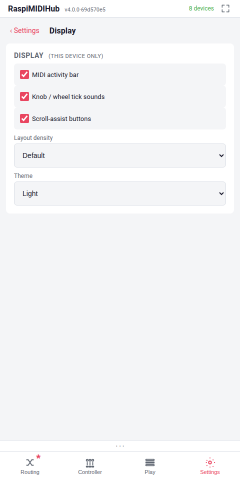
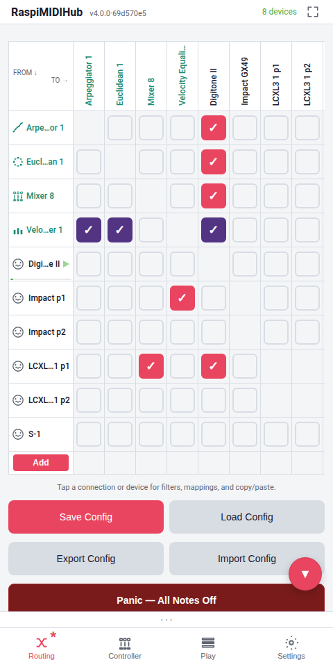
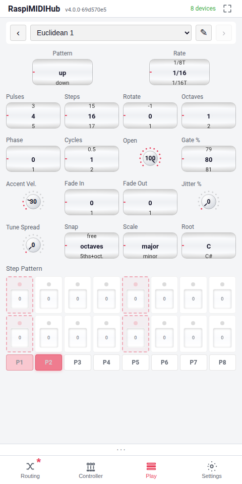
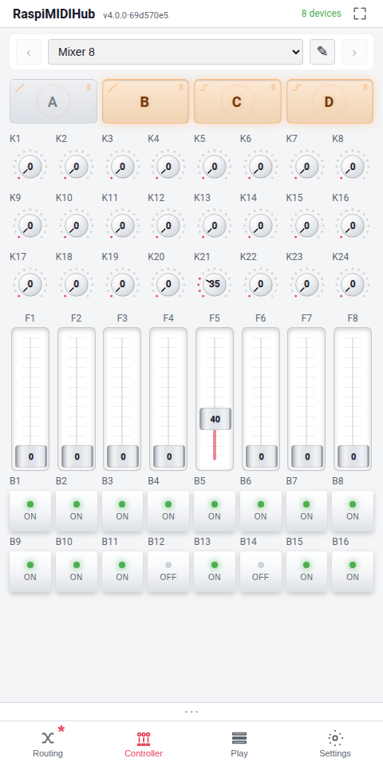

# Settings

The **Settings** tab is a hub of six sub-pages. The hub shows a card
per sub-page; tapping a card opens it under a `< Settings / <title>`
back-bar. The active sub-page is part of the URL
(`/settings/<section>`) and the bottom-nav remembers your last
sub-page across tab switches, same as Routing / Controller / Play.

The six sub-pages:

| Sub-page | What lives there |
|---|---|
| **Sys Info** | Live system stats (version, CPU, RAM, latency, IPs), **Reload App**, **Reboot Pi** |
| **Network** | WiFi card with mode picker + home / AP credentials, USB-tether status, Ethernet config |
| **MIDI** | Default routing for newly-plugged-in devices (all-to-all / disconnected) |
| **Display** | Per-device browser preferences — activity bar, knob/wheel tick sounds, scroll-assist FABs, layout density |
| **Update** | Check GitHub, manage stored versions, install |
| **Plugin Control Mappings** | Flat editable table of every CC binding across every plugin instance and every controller cell |

The dirty-state asterisk (chapter 6.4) does **not** track most
Settings changes. WiFi credentials, ethernet config, and the AP
password apply the moment you save them. The handful that *do* feed
the dirty-state model (the default-routing choice; the activity-bar
toggle) are called out in the relevant subsection.

## Plugin Control Mappings

{width=48%}

A scroll of rows, one per CC binding across every plugin instance
on the Pi. Columns:

- **Plugin** -- the instance's display name (the one you set via
  the matrix row header, or the spawn-time default).
- **Param** -- the control's label. For controller cells: the
  cell label as edited in the device-detail panel; XY pads expand
  to two rows with `(X)` and `(Y)` suffixes.
- **Ch** -- channel (`Any` or 1..16).
- **CC** -- the CC number (or `—` for a cleared binding).

Tap any row to open the same long-press popup you'd get on the
control itself -- CcBinding for plugin params (chapter 11.7),
CellBinding for controller cells (chapter 12). Edit, MIDI Learn,
Reset to factory, Clear, Save. Cleared bindings render dimmed
with `—` in the CC column.

The table is live: any binding edit made from this page, from a
long-press popup, or via the REST API broadcasts `cc_map_changed`
SSE and the table refreshes within milliseconds. Renaming an
instance also reflects immediately via `plugin-changed`.

When there are no plugin instances yet, the page shows a
placeholder pointing at the Routing tab's **Add** button. There's
no "create" affordance here -- this is a viewer / editor over
existing instances, not a way to spawn new ones.

## WiFi

A single card with the WiFi status badge plus rows for credentials
and mode.

### Status badge

Shows the current WiFi state in one line: AP mode SSID, client
mode SSID + IP, or "Bringing up..." during a transition. The badge
colour mirrors the operational state.

### Home WiFi

Two fields: **SSID** and **Password**. Saving the form provisions
the home network for the **WiFi for updates** and **WiFi always**
modes. The credentials are stored on the Pi as part of the saved
project state and *are* therefore included in **Export Config**
JSON files -- edit the WiFi section out before sharing an export
externally (chapter 15.7).

### AP Password

Sets the password for the RaspiMIDIHub access point. Minimum 8
characters (WPA2 requirement). Saving prompts a brief AP restart
-- the phone or laptop drops momentarily and reconnects with the
new password.

::: warning
The default AP password is `midihub1` and is published. Change it
the first time the unit is used in any environment outside a
personal home.
:::

### WiFi mode

Three radio buttons:

- **AP only** -- the default. The Pi broadcasts the AP and never
  associates as a client. No internet on the Pi.
- **WiFi for updates** -- the AP stays up at idle; when a software
  update is requested the Pi briefly flips `wlan0` from AP to
  client to fetch the deb, then flips back. The phone/laptop AP
  connection drops for ~30 seconds during the round-trip.
- **WiFi always** -- the AP is off. The Pi acts as a normal WiFi
  client. Use this when the Pi is on the home or venue network
  permanently.

### USB-tethered phone link

When a phone is USB-tethered to the Pi (chapter 17.4), the card
surfaces the tethered URL as a clickable "Open
http://x.y.z.w/ on your phone" row -- handy for switching the
browser to the faster link without leaving the AP.

## Ethernet (eth0)

Configures the wired interface. Two modes:

- **DHCP** -- the Pi accepts an address from the network's DHCP
  server. This is the default and the right answer for most home
  routers.
- **Static** -- four fields (Address, Netmask, Gateway, DNS) for
  manual configuration.

When `eth0` is connected and has an address, the card shows the
resulting URL (typically `http://raspimidihub.local/` or the IP)
as a clickable link.

## MIDI Routing

A single radio with two options:

- **Connect all** -- new USB devices are auto-routed to and from
  every existing device. The default. Plug-and-play.
- **None** -- new USB devices appear in the matrix but with no
  connections. The user wires them up by hand.

This choice **does** participate in the dirty-state model -- it
is part of the project state and survives **Save Config**.

The plugin "starts unconnected" rule (chapter 11.3) is
independent of this setting; plugins always start with no
connections regardless of the **MIDI Routing** choice.

## Display

Three toggles, a layout selector and a theme picker, all marked
**(this device only)** in the heading -- every Display preference
is browser-local; nothing on this card travels with **Save /
Export Config**.

- **MIDI activity bar** -- shows or hides the persistent
  two-source activity bar above the bottom navigation.
- **Knob / wheel tick sounds** -- enables a small click on each
  integer step of a wheel or fader drag.
- **Scroll-assist buttons** -- shows round accent-coloured
  floating buttons in the top-right (▲) and bottom-right (▼) of
  any overflowing page. Each tap scrolls roughly 200 px in that
  direction; the buttons only appear when content actually runs
  past the viewport edge. Default on.
- **Layout density** -- a dropdown with **Default** and **Small
  screen (tighter)**. Small mode shrinks the header, bottom
  navigation, page padding, and the per-plugin controller bar so
  more content fits on a 360-px-wide phone. The same hub can
  render in Default on a tablet and Small on a phone without one
  overriding the other.
- **Theme** -- a dropdown listing every theme present in
  `themes/manifest.json`. **Dark** is the default night-rig look;
  **Light** flips every surface, control and play-pad to a
  bright daytime look. The choice is browser-local, persists
  across reloads, and seeds the PWA status-bar colour so the
  mobile chrome matches the theme on the next page load.
  First-time visitors with no saved preference inherit their
  OS's `prefers-color-scheme` setting. The picker hides itself
  if only one theme is installed.

{width=42%}

{width=42%}

{width=42%}

{width=42%}

## Stats

A pocket-sized health dashboard. Live readouts:

- **Loop lag** -- how long the asyncio loop took to run its last
  cycle on the reserved CPU 3. Around 2 ms is the normal state and
  anything under 5 ms is fine; sustained values above 5 ms
  indicate something is starving the loop.
- **MIDI in → out latency** -- the time from a USB MIDI input
  event arriving to its corresponding output event leaving. Probed
  with a synthetic round-trip; the typical value is under 2 ms
  for filtered/mapped connections.
- **Control in → MIDI out latency** -- the round-trip from a UI
  control change to the resulting MIDI event leaving on a routed
  port. Useful for understanding controller responsiveness.
- **Process CPU %** -- the routing service's own CPU usage.
- **SSE rate / backlog** -- events per second going out over the
  SSE channel, and the backlog if the browser has fallen behind.

The Stats card is the first place to look when the unit feels
sluggish. Chapter 20 lists what each metric means when it is out
of the normal range.

## Software Versions

A list of every locally-stored `.deb`, newest first, each with its
changelog and an **Install** button.

**Check GitHub for newer versions** auto-downloads anything newer
than the running build, keeps the latest three on disk, and lets
you install offline with one tap. A live progress bar plus a
hopping "we're alive" dot reassures during the install. The
180-second service watchdog forces the Pi back to AP mode if the
orchestrator hangs.

The retention policy (latest three) means once anything has been
fetched, re-installs work fully offline -- no internet path needed.

The version installer also handles the
`raspimidihub-rosetup` package alongside the main
`raspimidihub` package. Both are kept on disk and offered
together.

See chapter 17 for the three internet paths the install can use
(ethernet, USB tethering, WiFi for updates) and the trade-offs of
each.

## PWA Install

A single **Install App** button. Tapping it triggers the
operating system's "Add to Home Screen" flow:

- **iOS Safari** -- the OS dialog appears; confirm to install.
- **Chrome on Android** -- the install prompt appears at the
  bottom of the screen.

After install, RaspiMIDIHub launches from a home-screen icon and
runs fullscreen, with no URL bar and no browser chrome. The PWA
state survives reboots and software updates.

## Reload App

A single **Reload App** button. Force-reloads the SPA bundle,
bypassing the browser cache. Use this when the header version
badge shows the "stale, reload" hint, or when troubleshooting a
UI quirk that smells like a stale bundle. The button busts mobile
Safari's bf-cache reliably -- a regular pull-to-refresh does not.

## System

A single **Reboot** button. Triggers a clean shutdown and reboot
of the Pi. The web UI shows a "Rebooting..." screen and reconnects
automatically when the unit is back up.

## The Safety Net

If the Pi is in WiFi-client mode and the configured network goes
away (router rebooted, taken out of range, password changed
elsewhere), the service falls back to AP mode within roughly 90
seconds. The fallback is automatic; no user action is required.

For a hard reset of the WiFi state from a console (USB keyboard
+ HDMI display, or SSH from another network):

```
sudo reset-wifi
```

This forces the Pi to AP mode with default credentials. Use it
when even the fallback has failed or when access to the unit has
been locked out.

