```{=latex}
\appendix
```

# Plugin Reference

Per-plugin parameter reference: summary, parameter table with
ranges and defaults, input/output behaviour, clock semantics.
The conceptual model of plugins is in chapter 7.

**CC defaults.** A `(CC N default)` note is the factory binding
(Any channel, CC N). Override per instance via long-press → MIDI
Learn (chapter 7).

**Play-surface plugins.** The Arpeggiator, Cartesian, Euclidean,
and Tracker share the play-surface chrome and Setup parameters
(behaviour: chapter 9): an end-of-surface **P1--P8** pattern strip
(slot 1 active by default); **Sync** (Radio: free / tempo /
transport, default transport) with a **BPM** wheel (40--300,
default 120) visible when Sync is free; a **Ctrl Ch** wheel
(Off / 1--16, default Off; named **Pt. Ctrl Ch** on the Tracker);
and, when Ctrl Ch is set, eight learnable **P1..P8** trigger notes
(NoteSelect, defaults 36..43 = C1..G1). The tables below list only
what is specific to each plugin.

## Arpeggiator

Surface and workflow: chapter 9.

| Trait | Value |
|-------|-------|
| Name | Arpeggiator |
| Description | Plays held notes as a pattern with a step sequencer |
| Surface | Play tab (`SURFACE_KIND = "play"`); add from **Add → Play** |
| Pattern modes | up / down / up-down / random / as-played / programmed / chord (7) |
| Rate range | 4/1 / 4/1T / 2/1 / ... / 1/16T / 1/32 (15 values) |
| Steps per pattern | 1..32 |
| Octaves | 1..4 |
| Patterns per instance | 8 numbered slots (see chapter 9) |

| Surface | Parameter | Type | Range | Default |
|---------|-----------|------|-------|---------|
| Play    | **Pattern** | Wheel (wide) | 7 modes (see above) | up |
| Play    | **Rate** | Wheel (wide) | 15 values | 1/8 |
| Play    | **Steps** | Wheel | 1--32 | 8 |
| Play    | **Accent Vel.** | Knob | 0--127 | 30 |
| Play    | **Gate %** | Wheel | 10--100 | 80 |
| Play    | **Octaves** | Wheel | 1--4 | 1 |
| Play    | **Step Pattern** | StepEditor | per-step on/off + offset + accent | all-on, offset 0 |
| Setup   | **Arp Ch** | ChannelSelect | 1--16 or any | any |

CC automation:

| CC | Parameter | CC | Parameter |
|----|-----------|----|-----------|
| 70 | Pattern   | 74 | Rate |
| 71 | Octaves   | 75 | Gate % |
| 73 | Steps     | 83 | Accent Vel. |

**Input.** Notes (held-note buffer), CC 64 (temporary Hold),
CC 70..83 (automation), Clock + Transport, the 8 learnable notes
on Ctrl Ch when set.
**Output.** Notes (the arpeggiated stream); Aftertouch and Pitch
Bend pass through.
**Clock.** Consumes external clock when Sync is `tempo` or
`transport`; free-runs at BPM when `free`.

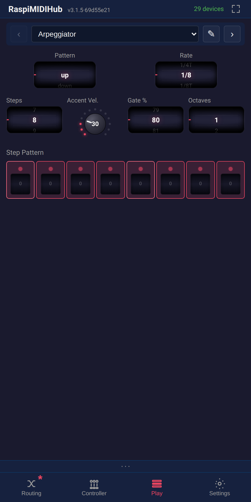{width=42%}

{width=35%}

## Cartesian

Surface and workflow: chapter 9.

| Trait | Value |
|-------|-------|
| Name | Cartesian |
| Description | 2D grid sequencer — voices a held note, swept by two clocks |
| Surface | Play tab (`SURFACE_KIND = "play"`); add from **Add → Play** |
| Pitch model | held note (Play Ch) = root; cells hold semitone offsets; plays `root + offset` |
| Harmony | set by the Root wheel: No root = chordal (played note = tonic, fixed quality); a root C..B = diatonic (Root + Scale = key, in-key harmonisation) |
| Clocks | Rate = step pulse (sweeps the grid along Path); Inv. Rate = inversion pulse (idle while Inversion = 0) |
| Fill voicings | Unison / 5th / Triad / 7th / Scale (5), scale-aware |
| Paths | Rows → / Cols ↓ / Diagonal / Knight / Spiral in / Spiral out / Random (7) |
| Grid sizes | 2×2 / 3×3 / 4×4 |
| Scales | major / minor / dorian / mixolydian / pentatonic / blues / harmonic m / whole tone / chromatic (9) |
| Rate range | 4/1 ... 1/32 (15 values, same as Arp) |
| Patterns per instance | 8 numbered slots (see chapter 9) |

| Surface | Parameter | Type | Range | Default |
|---------|-----------|------|-------|---------|
| Play    | **Fill Voicing** | Wheel (wide) | Unison / 5th / Triad / 7th / Scale | Triad |
| Play    | **Inversion** | Wheel | -4--+4 | 0 |
| Play    | **Inv. Rate** | Wheel | 15 values | 1/4 |
| Play    | **Root** | Wheel (wide) | No root / C ... B (No root = chordal; a root = diatonic key) | No root |
| Play    | **Scale** | Wheel (wide) | 9 scales (see above) | major |
| Play    | **Rate** | Wheel | 15 values | 1/16 |
| Play    | **Path** | Wheel (wide) | 7 modes (see above) | Rows → |
| Play    | **Grid** | Wheel | 2×2 / 3×3 / 4×4 | 4×4 |
| Play    | **Gate %** | Wheel | 10--100 | 80 |
| Play    | **Accent Vel.** | Knob | 0--127 | 30 |
| Play    | **Autofill** | Button (latching) | on = Live (re-stamps), off = Latch (frozen) | on |
| Play    | *(grid)* | CartesianGrid | side×side cells; tap = off/on/accent, mini-wheel = per-cell offset | all on, offsets from voicing |
| Setup   | **Play Ch** | ChannelSelect | 1--16 or any | any |
| Setup   | **Fill Ch** | Wheel | Off / 1--16 | Off |

CC automation (shared params match the Arp / Euclidean):

| CC | Parameter | CC | Parameter |
|----|-----------|----|-----------|
| 70 | Fill Voicing | 79 | Path |
| 71 | Inversion    | 83 | Accent Vel. |
| 72 | Grid (size)  | 87 | Scale |
| 73 | Gate %       | 88 | Root |
| 74 | Rate         |    |    |
| 75 | Inv. Rate    |    |    |

**Input.** Notes on Play Ch (the played root), notes on Fill Ch
(record cell offsets), CC 70..75 / 79 / 83 / 87 (automation),
8 learnable notes on Ctrl Ch when set (each picks a pattern slot;
consumed, not played), Clock + Transport, Aftertouch, Pitch Bend.
**Output.** Notes (grid-voiced); Aftertouch and Pitch Bend pass
through.
**Clock.** Consumes external clock when Sync is `tempo` or
`transport` (one subdivision per axis); free-runs at BPM when
`free`.

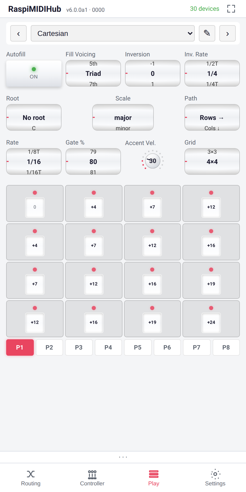{width=42%}

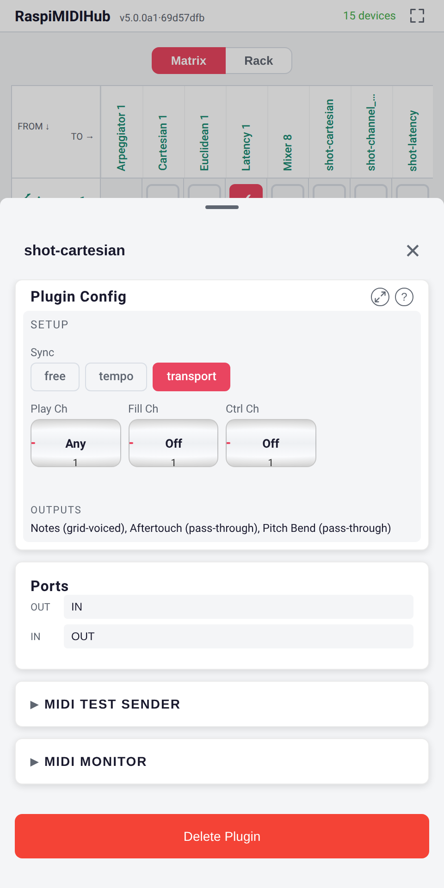{width=35%}

## CC LFO

Generates a CC waveform: five wave shapes, free-run or clock-synced
rate up to 8 bars, live scope. On a MIDI 2.0-capable hub the wave
is stepless into 2.0 destinations; MIDI 1.0 destinations get the
classic 0--127 steps.

| Group | Parameter | Type | Range | Default |
|-------|-----------|------|-------|---------|
| Waveform | **Wave** | Radio | sine / triangle / square / saw / s&h | sine |
| Timing | **Sync to Clock** | Button | on / off | off |
| Timing | **Rate** | Radio | 8 / 4 / 2 / 1 / 1/2 / 1/4 / 1/8 / 1/16 bars | 1 |
| Timing | **Frequency** | Fader | 0.1--20.0 Hz (raw 1--200) | 0.5 Hz (CC 74 default) |
| Output | **Channel** | ChannelSelect | 1--16 | 1 |
| Output | **CC #** | Wheel | 0--127 | 1 |
| Output | **Depth** | Fader (fine, 1 decimal) | 0--127 | 127 (CC 75 default) |
| Output | **Center** | Fader (fine, 1 decimal) | 0--127 | 64 (CC 76 default) |

**Input.** Clock (when **Sync to Clock** is on).
**Output.** CC (the LFO stream).
**Clock.** Consumes external clock when sync is on; free-runs at
the **Frequency** when off.
**Display.** Scope of the output value.

{width=35%}

## CC Smoother

Smooths jitter on a noisy CC by interpolating between incoming
values over a configurable window. On a MIDI 2.0-capable hub the
glide is stepless into 2.0 destinations; MIDI 1.0 destinations get
the classic smoothed integers.

| Parameter | Type | Range | Default |
|-----------|------|-------|---------|
| **Input CC #** | Wheel | 0--127 | 1 |
| **Output CC #** | Wheel | 0--127 | 1 |
| **Smoothing** | Fader | 1--50 (interpolation window) | 10 (CC 76 default) |

**Input.** CC at **Input CC #**.
**Output.** CC at **Output CC #** with smoothed values.
**Clock.** None.
**Display.** Two scopes -- input and output.

{width=35%}

## Channel Selector

Turns momentary CC buttons into a channel picker for controllers
without a display. Each slot binds one CC number; a value at or
above the trigger threshold makes that channel active. The input
channel is ignored -- every event is re-stamped onto the active
channel, so a downstream channel filter decides where it goes.

| Parameter | Type | Range | Default |
|-----------|------|-------|---------|
| **Active Channel** | Wheel | 1--16 | 1 |
| **Trigger ≥** | Wheel | 1--127 | 64 |
| CC → Channel -- **Ch 1**..**Ch 16** | CCSelect | Off, CC 0--127 | Off (unbound) |

**Active Channel** mirrors the live selection and doubles as a
manual override; a button press updates it without dirtying the
config. Each **Ch** slot has a **Learn** button: tap it, press the
controller button, the next incoming CC is captured. Selector CCs
are swallowed; other CCs pass through. A note held across a switch
gets its Note Off on its original channel -- no stuck notes.

**Input.** Notes / CC / Pitchbend / Aftertouch / Program Change
(input channel ignored).
**Output.** Every event re-stamped onto the active channel.
**Clock.** None.

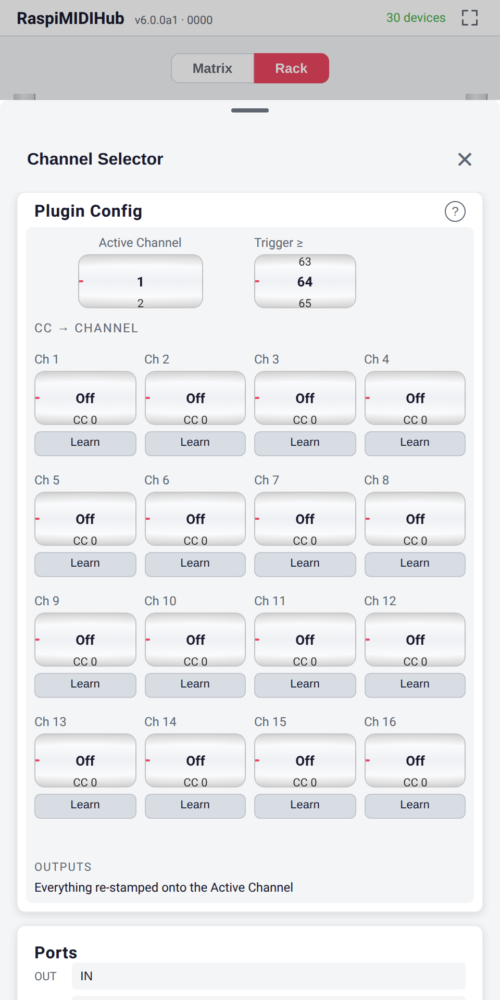{width=35%}

## Chord Generator

Each incoming Note On triggers a chord with selectable type and
inversion; the added-note velocity scale lets upper voices sound
softer than the played root.

| Group | Parameter | Type | Range | Default |
|-------|-----------|------|-------|---------|
| Chord | **Type** | Radio | major / minor / 7th / minor 7th / major 7th / sus2 / sus4 / custom intervals | major |
| Chord | **Inversion** | Radio | root / 1st / 2nd | root |
| Output | **Added Note Vel %** | Wheel | 10--100 % | 90 (CC 76 default) |

**Input.** Notes.
**Output.** Notes -- root + chord voices.
**Clock.** None.

{width=35%}

## Clock Divider

Emits one MIDI Clock for every N received -- drives a slow second
device from a fast master clock.

| Parameter | Type | Range | Default |
|-----------|------|-------|---------|
| **Divide by** | Wheel | 2--32 | 2 (CC 74 default) |

**Input.** Clock.
**Output.** Clock at 1/N the input rate; passes Start / Stop /
Continue through.
**Clock.** Consumes and produces.

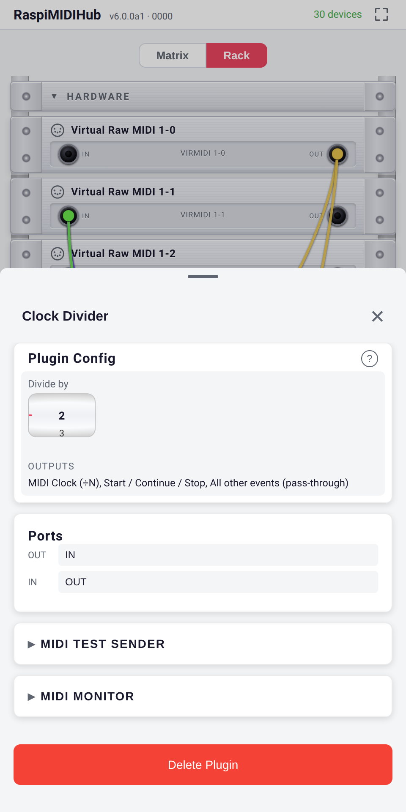{width=35%}

## Euclidean

Surface and workflow: chapter 9.

| Trait | Value |
|-------|-------|
| Name | Euclidean |
| Description | Held notes voiced through a Bjorklund-distributed step pattern |
| Surface | Play tab (`SURFACE_KIND = "play"`); add from **Add → Play** |
| Layers | Bjorklund + Window wave (sine threshold) + Manual override grid |
| Pattern modes | up / down / up-down / random / as-played / chord (6) |
| Rate range | 4/1 ... 1/32 (15 values, same as Arp) |
| Steps per pattern | 1..32 |
| Scales | major / minor / dorian / mixolydian / pentatonic / blues / harmonic m / whole tone / chromatic (9) |
| Patterns per instance | 8 numbered slots (see chapter 9) |

| Surface | Parameter | Type | Range | Default |
|---------|-----------|------|-------|---------|
| Play    | **Pattern** | Wheel (wide) | 6 modes (see above) | up |
| Play    | **Rate** | Wheel (wide) | 15 values | 1/16 |
| Play    | **Pulses** | Wheel | 0--32 (capped by Steps) | 4 |
| Play    | **Steps** | Wheel | 1--32 | 16 |
| Play    | **Rotate** | Wheel | -16--+16 | 0 |
| Play    | **Octaves** | Wheel | 1--4 | 1 |
| Play    | **Phase** | Wheel | 0--31 | 0 |
| Play    | **Cycles** | Wheel | 0.5 / 1 / 2 / 3 / 4 | 1 |
| Play    | **Open** | Knob | 0--100 | 100 |
| Play    | **Gate %** | Wheel | 10--100 | 80 |
| Play    | **Accent Vel.** | Knob | 0--127 | 30 |
| Play    | **Fade In** | Wheel | 0--16 firing steps | 0 |
| Play    | **Fade Out** | Wheel | 0--16 firing steps | 0 |
| Play    | **Jitter %** | Knob | 0--100 | 0 |
| Play    | **Tune Spread** | Knob | 0--100 | 0 |
| Play    | **Snap** | Wheel | free / octaves / 5ths+oct. | octaves |
| Play    | **Root** | Wheel | C ... B | C |
| Play    | **Scale** | Wheel | 9 scales (see above) | major |
| Play    | **Step Pattern** | StepEditor (override mode) | per-step default / force-on / force-on+accent / force-off + offset | all default |
| Setup   | **Arp Ch** | ChannelSelect | 1--16 or any | any |
| Setup   | **Retrig** | Button | reset cycle on first key of a phrase | on |

CC automation (full block CC 70..88, skipping CC 84 = GM
Portamento Control):

| CC | Parameter | CC | Parameter |
|----|-----------|----|-----------|
| 70 | Pattern    | 80 | Fade In |
| 71 | Octaves    | 81 | Fade Out |
| 72 | Pulses     | 82 | Jitter |
| 73 | Steps      | 83 | Accent Vel. |
| 74 | Rate       | 85 | Tune Spread |
| 75 | Gate %     | 86 | Snap |
| 76 | Open       | 87 | Scale |
| 77 | Phase      | 88 | Root |
| 78 | Cycles     |    |    |
| 79 | Rotate     |    |    |

**Input.** Notes (held buffer), CC 64 (sustain pedal), CC 70..83
/ CC 85..88 (automation), 8 learnable notes on Ctrl Ch when set
(each picks a pattern slot; consumed, not arpeggiated), Clock +
Transport, Aftertouch, Pitch Bend.
**Output.** Notes (Bjorklund-voiced, scale-quantised); Aftertouch
and Pitch Bend pass through.
**Clock.** Consumes external clock when Sync is `tempo` or
`transport`; free-runs at BPM when `free`.

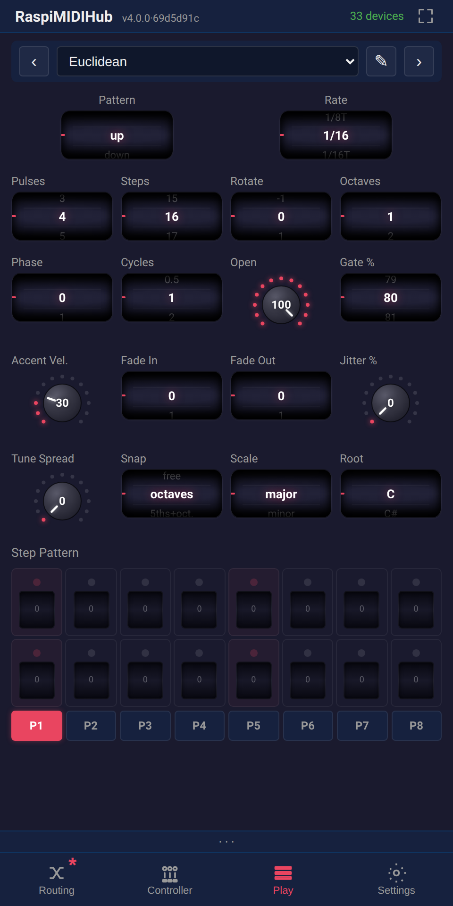{width=42%}

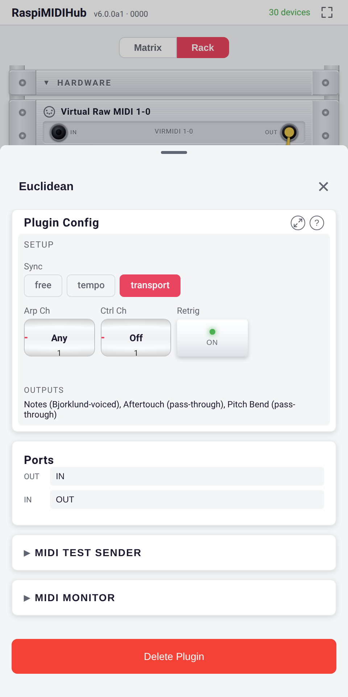{width=35%}

## Hold

Latches notes so they keep sounding after release. **Toggle
notes** picks the mode:

- **off (default) -- chord-latch.** While any key is down, presses
  extend the held chord; on full release the chord keeps sounding.
  The Release Note (default `C8`, above normal play range)
  silences it; any other note after a full release starts a new
  chord.
- **on -- per-note toggle.** Each note latches independently:
  first press holds, the next press of the same note releases;
  the keyboard's own note-offs are ignored. The Release Note still
  releases everything.

Flipping Toggle notes mid-session releases everything sounding.

| Group | Parameter | Type | Range | Default |
|-------|-----------|------|-------|---------|
| -- | **Toggle notes** | Button | on / off | off |
| Release Note | **Enabled** | Button | on / off | on |
| Release Note | **Note** | NoteSelect | 0--127 | C8 (108) |

**Input.** Notes.
**Output.** Notes -- with sustained Note Ons; the release note
turns off all held notes.
**Clock.** None.

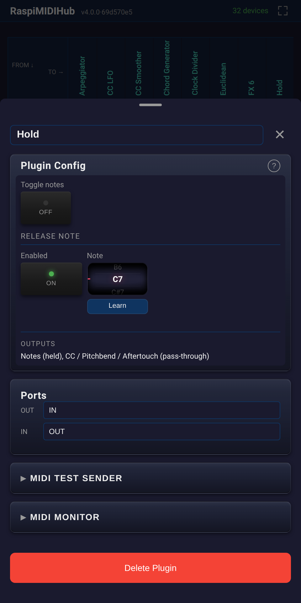{width=35%}

## Latency

Delays every MIDI event by a fixed number of milliseconds
(kernel-timed, sub-millisecond jitter). Compensates synths whose
MIDI-in processing lands the sound late: route a tight source
through Latency before that synth. Clock and transport pass
through immediately -- delaying them would shift the downstream
sequencer. Note-on/off pairs stay matched, so a fader move
mid-note cannot reorder them.

| Parameter | Type | Range | Default |
|-----------|------|-------|---------|
| **Delay (ms)** | Fader | 1--100 ms | 10 (CC 74 default) |

**Input.** All events.
**Output.** All events (delayed) plus clock + transport (immediate).
**Clock.** Pass-through (not delayed).

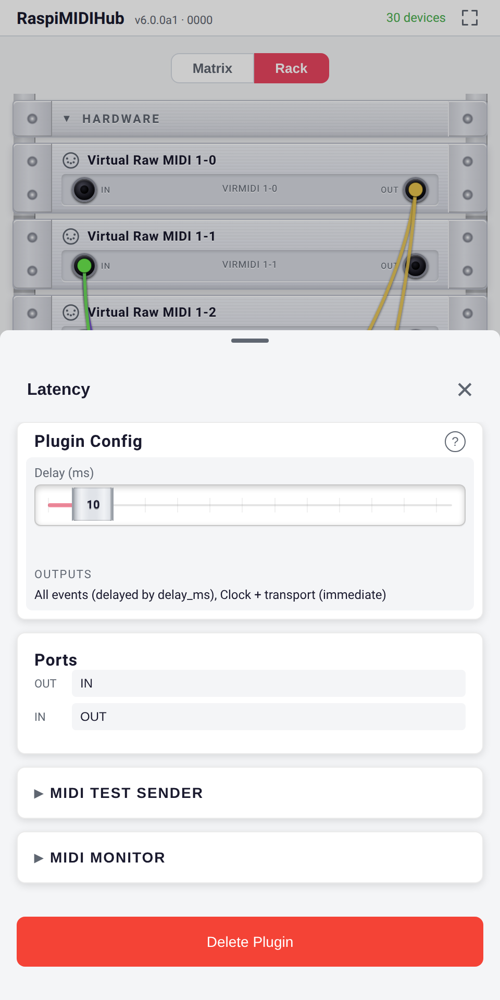{width=35%}

## Master Clock

Generates MIDI Clock from an internal BPM, with a transport
button, beat meter and bar counter.

| Parameter | Type | Range | Default |
|-----------|------|-------|---------|
| **BPM** | Wheel | 20--300 | 120 (CC 74 default) |
| **Play** | Button | on / off | off |

**Input.** None (generator).
**Output.** Clock, Start, Stop, Continue.
**Clock.** Produces.
**Display.** Beat meter, bar counter.

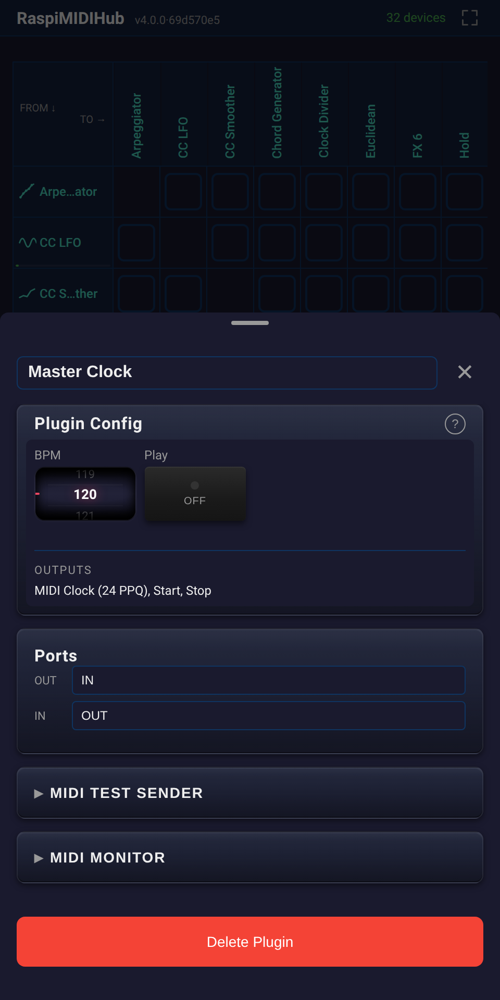{width=35%}

## MIDI Delay

Note echoes, kernel-timed (sub-millisecond jitter). Clock-synced
or free-running delay time; per-repeat velocity decay.

| Group | Parameter | Type | Range | Default |
|-------|-----------|------|-------|---------|
| Timing | **Sync to Clock** | Button | on / off | on |
| Timing | **Delay (ms)** | Fader | 10--2000 ms | 250 (CC 74 default) |
| Timing | **Rate** | Radio | 1/4 / 1/4T / 1/8 / 1/8T / 1/16 / 1/16T | 1/8 |
| Controls | **Repeats** | Wheel | 0--10 | 3 (CC 75 default) |
| Controls | **Vel Decay %** | Fader | 0--100 % | 20 (CC 76 default) |

**Input.** Notes.
**Output.** Notes -- the original plus the scheduled echoes.
**Clock.** Consumes external clock when **Sync to Clock** is on.

{width=35%}

## Note Splitter

Splits the keyboard at a configurable note into two channels with
independent per-zone transpose.

| Parameter | Type | Range | Default |
|-----------|------|-------|---------|
| **Split Point** | NoteSelect | 0--127 | C4 (60) (CC 74 default) |
| Lower Zone -- **Channel** | ChannelSelect | 1--16 | 1 |
| Lower Zone -- **Transpose** | Wheel | -48..+48 semitones | 0 (CC 75 default) |
| Upper Zone -- **Channel** | ChannelSelect | 1--16 | 2 |
| Upper Zone -- **Transpose** | Wheel | -48..+48 semitones | 0 (CC 76 default) |

**Input.** Notes.
**Output.** Notes routed to the lower or upper zone channel based
on the split point.
**Clock.** None.

{width=35%}

## Note Transpose

Shifts all incoming notes by a fixed number of semitones.

| Parameter | Type | Range | Default |
|-----------|------|-------|---------|
| **Semitones** | Wheel | -48..+48 | 0 (CC 74 default) |

**Input.** Notes.
**Output.** Notes -- shifted.
**Clock.** None.

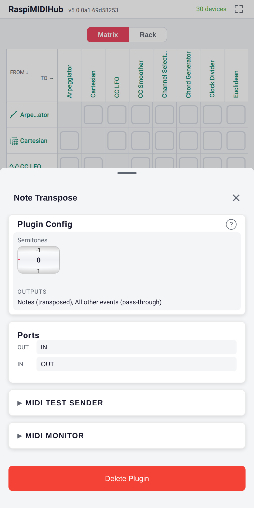{width=35%}

## Panic Button

Sends *All Notes Off* and *All Sound Off* on every MIDI channel
on each press -- kills stuck notes everywhere downstream.

| Parameter | Type | Range | Default |
|-----------|------|-------|---------|
| **Panic!** | Button (momentary, red) | trigger | -- |
| **Trigger CC #** | Wheel | 0--127 | 64 |

**Trigger CC #** fires the panic remotely: any value of 64 or
higher on that CC# triggers it.

**Input.** CC (for the trigger).
**Output.** All Sound Off (CC 120 = 0) and All Notes Off
(CC 123 = 0) on every channel, on every press.
**Clock.** None.

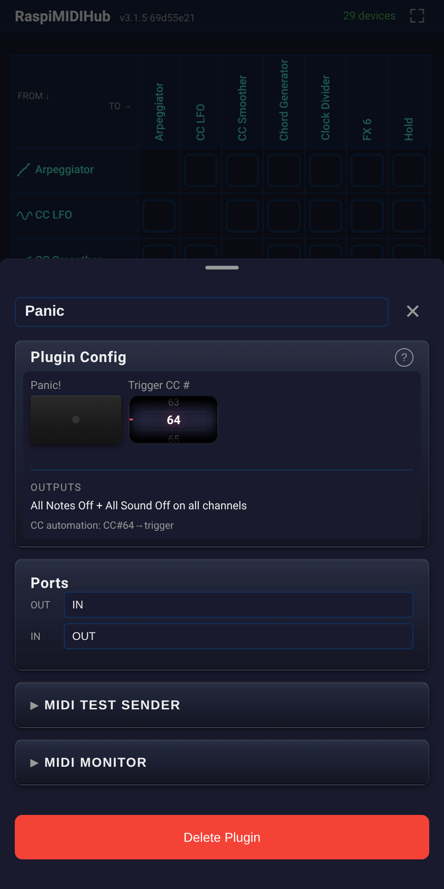{width=35%}

## Pitch CC

Chromatic playing for synths that pitch via a CC rather than the
note number (Korg Volca Sample, CC 49 = sample playback rate).
Each Note On emits a pitch CC -- value
`Base CC Value + (played_note - Base Note)`, clamped to 0--127 --
*before* the Note On. Note Off forwards without a CC.

| Parameter | Type | Range | Default |
|-----------|------|-------|---------|
| **Base Note** | NoteSelect (learnable) | 0--127 | 60 (C-3) |
| **Out CC#** | Wheel | 0--127 | 49 (Volca Sample pitch) |
| **Base Val** | Wheel | 0--127 | 64 |

**Input.** Notes, CC / Pitchbend / Aftertouch (pass-through).
**Output.** CC (pitch) + Notes on the same channel; other events
pass through.
**Clock.** None.

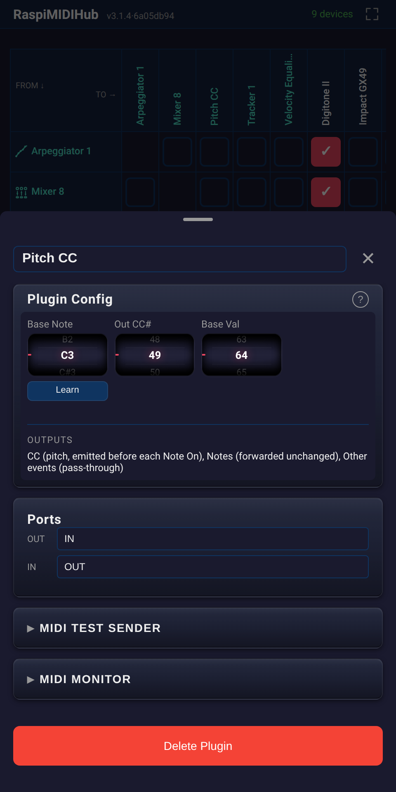{width=35%}

## Scale Remapper

Quantises incoming notes to a musical scale.

| Parameter | Type | Range | Default |
|-----------|------|-------|---------|
| **Root** | Wheel | 0--11 (note names) | C (CC 74 default) |
| **Scale** | Radio | major / minor / harmonic minor / melodic minor / pentatonic major / pentatonic minor / blues / chromatic / ... | major |

**Input.** Notes.
**Output.** Notes snapped to the nearest in-scale pitch.
**Clock.** None.

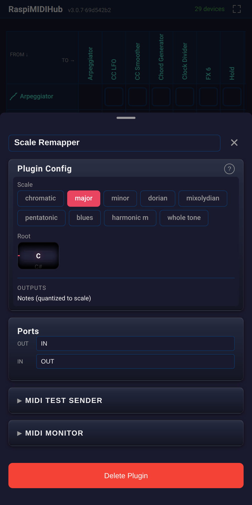{width=35%}

## SysEx Sender

Upload a `.syx` file; the bytes stream to the destination in
256-byte chunks with ~5 ms gaps (some legacy synths cannot handle
back-to-back SysEx).

| Parameter | Type | Range | Default |
|-----------|------|-------|---------|
| **File picker** | File upload | -- | -- |

The uploaded file is not saved; once sent, removing the instance
is safe.

**Input.** None.
**Output.** SysEx -- the file's bytes.
**Clock.** None.

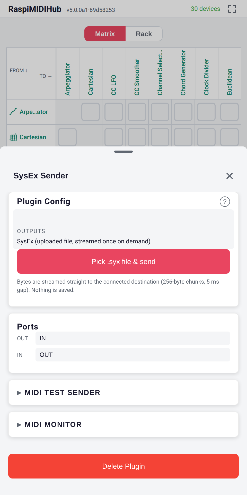{width=35%}

## Tracker

Surface and workflow: chapter 9.

| Trait | Value |
|-------|-------|
| Name | Tracker |
| Description | 8-voice step sequencer, single channel, paged |
| Voices | 8 (T1..T8) |
| Rows per page | 16 (hex 0..F) |
| Pages per pattern | up to 16, chained linearly, loops back to page 0 |
| Patterns per instance | 8 numbered slots; see chapter 9 |

Configuration parameters (device-detail panel):

- **Per-track channel** (T1..T8) -- 8 × ChannelSelect, default 1
  each. Also the input matcher for direct channel routing during
  live recording.
- **Auto Ch.** -- Wheel, `Off` / 1..16, default `Off`. Notes/CCs
  on this channel record cursor-relative (chord-spread from the
  cursor track across consecutive tracks). Other channels route by
  matching the per-track channel; unmatched channels are dropped.
- **Internal BPM** -- used when **Send Clock** is on and no
  external clock is routed in.
- **Send Clock** -- Button; on = clock master, generating 24-PPQ
  at the Internal BPM to OUT (incoming clock ignored). Off =
  follow external clock.
- **Send Trnsp.** -- Button; forwards incoming START / STOP /
  CONTINUE to OUT and emits its own when the on-screen Play / Stop
  buttons fire.
- **Rcv Trnsp.** -- Button, default **on**. On: external transport
  drives the playhead. Off: foreign transport is ignored -- only
  the Play / Stop buttons and the launch trigger modes start the
  Tracker, which still follows the shared clock for tempo. The
  Play / Stop buttons bypass this gate.
- **Ctrl Ch** -- Wheel, `Off` / 1..16, default `Off`. When set,
  the channel is reserved end-to-end (no recording, no
  pass-through, CCs dropped); incoming notes trigger the matching
  pattern slot.
- **Trigger Mode** -- Wheel, `Switch` / `One-shot` / `Hold` /
  `Toggle`, default `Switch`; visible only when **Ctrl Ch** is not
  Off. *Switch* selects the pattern like an on-screen Tap
  (queue-on-wrap; pre-existing configs load as Switch). The other
  three launch from row 0 on the next clock step without a
  transport Start: One-shot plays once then stops, Hold loops
  while the key is held, Toggle starts on press and stops on
  re-press. Launching is monophonic (a new trigger replaces the
  one in flight) and applies to MIDI triggers only; on-screen slot
  taps always behave as Switch.
- **Pattern Notes (P1..P8)** -- as in the play-surface preamble;
  visible only when **Ctrl Ch** is not Off. Non-matching notes on
  the control channel are dropped.

Grid data is part of the instance state; **Save Config** and
**Export Config** capture it.

**Input.** Notes, CC (live recording, channel-routed -- see
chapter 9 §Routing), Clock, Start, Stop, Continue.
**Output.** Notes, CC (from the grid), optionally Clock (when
**Send Clock** is on) and Start / Stop / Continue (when **Send
Trnsp.** is on).
**Clock.** Consumes and optionally re-emits.

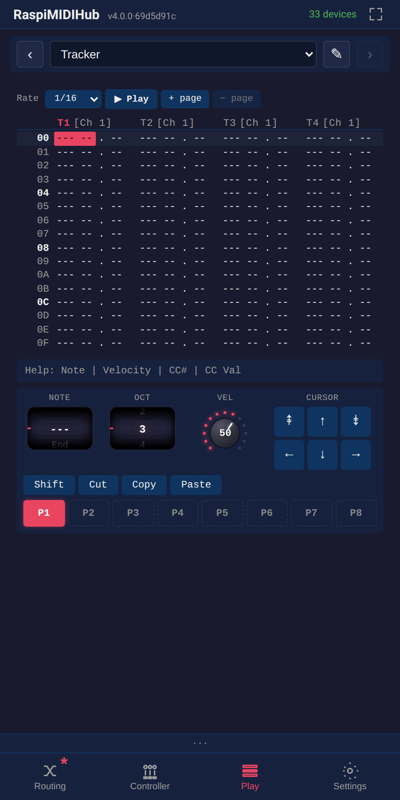{width=35%}

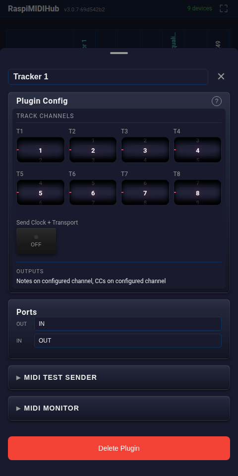{width=35%}

## Velocity Curve

Remaps velocity through a drawable 128-point curve; shape presets
(linear, ease-in, ease-out, S-curve) sit along the canvas edge.
On a MIDI 2.0-capable hub, fractional velocity is interpolated
*between* curve points and re-emitted at full resolution; integer
velocity behaves as before.

| Parameter | Type | Range | Default |
|-----------|------|-------|---------|
| **Velocity Curve** | CurveEditor | 128 points × 0..127 each | linear |

**Input.** Notes.
**Output.** Notes -- velocity remapped through the curve.
**Clock.** None.

{width=35%}

## Velocity Equalizer

Normalises incoming velocity to a fixed value or by compressing /
expanding the range. Compress / expand preserve a MIDI 2.0
keyboard's fine velocity gradations end to end; MIDI 1.0 devices
see the classic integer results.

| Group | Parameter | Type | Range | Default |
|-------|-----------|------|-------|---------|
|  | **Mode** | Radio | fixed / compress / expand | fixed |
| Fixed | **Velocity** | Wheel | 1--127 | 100 (CC 74 default) |
| Range | **Min** | Wheel | 1--127 | 60 (CC 75 default) |
| Range | **Max** | Wheel | 1--127 | 120 (CC 76 default) |

**Input.** Notes.
**Output.** Notes -- velocity adjusted.
**Clock.** None.

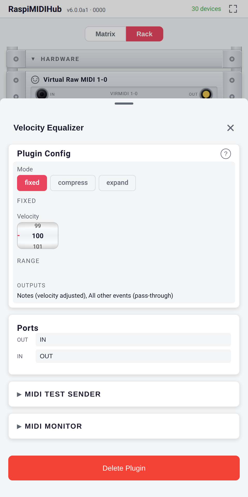{width=35%}

## User-Supplied Plugins

See chapter 7, *User-Supplied Plugins*; the plugin developer guide
in the project repository covers the API.
