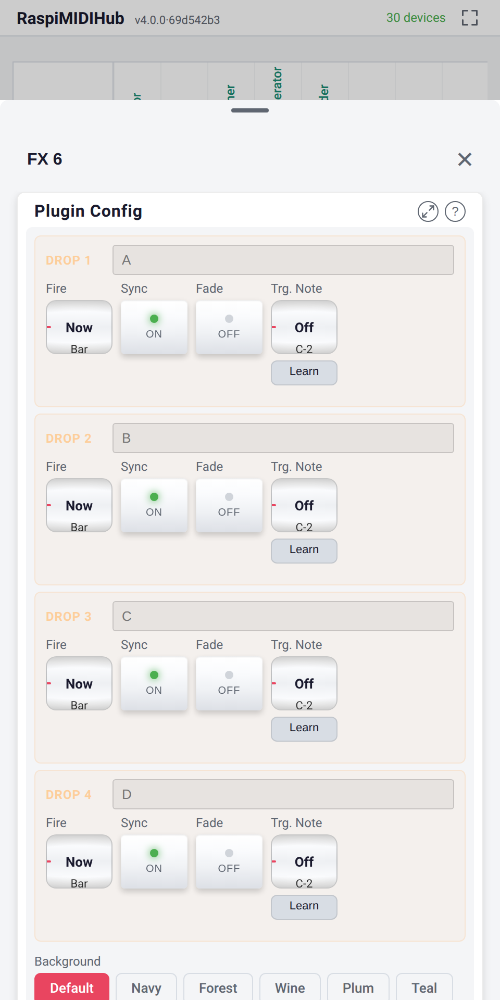
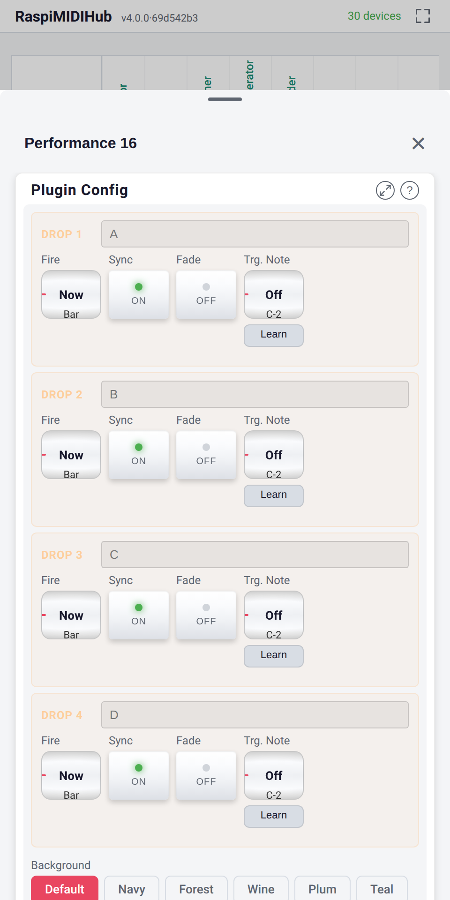
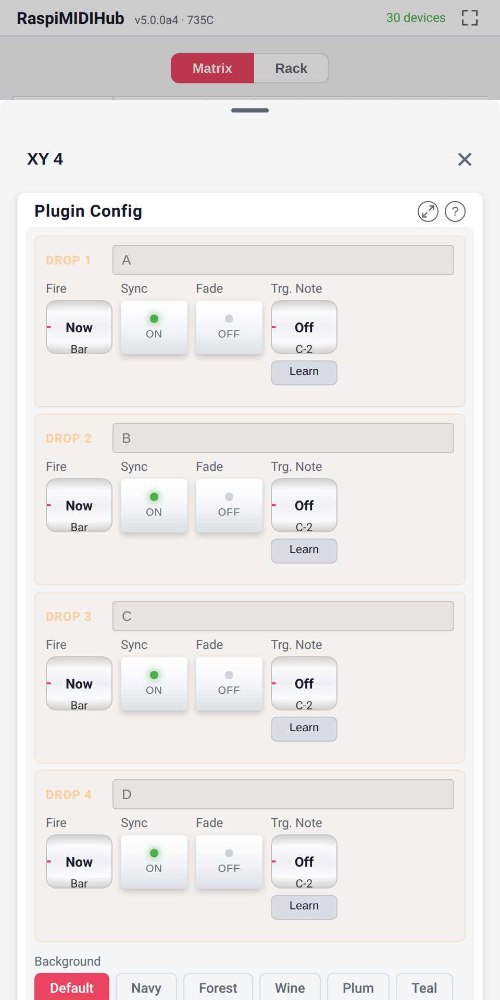

# Controller Reference

Per-controller layout, default CC assignments, and template-specific
mechanics. The conceptual model -- drop buttons, themes, maximisation
-- is in chapter 12.

## Mixer 8

| Trait | Value |
|-------|-------|
| Name | Controller -- Mixer 8 |
| Description | 8-wide mixer: 24 knobs / 8 faders / 16 buttons |
| Default CC range | 16--63 on channel 1 |
| Default On / Off | 127 / 0 |

**Layout.**

- **3 rows of 8 knobs** (24) -- send / send / channel-volume rows.
- **1 row of 8 faders** -- the channel faders.
- **2 rows of 8 buttons** (16) -- typically mute / solo per channel.

Every cell defaults to channel 1; override per cell via the Ch wheel
on the configuration panel. The four drop buttons sit above the play
surface.

{width=40%}

{width=40%}

## FX 6

| Trait | Value |
|-------|-------|
| Name | Controller -- FX 6 |
| Description | 6-wide FX: 18 knobs / 6 faders / 6 buttons |
| Default CC range | 16--45 on channel 1 |
| Default On / Off | 127 / 0 |

**Layout.**

- **3 rows of 6 knobs** (18) -- e.g. delay time / feedback / mix for
  six FX channels.
- **1 row of 6 faders** -- per-FX channel level.
- **1 row of 6 buttons** -- per-FX bypass / enable.

{width=40%}

{width=40%}

## Performance 16

| Trait | Value |
|-------|-------|
| Name | Controller -- Performance 16 |
| Description | 4-wide performance: 16 macros + 4 scene buttons |
| Default CC range | 16--35 on channel 1 |
| Default On / Off | 127 / 0 |

**Layout.**

- **4 rows of 4 knobs** (16 macros) -- each intended as one knob
  mapped to multiple destination parameters via routing mappings.
- **1 row of 4 buttons** -- the scene buttons.

{width=40%}

{width=40%}

## XY 4

| Trait | Value |
|-------|-------|
| Name | Controller -- XY 4 |
| Description | Performance: 2 XY pads / 8 knobs / 4 buttons |
| Default CC range | 16--31 on channel 1 |
| Default On / Off | 127 / 0 |

**Layout.**

- **2 large XY pads** at the top -- each sends two CCs (one per
  axis), with per-axis MIDI Learn.
- **2 rows of 4 knobs** (8) in the middle.
- **1 row of 4 buttons** along the bottom.

**XY pad specifics:** per-cell **Force** (0--127, 0 disables the
spring) and **Home** (Bottom-left or Centre). With Force > 0 the dot
returns to Home on release, firing a CC event per axis as it travels.

{width=40%}

{width=40%}

## Drop Buttons -- Complete Reference

Identical across templates; only the snapshot contents differ.

| Per-button parameter | Type | Values |
|----------------------|------|--------|
| **Mode** | Radio | Now / Bar / 2-Bar / 4-Bar / 8-Bar / 16-Bar |
| **Sync to bars** | Button (latching) | on / off |
| **Fade on fire** | Button (latching) | on / off |
| **Trg. Note** | NoteSelect + Learn | The MIDI note that triggers a fire |

**Behaviour table:**

| Sync | Fade | What happens on tap |
|------|------|---------------------|
| off | off | Snapshot applies instantly to all cells |
| off | on | Snapshot interpolates over the configured mode's bar length, starting now |
| on | off | Snapshot applies on the next mode-boundary (Bar / 2-Bar / 4-Bar / 8-Bar / 16-Bar) |
| on | on | Snapshot interpolates over the next mode-boundary cycle |

**Capture vs fire.** Long-press (~600 ms) captures the current state
into the slot; tap fires it. Captured = filled dot; empty = hollow
dot.

**MIDI-note trigger.** With **Trg. Note** set, that note on any
channel routed to the controller triggers the button as if tapped.

**Dual-slot scheduling.** One fade and one hard drop can queue at
once; a second fade overrides the first.

**Progress ring.** The segmented arc peach-pulses while waiting for
the boundary, fills the cycle in real time during a fade, and freezes
if MIDI Stop arrives mid-cycle.

## Themes

Eight dark themes ship with every controller; theme is **per
controller instance**, chosen in the plugin-config panel, applied
instantly.

| Theme | Accent colour |
|-------|---------------|
| Default | Cyan / turquoise |
| Navy | Deep blue |
| Forest | Green |
| Wine | Burgundy red |
| Plum | Purple |
| Teal | Blue-green |
| Sienna | Burnt orange |
| Slate | Cool grey |

**Screenshot needed.** `controller-themes-grid.png` -- one controller
in all eight themes, side by side.

## Saved State

Part of the project state:

- Per-cell rename
- Per-cell CC, channel, On / Off values
- Per-cell learned MIDI source
- Per-axis configuration (XY 4 spring / home)
- All four drop-button captured snapshots
- Per-drop-button **Mode**, **Sync**, **Fade**, **Trg. Note**
- The chosen theme

**Save Config** persists it; **Export Config** captures it in a JSON
snapshot (chapter 15); **Copy → Paste-as-new** duplicates it with a
fresh instance ID.
